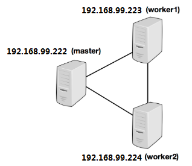
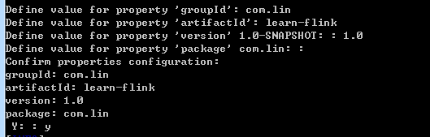
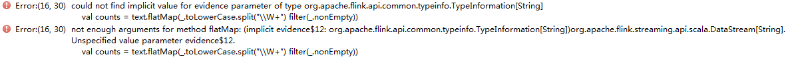

## 1.集群搭建




修改配置文件vim flink-conf.yaml

```
jobmanager.rpc.address: 192.168.9.222
jobmanager.rpc.port: 6123
jobmanager.heap.size: 4096m
taskmanager.heap.size: 4096m
taskmanager.numberOfTaskSlots: 5
parallelism.default: 4

fs.default-scheme: hdfs://flu05:8020/user/lin
rest.port: 2019   
```

修改master和slave：

指定master节点，需要端口 masters 

```sh
192.168.9.222:2019
```


指定task节点：slaves 

```sh
192.168.9.223
192.168.9.224
```

启动：在master节点启动：会自动发送启动命令到slave，完成启动

```sh
sh start-cluster.sh
```

生成项目模版：

1. 生成java项目模版：

```sh
$ mvn archetype:generate                               \
      -DarchetypeGroupId=org.apache.flink              \
      -DarchetypeArtifactId=flink-quickstart-java      \
      -DarchetypeVersion=1.7.1
```

2 .交互式生成scala项目（maven）：

```sh
D:\scala-project>mvn archetype:generate -DarchetypeGroupId=org.apache.flink   -DarchetypeArtifactId=flink-quickstart-scala     -DarchetypeVersion=1.7.1
```



本地直接生成好项目：learn-flink，导入IDE即可。

## 2.基本API概念

### 1. 整理概念

1. DataSet用于批处理

   DataStream用于流式处理

2. flink程序步骤

```sh
1. Obtain an execution environment,获取执行环境
2. Load/create the initial data,加载/创建初始化数据
3. Specify transformations on this data,针对数据执行特定的transformation
4. Specify where to put the results of your computations,存放计算结果
5. Trigger the program execution，触发执行。
```

3. 延迟计算

当main方法运行，数据加载和转换transformations没有直接运行。

需要execute()方法被调用才真正执行。

4. 特殊的keys

join, coGroup, keyBy, groupBy需要一个key作为参数，通过该参数中的key对应到程序中聚合的字段。

- 特殊的keys ： keyBy("字段名")
- java tuple中的 : keyBy(0) ，0代表第一个字段，f0则代表第一个字段。
- 字段表达式： `"complex.word.f2"`: 选择POJO中complex字段（是个对象），的word（是个Tupe3）的第二个元素。 直接通配符：`*`，表示选择所有类型，非Tuple和pojo类型都能使用。
- 自定义Key选择：使用`new KeySelector(a,b)`

4. Flink在数据集中或数据流中的能使用的元素种类：

   ```sh
   1. Java Tuples and Scala Case Classes
   2. Java POJOs
   3. Primitive Types
   4. Regular Classes
   5. Values: (org.apache.flinktypes.Value) ByteValue, ShortValue, IntValue, LongValue, FloatValue, DoubleValue, StringValue, CharValue, BooleanValue
   6. Hadoop Writables:实现org.apache.hadoop.Writable接口的类型
   7. Special Types:使用特殊类型，包括Scala的Either，Option和Try。
   ```

5.  Accumulators累计器，实现类有Counters

   ```java
   private IntCounter numLines = new IntCounter();
   // 需要注册
   getRuntimeContext().addAccumulator("num-lines", this.numLines);
   this.numLines.add(1);
   // 获取
   myJobExecutionResult.getAccumulatorResult("num-lines")
   ```
java:Accumulator是个接口，常用的实现类有：

- [**IntCounter**](https://github.com/apache/flink/blob/master//flink-core/src/main/java/org/apache/flink/api/common/accumulators/IntCounter.java), [**LongCounter**](https://github.com/apache/flink/blob/master//flink-core/src/main/java/org/apache/flink/api/common/accumulators/LongCounter.java) and [**DoubleCounter**](https://github.com/apache/flink/blob/master//flink-core/src/main/java/org/apache/flink/api/common/accumulators/DoubleCounter.java)

- [**Histogram**](https://github.com/apache/flink/blob/master//flink-core/src/main/java/org/apache/flink/api/common/accumulators/Histogram.java):(直方图)用于离散数量的容器的直方图实现。在内部，它只是一个从整数到整数的映射。您可以使用它来计算值的分布，例如单词计数程序的每行单词的分布。 

### 2. Scala API扩展

1. 批处理和流式传输的标准API中省略了一些允许Scala高级表达性的功能。可以导入隐式转换，使用扩展功能：

```scala
// 针对DataSet API
import org.apache.flink.api.scala.extensions._
// 针对DataStream API
import org.apache.flink.streaming.api.scala.extensions._
```

2. Accept partial functions 可接受的偏函数

   Flink 的DataSet和DataStream API不能使用偏函数，如：

   ```scala
   // 在flink会报错，需要使用mapWith方法
   val data: DataSet[(Int, String, Double)] = // [...]
   data.map {
     case (id, name, temperature) => // [...]
     // The previous line causes the following compilation error:
     // "The argument types of an anonymous function must be fully known. (SLS 8.5)"
   }
   ```

   需要使用可接受的偏函数 扩展的方法：

   1. 导入隐式转换

   2.  基本在原方法后面加上with，如map改为mapWith即可。具体参考:[Accept partial functions](https://ci.apache.org/projects/flink/flink-docs-release-1.7/dev/scala_api_extensions.html)

## 3. DataStreamAPI

### 1. 综述

socket程序：这里注意需要隐式转换，否则会报错



隐式转换：

```scala
import org.apache.flink.api.scala._ 
```

具体程序：

```scala
import org.apache.flink.streaming.api.scala.StreamExecutionEnvironment
import org.apache.flink.streaming.api.windowing.time.Time
object WindowWordCount {
  def main(args: Array[String]):Unit ={

    val env = StreamExecutionEnvironment.getExecutionEnvironment
    val text = env.socketTextStream("flu03",12019)
    // 需要隐式转换，否则flatMap会报错，也可以替换第一行
    import org.apache.flink.api.scala._
    val counts = text.flatMap(_.toLowerCase.split("\\W+") filter(_.nonEmpty))
      .map((_,1))
      .keyBy(0)
      .timeWindow(Time.seconds(5))
      .sum(1)
    counts.print()
    env.execute("window stream wordcount")
  }
}
```

测试：nc -lk 12019

java程序：需要注意如果本地测试，那么maven的jar包scope为compile，否则会出现classnotfound

```java
import org.apache.flink.api.common.functions.FlatMapFunction;
import org.apache.flink.api.java.tuple.Tuple2;
import org.apache.flink.streaming.api.datastream.DataStream;
import org.apache.flink.streaming.api.environment.StreamExecutionEnvironment;
import org.apache.flink.streaming.api.windowing.time.Time;
import org.apache.flink.util.Collector;

public class WindowWordCountJava {
    public static void main(String[] args) {
        StreamExecutionEnvironment env = StreamExecutionEnvironment.getExecutionEnvironment();
        DataStream<Tuple2<String, Integer>> dataStream = env.socketTextStream("flu03", 12019)
                .flatMap(new FlatMapFunction<String, Tuple2<String, Integer>>() {
                    @Override
                    public void flatMap(String value, Collector<Tuple2<String, Integer>> out) throws Exception {
                        for (String word : value.split(" ")) {
                            out.collect(new Tuple2<>(word, 1));
                        }
                    }
                })
                // 功能通过keyBy来分组
                .keyBy("f0")
                .timeWindow(Time.seconds(5))
                .sum("f1");
        dataStream.print();
        try {
            env.execute("java window count");
        } catch (Exception e) {
            e.printStackTrace();
        }
    }
}
```

#### 数据源：

StreamExecutionEnvironment.addSource(sourceFunction)

>  可以实现`SourceFunction` 非并行源，或者通过实现`ParallelSourceFunction`接口或扩展 `RichParallelSourceFunction`并行源来编写自己的自定义源。

预定义的数据源：

- `readTextFile(path)`- `TextInputFormat`逐行读取文本文件，即符合规范的文件，并将它们作为字符串返回。
- `readFile(fileInputFormat, path)` - 按指定的文件输入格式指定读取（一次）文件。
- `readFile(fileInputFormat, path, watchType, interval, pathFilter, typeInfo)` - 这是前两个内部调用的方法

```java
env.readFile(new TextInputFormat(new Path("D:\\DataSourceWordCountJava.java")),"D:\\DataSourceWordCountJava.java"
                , FileProcessingMode.PROCESS_CONTINUOUSLY,5000, BasicTypeInfo.STRING_TYPE_INFO)
```

读取文件过程分为2个子任务，目录监控和数据读取。子任务中的每一个都由单独的实体实现。监视是非并行的。读取是并行的，并行性等于工作并行性。监视任务分为定期或仅一次，由watchType控制。

watchType:

> - 定期：`FileProcessingMode.PROCESS_CONTINUOUSLY`：文件如果修改，那么文件会被全部再次读取，打破“完全一次”语义。因为修改导致其他内容被重新处理

> - 仅一次：`FileProcessingMode.PROCESS_ONCE` 则读取一次后退出

- `generateSequence(from, to)` - 并行生成给定间隔中的数字序列，头尾都包含。

#### DataStream转换

参阅[运算符](https://ci.apache.org/projects/flink/flink-docs-release-1.7/dev/stream/operators/index.html)。

#### 数据Sinks

`write*()`方法`DataStream`主要用于调试目的，因为没有参与检查点，所有通常“至少一次”。

write方法输出依据OutPutFormat的具体实现，偶尔不能立即看到结果，因为如写文件，需要刷新flush，才会到文件系统。

write*失败情况下，记录可能丢失。

为保证可靠，使用flink-connector-filesystem，还可以自定义addSink()通过checkpointing实现exactly-once

#### 迭代

主要是closeWith方法的理解。相当于要先全部执行map，得到一次结果，然后对接结果中那些还能再进行map，再得到一次结果。把多次结果合并在一起，就是迭代器满足closeWith的结果。

如：（0，1，2，3） 执行map 减1 ，closeWith条件是大于0。那么最终结果是：-1，0，1，2，0，1，0

过程：0，1，2，3第一次map：-1，0，1，2  。

1，2再map：0，1

1再map：0

```java
import org.apache.flink.streaming.api.datastream.DataStream;
import org.apache.flink.streaming.api.datastream.DataStreamSource;
import org.apache.flink.streaming.api.datastream.IterativeStream;
import org.apache.flink.streaming.api.environment.StreamExecutionEnvironment;

public class MyIterationStream {
    public static void main(String[] args) throws Exception {
        StreamExecutionEnvironment env = StreamExecutionEnvironment.getExecutionEnvironment();

        DataStreamSource<Long> someIntegers = env.generateSequence(0, 3);
        IterativeStream<Long> iteration = someIntegers.iterate();

        DataStream<Long> minusOne = iteration.map(vlaue -> vlaue - 1);
        DataStream<Long> stillGreaterThanZero = minusOne.filter(value -> value > 0);

        //关闭 param ：feedbackStream，
        iteration.closeWith(stillGreaterThanZero);
        DataStream<Long> lessThenZero = minusOne.filter(value -> value <= 0);

        //closeWith相当于迭代器中每个元素都会执行一次map方法，得到minusOne，
        // 然后对比是否满足停止条件，如果有元素还没满足，则没满足的元素继续执行map方法
        //第一个次减1，得到-1，0，1，2，那么还有元素不满足，
        // 则不满足的1，2拿出来执行第二次得到：0，1，还有元素不满足，
        //不满足的1拿出来执行，第三次得到：0，所有最终结果是：-1，0，1，2，0，1，0
//        minusOne.print();
        // 2,1,1
//        stillGreaterThanZero.print();
        // 0 ,-1 ,0,0
        lessThenZero.print();
          // 0 ,1,2,3
        someIntegers.print();
        env.execute("my iteration stream");
    }
}
```

#### 执行参数

```java
StreamExecutionEnvironment env = StreamExecutionEnvironment.getExecutionEnvironment();
ExecutionConfig executionConfig = env.getConfig();
或者直接env设置
```

通过executionConfig或者env来程序中设置参数，（第七章内容）：请参阅[执行配置](https://ci.apache.org/projects/flink/flink-docs-release-1.7/dev/execution_configuration.html)

#### 容错

[State＆Checkpointing](https://ci.apache.org/projects/flink/flink-docs-release-1.7/dev/stream/state/checkpointing.html)

#### 数据控制延迟

默认元素会缓存，直到一定量，才会发送到其他机器，吞吐量优化。但是可能存在延时，默认100ms。

通过：env.setBufferTimeout(timeoutMillis)设置。设置为-1，则不超时，会一直等待，直到缓冲区满，才被刷新，要求最小延迟，则设置成接近0的值，如5或者10。避免设置0，因为会导致严重性能下降。

```java
LocalStreamEnvironment env = StreamExecutionEnvironment.createLocalEnvironment();
env.setBufferTimeout(timeoutMillis);

env.generateSequence(1,10).map(new MyMapper()).setBufferTimeout(timeoutMillis);
```


#### 调试

**本地执行环境：**

`LocalStreamEnvironment`在创建它的同一JVM进程中启动Flink系统，可以在IDE中设置断点。

但是env.execute()提交后会报错，所有为了方便查看结果，可以设置日志级别为ERROR忽略错误。

或者干脆不执行：env.execute()

```java
final StreamExecutionEnvironment env = StreamExecutionEnvironment.createLocalEnvironment();

DataStream<String> lines = env.addSource(/* some source */);

env.execute();
```

**添加数据**：方便测试可以从集合中添加数据。

目前，集合数据要求实现数据类型和 iterators和可序列化  `Serializable`

如下方式添加数据源，并行度=1

```java
// Create a DataStream from a list of elements
DataStream<Integer> myInts = env.fromElements(1, 2, 3, 4, 5);

// Create a DataStream from any Java collection
List<Tuple2<String, Integer>> data = ...
DataStream<Tuple2<String, Integer>> myTuples = env.fromCollection(data);

// Create a DataStream from an Iterator
Iterator<Long> longIt = ...
DataStream<Long> myLongs = env.fromCollection(longIt, Long.class);
```

**接收数据：**

```java
import org.apache.flink.streaming.experimental.DataStreamUtils

DataStream<Tuple2<String, Integer>> myResult = ...
Iterator<Tuple2<String, Integer>> myOutput = DataStreamUtils.collect(myResult)
```

### 2. 事件时间Event Time和水印Water Marks

> 主要是实现支持处理无序事件


**Processing time:**执行时间

**Event time：**时间产生时间

**Ingestion time：**数据进入flink的时间，在内容与event time相似，但具有自动时间戳分配和自动水印生成功能

设置时间特征：

```java
env.setStreamTimeCharacteristic(TimeCharacteristic.ProcessingTime);
```

```java
import Utils.KafkaProps;
import org.apache.flink.streaming.api.TimeCharacteristic;
import org.apache.flink.streaming.api.datastream.DataStreamSource;
import org.apache.flink.streaming.api.datastream.SingleOutputStreamOperator;
import org.apache.flink.streaming.api.environment.StreamExecutionEnvironment;
import org.apache.flink.streaming.api.windowing.time.Time;
import org.apache.flink.streaming.connectors.kafka.FlinkKafkaConsumer011;

public class EventTimeDemo {
    public static void main(String[] args) throws Exception {
        StreamExecutionEnvironment env = StreamExecutionEnvironment.getExecutionEnvironment();
        // 设置时间特性
        env.setStreamTimeCharacteristic(TimeCharacteristic.EventTime);

        DataStreamSource<MyEvent> myEvent = env.addSource(new FlinkKafkaConsumer011<MyEvent>("flink-1", new MyDeserializationSchema(), KafkaProps.loadProp()));

        SingleOutputStreamOperator<MyEvent> max = myEvent.keyBy("id")
                .timeWindow(Time.seconds(5))
                .max("eventTime");
        max.print();
        env.execute("Event Time");
    }
}
```


**Water Marks：**就相当于设立一个时间点，这个时间点之前的数据都已经到达，来处理`Late Elements晚到的元素`以及`ldling sources怠速来源`

水印，水位线：用于衡量事件时间进度的机制。watermark时间点的之前数据都已经到到了。

> watermark是用于处理乱序事件的，而正确的处理乱序事件，通常用watermark机制结合window来实现。
>
> 流处理从事件产生，到流经source，再到operator，中间是有一个过程和时间的。虽然大部分情况下，流到operator的数据都是按照事件产生的时间顺序来的，但是也不排除由于网络、背压等原因，导致乱序的产生（out-of-order或者说late elements）。
> 但是对于late elements，我们又不能无限期的等下去，必须要有个机制来保证一个特定的时间后，必须触发window去进行计算了。这个特别的机制，就是watermark。


#### 2.1. 生成Timestamps 和Water Marks

##### 2.1.1 Flink 2种方法分配时间戳并生成水印

1. 直接在数据流源中分配
2. 通过时间戳分配器、水印生成器（时间戳分配器还定义要发出的水印）

时间戳以1970-01-01T00：00：00Z的Java纪元开始，时间戳和水印都指定为毫秒。

##### 2.1.2 带时间戳和水印的源函数

使用kafka异步提交，异常同步提交来消费数据，将消费到的数据在进入flink的源头分配时间戳和水印

```java
package datastream.eventtime;

import org.apache.kafka.clients.producer.KafkaProducer;
import org.apache.kafka.clients.producer.ProducerRecord;
import org.slf4j.Logger;
import org.slf4j.LoggerFactory;

import java.util.Properties;
import java.util.Random;
import java.util.stream.IntStream;

import static java.lang.System.currentTimeMillis;

/**
 * 异步发送，用于生成测试数据
 */
public class ASyncSender {
    private static final Logger LOGGER = LoggerFactory.getLogger(ASyncSender.class);

    public static void main(String[] args) {
        Properties properties = initPros();
        KafkaProducer<String, String> producer = new KafkaProducer<>(properties);
        Random random = new Random();
        IntStream.range(0, 100).forEach(i -> {
//            String value = String.format("%s %s %s", random.nextInt(10),System.currentTimeMillis(),"info-"+i);
            String value = String.format("%s %s %s", i,System.currentTimeMillis(),"info-"+i);
            ProducerRecord<String, String> record = new ProducerRecord<String, String>("flink-1", String.valueOf(i), value);
            System.out.println(value);
            /*producer.send(record, (recordMetadata, execption) -> {
                        // 发送成功
                        if (execption == null) {
                            LOGGER.info("key is {},offset {},partition {}", i, recordMetadata.offset(),recordMetadata.partition());
                        }
                    }*/
//            );
            producer.flush();
            try {
//                System.out.printf("spout: %d , value: %s....,\n",i,value);
                Thread.sleep(1000);

            } catch (InterruptedException e) {
                e.printStackTrace();
            }
        });
    }

    private static Properties initPros() {
        final Properties properties = new Properties();
        properties.put("bootstrap.servers", "flu02:9093,flu03:9093,flu04:9093");
        properties.put("key.serializer", "org.apache.kafka.common.serialization.StringSerializer");
        properties.put("value.serializer", "org.apache.kafka.common.serialization.StringSerializer");
        return properties;
    }
}
```


```java
public class KafkaProps {
    public static Properties loadProp() {
        Properties properties = new Properties();
        properties.put("bootstrap.servers", "flu02:9093,flu03:9093,flu04:9093");
        properties.put("key.deserializer", "org.apache.kafka.common.serialization.StringDeserializer");
        properties.put("value.deserializer", "org.apache.kafka.common.serialization.StringDeserializer");
        properties.put("group.id", "goods-group");
        properties.put("auto.offset.reset", "earliest");
        // 非自动提交offset
        properties.put("enable.auto.commit", "false");
        return properties;
    }
}
```


```java
package datastream.eventtime;

import Utils.KafkaProps;
import org.apache.flink.streaming.api.TimeCharacteristic;
import org.apache.flink.streaming.api.datastream.DataStreamSource;
import org.apache.flink.streaming.api.datastream.SingleOutputStreamOperator;
import org.apache.flink.streaming.api.environment.StreamExecutionEnvironment;
import org.apache.flink.streaming.api.functions.source.SourceFunction;
import org.apache.flink.streaming.api.watermark.Watermark;
import org.apache.flink.streaming.api.windowing.time.Time;
import org.apache.kafka.clients.consumer.ConsumerRecords;
import org.apache.kafka.clients.consumer.KafkaConsumer;
import java.util.Collections;

public class GenerateTimestampInSourceFunction {
    public static void main(String[] args) throws Exception {
        StreamExecutionEnvironment env = StreamExecutionEnvironment.getExecutionEnvironment();
        env.setStreamTimeCharacteristic(TimeCharacteristic.EventTime);

        // 在添加数据源处直接生成Timestamps和Watermarks
        DataStreamSource<MyEvent> dataStreamSource = env.addSource(new SourceFunction<MyEvent>() {

            @Override
            public void run(SourceContext<MyEvent> ctx) throws Exception {

                KafkaConsumer<String, String> consumer = new KafkaConsumer<String, String>(KafkaProps.loadProp());
                consumer.subscribe(Collections.singleton("flink-1"));
                try {
                    for (; ; ) {
                        ConsumerRecords<String, String> records = consumer.poll(100);
                        // 处理kafka数据逻辑
                        records.forEach(record->{
                            String[] split = record.value().split(",");
                            MyEvent myEvent = new MyEvent(split[0], Long.parseLong(split[1]), split[2]);
                            //生成timestamp
                            ctx.collectWithTimestamp(myEvent,myEvent.getEventTime());
                            // 生成watermarks ，实际中应该是隔一段时间生成水印，而不是生成时间戳就生成一个水印
                            ctx.emitWatermark(new Watermark(myEvent.getEventTime()));

                        });
                        consumer.commitAsync();
                    }
                }catch (Exception e){
                    e.printStackTrace();
                }finally {
                    try {
                        consumer.commitSync();
                    }finally {
                        consumer.close();
                    }
                }
            }
            @Override
            public void cancel() {
                // nothing
            }
        });
        
        SingleOutputStreamOperator<MyEvent> max = dataStreamSource.keyBy("id")
                .timeWindow(Time.seconds(5))
                .max("eventTime");
        max.print();
        env.execute("Event Time");
    }
}

```


##### 2.1.3 时间戳分配器/水印生成器

MyEvent.java

```java
public class MyEvent implements Serializable {
    private String id;
    private Long eventTime;
    private String info;

    public MyEvent(String id, Long eventTime, String info) {
        this.id = id;
        this.eventTime = eventTime;
        this.info = info;
    }

    public MyEvent() {
    }
   ……省略getter/setter/toString
```


```java
package datastream.eventtime;

import org.apache.flink.api.common.ExecutionConfig;
import org.apache.flink.api.common.functions.MapFunction;
import org.apache.flink.api.common.typeinfo.BasicTypeInfo;
import org.apache.flink.api.java.io.TextInputFormat;
import org.apache.flink.core.fs.Path;
import org.apache.flink.streaming.api.TimeCharacteristic;
import org.apache.flink.streaming.api.datastream.DataStreamSource;
import org.apache.flink.streaming.api.datastream.SingleOutputStreamOperator;
import org.apache.flink.streaming.api.environment.StreamExecutionEnvironment;
import org.apache.flink.streaming.api.functions.AssignerWithPeriodicWatermarks;
import org.apache.flink.streaming.api.functions.AssignerWithPunctuatedWatermarks;
import org.apache.flink.streaming.api.functions.source.FileProcessingMode;
import org.apache.flink.streaming.api.watermark.Watermark;
import org.apache.flink.streaming.api.windowing.time.Time;

import javax.annotation.Nullable;

public class GenerateTimestampByAssigner {
    public static void main(String[] args) throws Exception {
        StreamExecutionEnvironment env = StreamExecutionEnvironment.getExecutionEnvironment();
        env.setStreamTimeCharacteristic(TimeCharacteristic.EventTime);
        ExecutionConfig config = env.getConfig();
        // 生成水印间隔
        config.setAutoWatermarkInterval(5000);

        String filePath = "D:\\scala-project\\learn-flink\\src\\main\\java\\datastream\\eventtime\\GenerateTimestampByAssigner.java";
        DataStreamSource<String> stream = env.readFile(new TextInputFormat(new Path(filePath)), filePath, FileProcessingMode.PROCESS_CONTINUOUSLY, 100, BasicTypeInfo.STRING_TYPE_INFO);

        SingleOutputStreamOperator<MyEvent> withTimestampsAndWatermarks = stream.map(new MapFunction<String, MyEvent>() {
            @Override
            public MyEvent map(String record) throws Exception {
                String[] split = record.split(",");
                return new MyEvent(split[0], Long.parseLong(split[1]), split[2]);
            }
        }).assignTimestampsAndWatermarks(new AssignerWithPunctuatedWatermarks<MyEvent>() {
            @Nullable
            @Override
            public Watermark checkAndGetNextWatermark(MyEvent lastElement, long extractedTimestamp) {
                // lastElement 是否含有watermark
                return (lastElement.getEventTime() < System.currentTimeMillis()-5000) ? new Watermark(extractedTimestamp) : null;
            }

            @Override
            public long extractTimestamp(MyEvent element, long previousElementTimestamp) {
                return element.getEventTime();
            }
        });

        withTimestampsAndWatermarks.keyBy("eventTime").timeWindow(Time.seconds(10)).sum(2).print();

        env.execute("Event Time");
    }

}

class BoundedOutOfOrdernessGenerator implements AssignerWithPeriodicWatermarks<MyEvent> {

    private final long maxOutOfOrderness = 3500;
    private long currentMaxTimestamp;

    /*
    每次调用分配器的方法，如果返回的水印非空并且大于先前的水印，则将发出新的水印
     */
    @Nullable
    @Override
    public Watermark getCurrentWatermark() {
        return new Watermark(currentMaxTimestamp - maxOutOfOrderness);
    }

    @Override
    public long extractTimestamp(MyEvent element, long previousElementTimestamp) {
        long timestamp = element.getEventTime();
        currentMaxTimestamp = Math.max(timestamp, currentMaxTimestamp);
        return timestamp;
    }
}

/**
 * 通常最好保持接收到的最大时间戳，并创建具有最大预期延迟的水印，而不是从当前系统时间减去。
 * BoundedOutOfOrdernessGenerator相对更常用些
 */
class TimeLagWatermarkGenerator implements AssignerWithPeriodicWatermarks<MyEvent> {
    private final long maxTimeLag = 5000;

    @Nullable
    @Override
    public Watermark getCurrentWatermark() {
        return new Watermark(System.currentTimeMillis() - maxTimeLag);
    }

    @Override
    public long extractTimestamp(MyEvent element, long previousElementTimestamp) {
        return element.getEventTime();
    }
}

class MyAssignerWithPunctuatedWatermarks implements AssignerWithPunctuatedWatermarks<MyEvent> {
    @Nullable
    @Override
    public Watermark checkAndGetNextWatermark(MyEvent lastElement, long extractedTimestamp) {
        return (lastElement.getEventTime() < System.currentTimeMillis() - 5000) ?
                new Watermark(extractedTimestamp) : null;
    }

    @Override
    public long extractTimestamp(MyEvent element, long previousElementTimestamp) {
        return element.getEventTime();
    }
}
```


##### 2.1.4 使用周期性水印

```java
class BoundedOutOfOrdernessGenerator implements AssignerWithPeriodicWatermarks<MyEvent> {

    private final long maxOutOfOrderness = 3500;
    private long currentMaxTimestamp;

    /*
    每次调用分配器的方法，如果返回的水印非空并且大于先前的水印，则将发出新的水印
     */
    @Nullable
    @Override
    public Watermark getCurrentWatermark() {
        return new Watermark(currentMaxTimestamp - maxOutOfOrderness);
    }

    @Override
    public long extractTimestamp(MyEvent element, long previousElementTimestamp) {
        long timestamp = element.getEventTime();
        currentMaxTimestamp = Math.max(timestamp, currentMaxTimestamp);
        return timestamp;
    }
}
```

```java
/**
 * 通常最好保持接收到的最大时间戳，并创建具有最大预期延迟的水印，而不是从当前系统时间减去。
 * BoundedOutOfOrdernessGenerator相对更常用些
 */
class TimeLagWatermarkGenerator implements AssignerWithPeriodicWatermarks<MyEvent> {
    private final long maxTimeLag = 5000;

    @Nullable
    @Override
    public Watermark getCurrentWatermark() {
        return new Watermark(System.currentTimeMillis() - maxTimeLag);
    }

    @Override
    public long extractTimestamp(MyEvent element, long previousElementTimestamp) {
        return element.getEventTime();
    }
}
```


##### 2.1.5 With Punctuated Watermarks

```java
public class PunctuatedAssigner implements AssignerWithPunctuatedWatermarks<MyEvent> {

	@Override
	public long extractTimestamp(MyEvent element, long previousElementTimestamp) {
		return element.getCreationTime();
	}

	@Override
	public Watermark checkAndGetNextWatermark(MyEvent lastElement, long extractedTimestamp) {
		return lastElement.hasWatermarkMarker() ? new Watermark(extractedTimestamp) : null;
	}
}
```


##### 2.1.6 卡夫卡分区的时间戳

```java
import org.apache.flink.api.common.serialization.DeserializationSchema;
import org.apache.flink.api.common.typeinfo.TypeHint;
import org.apache.flink.api.common.typeinfo.TypeInformation;


import java.io.IOException;

class MyDeserializationSchema implements DeserializationSchema<MyEvent> {
    @Override
    public MyEvent deserialize(byte[] message) throws IOException {
        String event = new String(message);
        String[] split = event.split(",");
        if(split.length != 3){
            throw new IllegalArgumentException("The event object could not be constructed!");
        }
        return new MyEvent(split[0],Long.parseLong(split[1]),split[2]);
    }

    @Override
    public boolean isEndOfStream(MyEvent nextElement) {
        return false;
    }

    @Override
    public TypeInformation<MyEvent> getProducedType() {
        return TypeInformation.of(new TypeHint<MyEvent>() {
            @Override
            public TypeInformation<MyEvent> getTypeInfo() {
                return super.getTypeInfo();
            }
        });
    }
}
```


```java
import Utils.KafkaProps;
import org.apache.flink.streaming.api.TimeCharacteristic;
import org.apache.flink.streaming.api.datastream.DataStreamSource;
import org.apache.flink.streaming.api.environment.StreamExecutionEnvironment;
import org.apache.flink.streaming.api.functions.timestamps.AscendingTimestampExtractor;
import org.apache.flink.streaming.api.functions.timestamps.BoundedOutOfOrdernessTimestampExtractor;
import org.apache.flink.streaming.api.windowing.time.Time;
import org.apache.flink.streaming.connectors.kafka.FlinkKafkaConsumer011;
public class GenerateTimestampKafkaConsumer {
    public static void main(String[] args) {
        StreamExecutionEnvironment env = StreamExecutionEnvironment.getExecutionEnvironment();
        env.setStreamTimeCharacteristic(TimeCharacteristic.EventTime);
        FlinkKafkaConsumer011<MyEvent> kafkaSource = new FlinkKafkaConsumer011<MyEvent>("flink-1",new MyDeserializationSchema(), KafkaProps.loadProp());

        // 具有递增时间戳的分发者 ,水印直接是递增的时间戳
        kafkaSource.assignTimestampsAndWatermarks(new AscendingTimestampExtractor<MyEvent>(){
            @Override
            public long extractAscendingTimestamp(MyEvent element) {
                return element.getEventTime();
            }
        });

        // 允许固定数量的迟到的分配者
        kafkaSource.assignTimestampsAndWatermarks(new BoundedOutOfOrdernessTimestampExtractor<MyEvent>(Time.seconds(5)) {
            @Override
            public long extractTimestamp(MyEvent element) {
                return element.getEventTime();
            }
        });
        DataStreamSource<MyEvent> stream = env.addSource(kafkaSource);
    }
}
```


#### 2.2 预定义的时间戳提取器/水印发射器

递增时间戳分配器/ 允许固定数量的迟到分配器

```java
public class PredefinedTimestampWatermark {
    public static void main(String[] args) {
        StreamExecutionEnvironment env = StreamExecutionEnvironment.getExecutionEnvironment();
        env.setStreamTimeCharacteristic(TimeCharacteristic.EventTime);
        DataStreamSource<String> dss = env.socketTextStream("flu03", 12019);

        SingleOutputStreamOperator<MyEvent> stream = dss.map(line -> {
            String[] split = line.split(",");
            return new MyEvent(split[0], Long.parseLong(split[1]), split[2]);
        });
        // 具有递增时间戳的分发者
        stream.assignTimestampsAndWatermarks(new AscendingTimestampExtractor<MyEvent>() {
            @Override
            public long extractAscendingTimestamp(MyEvent element) {
                return element.getEventTime();
            }
        });

        // 允许固定数量的迟到的分配者
        stream.assignTimestampsAndWatermarks(new BoundedOutOfOrdernessTimestampExtractor<MyEvent>(Time.seconds(10)) {
            @Override
            public long extractTimestamp(MyEvent element) {
                return element.getEventTime();
            }
        });
    }
}

```

##### 2.1.7 水印测试

```java
package datastream.eventtime;

import org.apache.flink.api.common.ExecutionConfig;
import org.apache.flink.api.common.functions.MapFunction;
import org.apache.flink.api.common.typeutils.TypeSerializer;
import org.apache.flink.api.java.tuple.Tuple;
import org.apache.flink.streaming.api.TimeCharacteristic;
import org.apache.flink.streaming.api.datastream.DataStream;
import org.apache.flink.streaming.api.datastream.DataStreamSource;
import org.apache.flink.streaming.api.datastream.DataStreamUtils;
import org.apache.flink.streaming.api.datastream.SingleOutputStreamOperator;
import org.apache.flink.streaming.api.environment.StreamExecutionEnvironment;
import org.apache.flink.streaming.api.functions.AssignerWithPeriodicWatermarks;
import org.apache.flink.streaming.api.functions.windowing.AllWindowFunction;
import org.apache.flink.streaming.api.functions.windowing.WindowFunction;
import org.apache.flink.streaming.api.watermark.Watermark;
import org.apache.flink.streaming.api.windowing.assigners.TumblingEventTimeWindows;
import org.apache.flink.streaming.api.windowing.assigners.WindowAssigner;
import org.apache.flink.streaming.api.windowing.time.Time;
import org.apache.flink.streaming.api.windowing.triggers.Trigger;
import org.apache.flink.streaming.api.windowing.windows.GlobalWindow;
import org.apache.flink.streaming.api.windowing.windows.TimeWindow;
import org.apache.flink.streaming.api.windowing.windows.Window;
import org.apache.flink.util.Collector;

import javax.annotation.Nullable;
import java.text.SimpleDateFormat;
import java.util.Collection;
import java.util.Iterator;

public class WatermarkTest {
    public static void main(String[] args) throws Exception {
        StreamExecutionEnvironment env = StreamExecutionEnvironment.getExecutionEnvironment();
        env.setParallelism(1);
        env.setStreamTimeCharacteristic(TimeCharacteristic.EventTime);

        DataStreamSource<String> input = env.socketTextStream("flu03", 12019);
        DataStream<MyEvent> inputMap = input.filter(line -> {
            return line.split("\\s").length == 3;
        }).map(new MapFunction<String, MyEvent>() {
            @Override
            public MyEvent map(String value) throws Exception {
                String[] split = value.split("\\s");
                return new MyEvent(split[0], Long.parseLong(split[1]), split[2]);
            }
        });

/*
        DataStream<MyEvent> watermark = inputMap.assignTimestampsAndWatermarks(new AssignerWithPeriodicWatermarks<MyEvent>() {
            private long currentMaxTimestamp = 0;

            // 最大允许的乱序时间是10s
            private final long maxOutOfOrderness = 5000L;

            SimpleDateFormat format = new SimpleDateFormat("yyyy-MM-dd HH:mm:ss.SSS");

            private Watermark watermark;

            @Nullable
            @Override
            public Watermark getCurrentWatermark() {
                watermark = new Watermark(currentMaxTimestamp - maxOutOfOrderness);
                return watermark;
            }

            @Override
            public long extractTimestamp(MyEvent element, long previousElementTimestamp) {
                long timestamp = element.getEventTime();
                currentMaxTimestamp = Math.max(timestamp, currentMaxTimestamp);
                System.out.printf("Watermark ：event : %s; timestamp : %s, %s; currentMaxTimestamp : %s, %s, watermark : %s \n", element.getId()+" | "+format.format(element.getEventTime())+" | "+element.getInfo(),
                        timestamp, format.format(timestamp), currentMaxTimestamp, format.format(currentMaxTimestamp), watermark.toString()+" - "+format.format(watermark.getTimestamp()));
                return timestamp;
            }
        });
        // 会话窗口window
        // 时间窗口
        SingleOutputStreamOperator<String> result = watermark.keyBy("id")
              .timeWindow(Time.seconds(10),Time.seconds(5))
              .apply(new WindowFunction<MyEvent, String, Tuple, TimeWindow>() {
                    SimpleDateFormat format = new SimpleDateFormat("yyyy-MM-dd HH:mm:ss.SSS");

                    @Override
                    public void apply(Tuple tuple, TimeWindow window, Iterable<MyEvent> input, Collector<String> out) throws Exception {
                        input.forEach(event -> {
                            out.collect(String.format("event.Id():%s, event.EventTime():%s, event.Info():%s,  watermark : %s - %s", event.getId(), format.format(event.getEventTime())
                                    , event.getInfo(), format.format(window.getStart()), format.format(window.getEnd())));
                        });


                    }
                });*/

        // 计数窗口：这里因为前有keyBy，所以这里count的是对相同id有5个才输出
   /*     SingleOutputStreamOperator<String> result = inputMap.keyBy("id")
                .countWindow(5)
                //IN, OUT, KEY, W extends Window
                .apply(new WindowFunction<MyEvent, String, Tuple, GlobalWindow>() {
                    @Override
                    public void apply(Tuple tuple, GlobalWindow window, Iterable<MyEvent> input, Collector<String> out) throws Exception {
                        input.forEach(event->{
                            out.collect(tuple.toString() + "-" + tuple.getField(0) + ":" + event.toString() +":"+ window.maxTimestamp());
                        });

                    }
                });*/

        // 这里直接统计个数
        SingleOutputStreamOperator<String> result = inputMap
                .countWindowAll(5)
                .apply(new AllWindowFunction<MyEvent, String, GlobalWindow>() {
                    @Override
                    public void apply(GlobalWindow window, Iterable<MyEvent> values, Collector<String> out) throws Exception {
                        values.forEach(event->{
                            out.collect( event.toString() +":"+ window.maxTimestamp());
                        });
                    }
                });
        Iterator<String> collect = DataStreamUtils.collect(result);
        collect.forEachRemaining(s -> System.out.println("分组：" + s));
        env.execute("watermark !!!");
    }
}

```

### 3. State和容错

### 4. Operators

### 5. Connectors

### 6. Side Outputs

### 7. Python API

### 8. Testing

### 9. Experimental Features实验中的特性

## 4.DataSet API

## 5.Table API & SQL

## 6.Data Type & Serialization

## 7.Managing Exection

## 8.Libraries

## 9.Base Practices

## 10.API migration Guides :API升级指南

