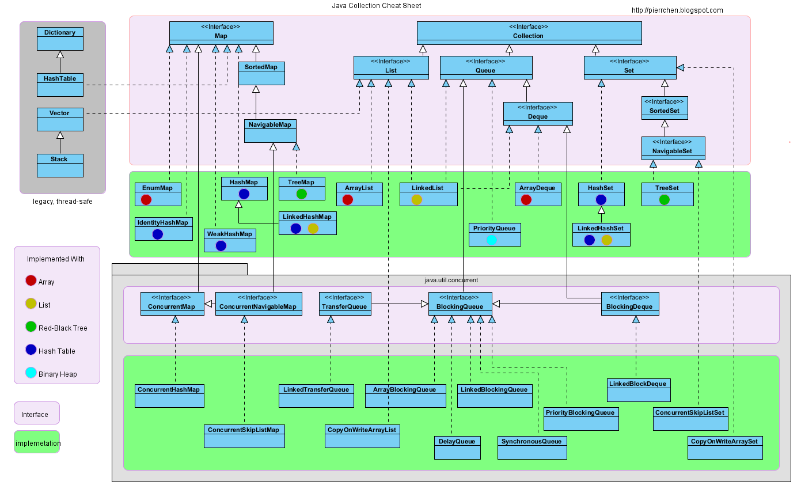
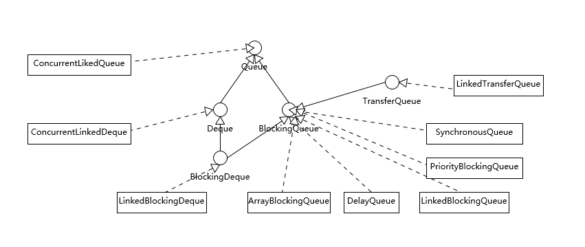
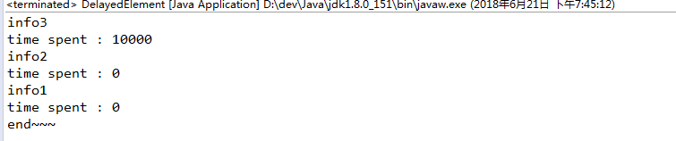
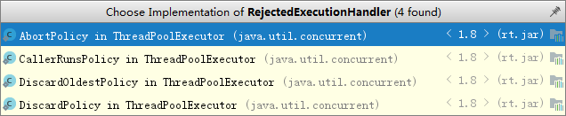
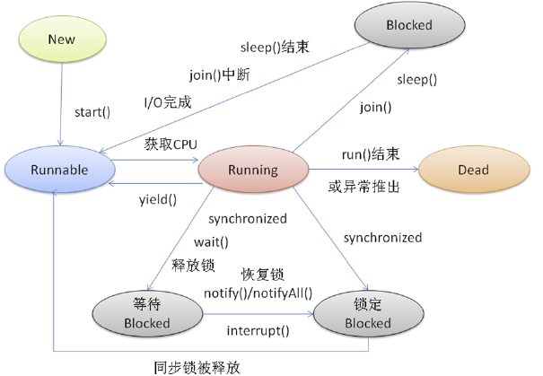
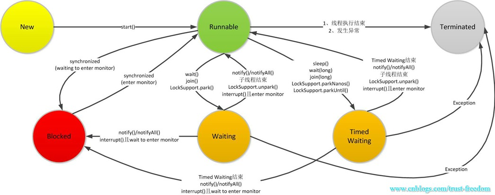
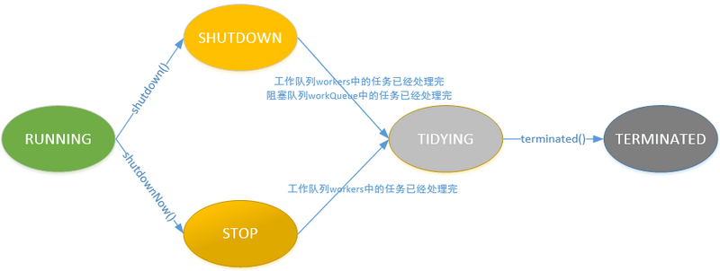
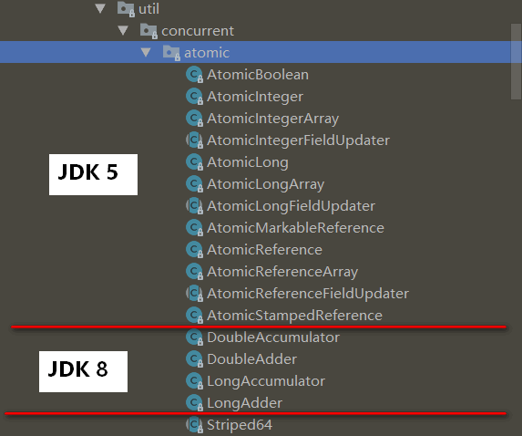

shi

https://blog.csdn.net/Holmofy/article/details/82714665

### java集合

#### 1. [java集合类图](https://blog.csdn.net/QiMinghao/article/details/78205924)

   

> 在这里，集合类分为了实现**Map**接口和**Collection**接口两个大的类别，Collection是Iterable子类。   
>
> 处于图片左上角的那一块灰色里面的四个类（**Dictionary**、**HashTable**、  **Vector**、**Stack**）都是**线程安全**的，可是它们都是JDK的老的遗留类。如今基本都不怎么使用了，都有了相应的取代类：
>
> 当中**Map接口**是用来取代图片中左上角的那个**Dictionary抽象类**   
> 对于**HashTable**，官方推荐**ConcurrentHashMap**来取代；   
> **Vector**是**List接口**的一个实现类。  

#### 2.常用集合类说明

##### 1.依照**实现接口**分类：

实现Map接口的有：EnumMap、IdentityHashMap、HashMap、LinkedHashMap、WeakHashMap、TreeMap 
实现List接口的有：ArrayList、LinkedList   
实现Set接口的有：HashSet、LinkedHashSet、TreeSet   
实现Queue接口的有：PriorityQueue、LinkedList、ArrayQueue  

##### 2.依据**底层实现的数据结构**分类：

底层以数组的形式实现：EnumMap、ArrayList、ArrayQueue   
底层以链表的形式实现：LinkedHashSet、LinkedList、LinkedHashMap   
底层以hash table的形式实现：HashMap、HashSet、LinkedHashMap、LinkedHashSet、WeakHashMap、IdentityHashMap   
底层以红黑树的形式实现：TreeMap、TreeSet   
底层以二叉堆的形式实现：PriorityQueue  

##### 3.Queue/Deque



##### 4. Queue添加删除提供了三对方法
>  Queue不提供阻塞，仅仅是个如FIFO队列（或者优先级队列）接口

add、remove，提供插入和删除元素，会抛出异常，比如add时队列空间不足，remove时队列为空  
offer和poll 提供插入和删除，不会抛出异常，offer返回true、false，poll返回元素或者null  
还有2个用于检查队列头部是否有数据：element会抛出异常，peek返回元素或者null  

##### 5. BlockingQueue生产消费提供了5对方法
> BlockingQueue提供了额外的2对阻塞的方法  

其他同Queue一样，额外提供了2对阻塞方法  
put、take 生产和消费，一直等待  
offer(e,time,unit),poll(time,unit) 生产和消费 ，  
	这里注意生产超时返回的是false，只有打断或者其他才会异常。
	消费超时返回null
说明：

两个接口都集成自Collection，其中Deque集成了Queue
```java
public interface Queue<E> extends Collection<E>
public interface Deque<E> extends Queue<E>
```
Queue的子接口：`BlockingDeque<E>`, `BlockingQueue<E>`, `Deque<E>`

​	非juc包下子类：LinkedList、PriorityQueue

Deque的子接口：`BlockingDeque<E>`

​	非juc包下子类：ArrayDeque、LinkedList

其中`BlockingDeque<E>`, `BlockingQueue<E>`这2个接口在`java.util.concurrent`中定义。

**以下均在`java.util.concurrent`中定义：**

1. **BlockingQueue接口的子类：**
   - BlockingDeque
   - TransferQueue

2. **BlockingQueue接口的实现类：**  
   - ArrayBlockingQueue 
   - DelayQueue
   - LinkedBlockingDeque
   - PriorityBlockingQueue
   - SynchronousQueue  
   - LinkedBlockingQueue(BlockingDeque的子类)
   - LinkedTransferQueue(TransferQueue的子类)

3. **BlockingDeque接口的实现类：**  
   - LinkedBlockingDeque

4. **TransferQueue接口的实现类：**  

   - LinkedTransferQueue

5. 并发代替：（不准确，可助理解）     
   接口：

  - ConCurrentMap接口是Map接口的并发代替
  - ConcurrentNavigableMap接口NavigableMap代替，NavigableMap是SortedMap的子接口

   实现：

  - ConcurrentHashMap 对应HashMap
  - ConcurrentSkipListMap 对应TreeMap 
  - ConcurrentSkipListSet 对应TreeSet
  - CopyOnWriteArraySet 对应HashSet
  - CopyOnWriteArrayList 对应ArrayList

  队列：

  - ConcurrentLinkedQueue

    并发单向队列队列。
ConcurrentLinkedQueue和LinkedBlockingQueue 区别：
> Concurrent 类型基于 lock-free，在常见的多线程访问场景，一般可以提供较高吞吐量。
> 而 LinkedBlockingQueue 内部则是基于锁，并提供了 BlockingQueue 的等待性方法。  
> Concurrent 类型没有类似 CopyOnWrite 之类容器相对较重的修改开销。但是，凡事都是有代价的，Concurrent 往往提供了较低的遍历一致性。你可以这样理解所谓的弱一致性，例如，当利用迭代器遍历时，如果容器发生修改，迭代器仍然可以继续进行遍历。  
>
>与弱一致性对应的，就是我介绍过的同步容器常见的行为“fail-fast”，也就是检测到容器在遍历过程中发生了修改，则抛出 ConcurrentModificationException，不再继续遍历。
>
>弱一致性的另外一个体现是，size 等操作准确性是有限的，未必是 100% 准确。与此同时，读取的性能具有一定的不确定性。

  - ConcurrentLinkedDeque

    并发双端队列。
#### 3.接口ConcurrentMap

提供线程安全和原子性保证的Map。

> 子接口有：[ConcurrentNavigableMap](https://docs.oracle.com/javase/8/docs/api/java/util/concurrent/ConcurrentNavigableMap.html)<K,V>
>
> 子类有：[ConcurrentHashMap](https://docs.oracle.com/javase/8/docs/api/java/util/concurrent/ConcurrentHashMap.html), [ConcurrentSkipListMap](https://docs.oracle.com/javase/8/docs/api/java/util/concurrent/ConcurrentSkipListMap.html)

#### 4.ConcurrentHashMap

HashMap（HashTable）的并发代替，不允许`null`用作键或值。

ConcurrentHashMap 和 java.util.HashTable 类很相似，但 ConcurrentHashMap 能够提供比 HashTable 更好的并发性能。在你从中读取对象的时候 ConcurrentHashMap 并不会把整个 Map 锁住。此外，在你向其中写入对象的时候，ConcurrentHashMap 也不会锁住整个 Map。它的内部只是把 Map 中正在被写入的部分进行锁定。

另外一个不同点是，在被遍历的时候，即使是 ConcurrentHashMap 被改动，它也不会抛 ConcurrentModificationException。尽管 Iterator 的设计不是为多个线程的同时使用。

#### 5.接口 ConcurrentNavigableMap

ConcurrentMap、NavigableMap的子类，提供SortedMap接口（TreeMap是SortedMap的子类）功能

> ```java
> public interface ConcurrentNavigableMap<K,V>
> 	extends ConcurrentMap<K,V>, NavigableMap<K,V> //NavigableMap是SortedMap的子接口
> ```
>
> 子类有：[ConcurrentSkipListMap](https://docs.oracle.com/javase/8/docs/api/java/util/concurrent/ConcurrentSkipListMap.html)

方法：
```java
NavigableSet<K>	descendingKeySet() // 返回key倒序
ConcurrentNavigableMap<K,V>	descendingMap() // 返回k-v倒序
ConcurrentNavigableMap<K,V>	headMap(K toKey) // 取头部
ConcurrentNavigableMap<K,V>	subMap(K fromKey, boolean fromInclusive, K toKey, boolean toInclusive)  // 截取一段，boolean表示是否包含端点的元素。

ConcurrentNavigableMap<K,V>	tailMap(K fromKey, boolean inclusive)  // 取后半截，默认包含头，不包含尾，true表示包含尾
```

#### 6.ConcurrentSkipListMap
`TreeMap`的并发代替。

映射根据其键的自然顺序进行排序，或者由映射创建时提供的比较器进行排序，这取决于使用的是哪个构造函数。

与大多数其他并发集合实现一样，该类不允许使用`null`元素，因为不能可靠地将null参数和返回值与缺少元素区分开来。

```java
public class ConcurrentSkipListMap<K,V>
	extends AbstractMap<K,V>
	implements ConcurrentNavigableMap<K,V>, Cloneable, Serializable
```

#### 7.ConcurrentSkipListSet

`TreeSet`的并发代替。
基于ConcurrentSkipListMap的可伸缩并发NavigableSet实现。
与大多数其他并发集合实现一样，该类不允许使用null元素，因为不能可靠地将null参数和返回值与缺少元素区分开来。

> ```java
> public class ConcurrentSkipListSet<E>
> extends AbstractSet<E>
> implements NavigableSet<E>, Cloneable, Serializable
> ```

#### 8.CopyOnWriteArrayList

`ArrayList`其中所有的变异操作（`add`，`set`等等）都是通过制作底层数组的新副本来实现的。

变异操作成本很高！当多线程遍历操作大大超过变异操作，才比ArrayList效率更高。

可以存放`null`

迭代器本身上的元素更改操作`remove`，`set`，和 `add`（这三个方法返回的是void，在该类中对应有返回值的这三个方法都是支持的。这里是迭代器的时候）不被支持，调用直接抛出这些方法 `UnsupportedOperationException`。

#### 9.CopyOnWriteArraySet

`HashSet`并发代替，内部使用CopyOnWriteArrayList，因此他们具有相同属性：

- 它最适合于设置大小通常很小的应用程序，只读操作数量远远超过可变操作，并且您需要在遍历期间防止线程之间的干扰。
- 它是线程安全的。
- 可变操作（`add`，`set`，`remove`等）是昂贵的，因为它们通常意味着复制整个底层数组。
- 迭代器不支持变异`remove`操作。
- 遍历迭代器的速度很快，不会遇到来自其他线程的干扰。迭代器在构造迭代器时依赖于不变的数组快照。

#### 10.ConcurrentLinkedQueue

#### 11.ConcurrentLinkedDeque

### 阻塞队列 BlockingQueue

#### BlockingQueue 的方法：

|      | 抛异常    | 特定值   | 阻塞   | 超时                        |
| ---- | --------- | -------- | ------ | --------------------------- |
| 插入 | add(e)    | offer(e) | put(e) | offer(e, timeout, timeunit) |
| 移除 | remove()  | poll()   | take() | poll(timeout, timeunit)     |
| 检查 | element() | peek()   |        |                             |

四组不同的行为方式解释：

1. **抛异常**：如果试图的操作无法立即执行，抛一个异常。

   > add方法在容量有限的队列添加，如果没有空间，会抛出异常，所以在使用容量受限队列时，通常最好使用offer

2. **特定值**：如果试图的操作无法立即执行，返回一个特定的值(常常是 true / false)。

3. **阻塞**：如果试图的操作无法立即执行，该方法调用将会发生阻塞，直到能够执行。

4. **超时**：如果试图的操作无法立即执行，该方法调用将会发生阻塞，直到能够执行，但等待时间不会超过给定值。返回一个特定值以告知该操作是否成功(典型的是 true / false)。
> BlockingQueue 不接收null。如果插入 null，BlockingQueue 将会抛出一个 NullPointerException。
>
> 主要用于生产者-消费者队列，但还支持集合接口。例如，可以使用remove(x)从队列中删除任意元素，但是和ArrayList效率低。

#### BlockingQueue 的实现

BlockingQueue 是个接口，你需要使用它的实现之一来使用 BlockingQueue。java.util.concurrent 具有以下 BlockingQueue 接口的实现(Java 6)：

- [ArrayBlockingQueue](http://blog.csdn.net/defonds/article/details/44021605#t7)
- [DelayQueue](http://blog.csdn.net/defonds/article/details/44021605#t8)
- [LinkedBlockingQueue](http://blog.csdn.net/defonds/article/details/44021605#t9)
- [PriorityBlockingQueue](http://blog.csdn.net/defonds/article/details/44021605#t10)
- [SynchronousQueue](http://blog.csdn.net/defonds/article/details/44021605#t11)

- LinkedBlockingDeque(这个队列同时也实现了BlockingDeque)

#### 1.ArrayBlockingQueue数组阻塞队列 

> 基于数组，大小不可变，先进先出
>
> 初始化的时候必须给定一个初始长度。

ArrayBlockingQueue 类实现了 BlockingQueue 接口。

ArrayBlockingQueue 是一个有界的阻塞队列，其内部实现是将对象放到一个数组里。有界也就意味着，它不能够存储无限多数量的元素。它有一个同一时间能够存储元素数量的上限。可以在对其初始化的时候设定这个上限，但之后就无法对这个上限进行修改了(译者注：因为它是基于数组实现的，也就具有数组的特性：一旦初始化，大小就无法修改)。

ArrayBlockingQueue 内部以 FIFO(先进先出)的顺序对元素进行存储。队列中的头元素在所有元素之中是放入时间最久的那个，而尾元素则是最短的那个。

#### 2.DelayQueue延迟队列 

> 初始化不需要给定初始长度（没有传初始容量的构造函数），默认长度是PriorityQueue的长度11。
>
> 意思是：时间到了，元素到队列头，否则，没有队列头。也就取不出东西。。。
>
> 底层使用PriorityQueue来存储元素，PriorityQueue最大个数 Integer.MAX_VALUE - 8，属于无界队列，因此DelayQueue也是无界队列。PriorityQueue扩容是当元素个数小于64个，则翻一倍+2，当元素大于64个，比较大的队列，则每次增加50%
>
> ```java
> int newCapacity = oldCapacity + ((oldCapacity < 64) ?
>                                  (oldCapacity + 2) :
>                                  (oldCapacity >> 1));
> ```
>

```java
public class DelayQueue<E extends Delayed> extends AbstractQueue<E>
	implements BlockingQueue<E>
```

Delayed 元素，里面存的元素需要实现Delayed接口

```java
public interface Delayed extends Comparable<Delayed>
```

这个队列里面放Delay元素，Delayed是个接口，里面需要实现2个方法：
```shell
long getDelay   # 用于返回一个等待时间，只有时间到了，才能从这个队列中取出元素。
int compareTo   # 用于DelayQueue内部取出元素的顺序排列。
```
Delayed 元素的一个无界阻塞队列，只有在延迟期满时才能从中提取元素。该队列的头部 是延迟期满后保存时间最长的 Delayed 元素。如果延迟都还没有期满，则队列没有头部，并且 poll 将返回 null。当一个元素的 getDelay(TimeUnit.NANOSECONDS) 方法返回一个小于等于 0 的值时，将发生到期。即使无法使用 take 或 poll 移除未到期的元素，也不会将这些元素作为正常元素对待。例如，size 方法同时返回到期和未到期元素的计数。此队列不允许使用 null 元素。

如下例子，只有第一个元素是需要等10秒的，其他元素并不需要，看下面列子的输出

```java
import java.util.concurrent.DelayQueue;
import java.util.concurrent.Delayed;
import java.util.concurrent.TimeUnit;

public class DelayedElement implements Delayed {

    private String info;
    private int num;

    public DelayedElement(String info, int num) {
        this.info = info;
        this.num = num;
    }

    long s = (System.currentTimeMillis() + 10000);

    public void info() {
        System.out.println(info);
    }

    @Override
    public long getDelay(TimeUnit unit) {
        // 使用当前时间+时间，是为了和下面的return单位保持一直，如果直接范围return 4000L，会等很久。
        return (s - System.currentTimeMillis());
        //使用下面这个报错，unit.convert用于将L类型的数值转为后面这个单位，这里使用无法生效
        // return unit.convert(4000L, TimeUnit.SECONDS);
    }

    @Override
    public int compareTo(Delayed o) {
        // 用于排序，这样就能取出对应的值。这里如果返回数值大的，正序
        return -(this.num - ((DelayedElement) o).num);
    }

    public static void main(String[] args) throws Exception {

        DelayQueue<DelayedElement> queue = new DelayQueue<DelayedElement>();

        DelayedElement element = new DelayedElement("info1", 10);
        DelayedElement element1 = new DelayedElement("info2", 11);
        DelayedElement element3 = new DelayedElement("info3", 12);

        queue.add(element3);
        queue.add(element1);
        queue.add(element);

        while (queue.size() != 0) {
            long startTime = System.currentTimeMillis();
            DelayedElement element2 = queue.take();
            element2.info();
            long endTime = System.currentTimeMillis();
            System.out.println("time spent : " + (endTime - startTime));
        }
        System.out.println("end~~~");
    }
}
```

 输出：



#### 3.LinkedBlockingQueue链阻塞队列

> LinkedBlockingDeque() //这里默认是Integer.MAX_VALUE
> LinkedBlockingDeque(Collection<? extends E> c)
> LinkedBlockingDeque(int capacity)
>
> 内部有个class Node<E> 链表结构来存放数据

先进先出队列，长度没有限制，最长[Integer.MAX_VALUE](mk:@MSITStore:E:\API帮助文档\JDK_API_1_6_zh_CN.CHM::/java/lang/Integer.html#MAX_VALUE).或者创建的时候指定默认长度。

链接队列的吞吐量通常要高于基于数组ArrayBlockingQueue的队列，但是在大多数并发应用程序中，其可预知的性能要低。

#### 4.PriorityBlockingQueue具有优先级的阻塞队列

> 默认长度11，最大Integer.MAX_VALUE
>
> 底层使用transient Object[] queue存放元素，序列化的时候使用PriorityQueue<E>存放。
>
> 存储的对象实现Comparable或者传入一个比较器Comparator
>
> 使用Iterator遍历不保证顺序

所有插入到 PriorityBlockingQueue 的元素必须实现 java.lang.Comparable 接口。因此该队列中元素的排序就取决于你自己的 Comparable 实现。

注意 PriorityBlockingQueue 对于具有相等优先级(compare() == 0)的元素并不强制任何特定行为。

使用迭代器遍历，不保证优先级输出。

#### 5.SynchronousQueue同步队列

> 没有容量，容量为0，使用transfer，直接插入就直接操作。
>
> 底层使用class Transferer<E>内部类来操作单个元素。
>
> 如put添加元素源码：
>
> ```java
> public void put(E e) throws InterruptedException {
>     if (e == null) throw new NullPointerException();
>     if (transferer.transfer(e, false, 0) == null) {
>         Thread.interrupted();
>         throw new InterruptedException();
>     }
> }
> ```

同时只能够容纳单个元素，每个插入操作必须等待另一个线程的对应移除操作 ，反之亦然。

非常适合于传递性设计，在这种设计中，在一个线程中运行的对象要将某些信息、事件或任务传递给在另一个线程中运行的对象，它就必须与该对象同步。

### TransferQueue

> 该类的方法，在SynchronousQueue 作为内部类被使用，该接口的实现类(jdk7)只有LinkedTransferQueue
>
> 是一个同消费者绑定的类。消费者阻塞时，通过该队列能获取到瞬时状态下的消费者数量。
>
>

TransferQueue可能是有用的，例如在消息传递应用程序中，生产者有时(使用方法transfer(E))通过调用take或poll来等待元素的接收，而在其他时候(通过方法put)排队而不等待接收。

```java
getWaitingConsumerCount() :获取等待中的消费者，返回的是瞬时状态

hasWaitingConsumer()：是否有消费者在等待，仅判断是否有消费者，该方法比getWaitingConsumerCount效率更高

transfer(E e) ：没有消费者会被阻塞，数据会进入到队尾部，直到有消费者消费。

tryTransfer(E e):若当前存在一个正在等待获取的消费者线程，则该方法会即刻转移e，并返回true;
若不存在则返回false，但是并不会将e插入到队列中。这个方法不会阻塞当前线程，要么快速返回true，要么快速返回false。

tryTransfer(E e, long timeout, TimeUnit unit) :若当前存在一个正在等待获取的消费者线程，会立即传输给它; 否则将元素e插入到队列尾部，并且等待被消费者线程获取消费掉。若在指定的时间内元素e无法被消费者线程获取，则返回false，同时该元素从队列中移除。
```

#### 6.LinkedTransferQueue

> 无界阻塞队列，内部类Node存放数据，链表结构。
>
> 构造函数：
>
> public LinkedTransferQueue() { }
>
> public LinkedTransferQueue(Collection<? extends E> c) {
> ​    this();
> ​    addAll(c);
> }
>
> [Doug Lea说](http://cs.oswego.edu/pipermail/concurrency-interest/2009-February/005888.html)从功能角度来讲，LinkedTransferQueue实际上是ConcurrentLinkedQueue、SynchronousQueue（公平模式）和LinkedBlockingQueue的超集。而且LinkedTransferQueue更好用，因为它不仅仅综合了这几个类的功能，同时也提供了更高效的实现。

该队列能实现，transfer生产者等待消费者来消费，如果没有消费者，元素也可以进入队列中，指定时间内没有消费者出现，则自动删除进入队列的元素。

tryTransfer(E e)若当前存在一个正在等待获取的消费者线程，则该方法会即刻转移e，并返回true;
 若不存在则返回false，但是并不会将e插入到队列中。这个方法不会阻塞当前线程，要么快速返回true，要么快速返回false。

 tryTransfer(E e, long timeout, TimeUnit unit) 若当前存在一个正在等待获取的消费者线程，会立即传输给它; 
 否则将元素e插入到队列尾部，并且等待被消费者线程获取消费掉。若在指定的时间内元素e无法被消费者线程获取，则返回false，同时该元素从队列中移除。

源码解析参考：[J.U.C之阻塞队列：LinkedTransferQueue](https://blog.csdn.net/zhxdick/article/details/78149726)
测试案例：

```java
public class LTQ {
    static TransferQueue<String> queue = new LinkedTransferQueue<>();

    public static void main(String[] args) throws InterruptedException {
        new Productor(1).start();
        Thread.sleep(3000);
        System.out.println("over.size=" + queue.size()); // 1
//        String take = queue.take();
//        System.out.println(take);
        System.out.println("over.size=" + queue.size());//  0
    }

    static class Productor extends Thread {
        private int id;

        public Productor(int id) {
            this.id = id;
        }

        @Override
        public void run() {
            String result = "id=" + this.id;
            System.out.println("begin to produce." + result);
            try {
              // 没有消费者会被阻塞，数据会入队
//            queue.transfer(result); 
              // 没有消费者，不会被阻塞，返回false，数据不会入队
//            boolean resp = queue.tryTransfer(result);  
              // 指定时间内等待消费者来消费，数据先入队，时间到了，没有消费者，则删除入队的数据
              boolean resp = queue.tryTransfer(result,5, TimeUnit.SECONDS);  
            } catch (InterruptedException e) {
                e.printStackTrace();
            }
            System.out.println("success to produce." + result);
        }
    }
}
```
### BlockingDeque阻塞双端队列 

#### BlockingDeque 的方法

BlockingDeque 具有 4 组不同的方法用于插入、移除以及对双端队列中的元素进行检查。如果请求的操作不能得到立即执行的话，每个方法的表现也不同。这些方法如下：

|      | 抛异常        | 特定值        | 阻塞        | 超时                             |
| ---- | ------------- | ------------- | ----------- | -------------------------------- |
| 插入 | addFirst(e)   | offerFirst(e) | putFirst(e) | offerFirst(e, timeout, timeunit) |
| 移除 | removeFirst() | pollFirst()   | takeFirst() | pollFirst(timeout, timeunit)     |
| 检查 | getFirst()    | peekFirst()   |             |                                  |

|      | 抛异常       | 特定值       | 阻塞       | 超时                            |
| ---- | ------------ | ------------ | ---------- | ------------------------------- |
| 插入 | addLast(e)   | offerLast(e) | putLast(e) | offerLast(e, timeout, timeunit) |
| 移除 | removeLast() | pollLast()   | takeLast() | pollLast(timeout, timeunit)     |
| 检查 | getLast()    | peekLast()   |            |                                 |

#### LinkedBlockingDeque链阻塞双端队列

```java
import java.util.concurrent.LinkedBlockingDeque;

public class BlockingDeque {

    public static void main(String[] args) throws InterruptedException {
        LinkedBlockingDeque<String> deque = new LinkedBlockingDeque<String>();
        deque.addFirst("1");
        deque.addLast("2");
        String twoString = deque.takeLast();
        String oneString = deque.takeFirst();
        System.out.println(twoString + "===" + oneString);

        new Thread(() -> {

            try {
                System.out.println("thread sleeping...");
                Thread.sleep(5000);
                System.out.println("thread awake...");
                deque.add("3");
            } catch (InterruptedException e) {
                e.printStackTrace();
            }
        }).start();
        System.out.println("start main...blocking...");
        String threeString = deque.takeLast();
        System.out.println(threeString);

    }
}
```

### JUC同步器

> 五个类有助于共同的专用同步习语。
>
> - [`Semaphore`](https://docs.oracle.com/javase/8/docs/api/java/util/concurrent/Semaphore.html) 是一种经典的并发工具。
> - [`CountDownLatch`](https://docs.oracle.com/javase/8/docs/api/java/util/concurrent/CountDownLatch.html) 是一个非常简单但非常常见的阻塞功能，直到给定数量的信号，事件或条件成立。
> - A [`CyclicBarrier`](https://docs.oracle.com/javase/8/docs/api/java/util/concurrent/CyclicBarrier.html)是可复位的多路同步点，在某些并行编程风格中很有用。
> - A [`Phaser`](https://docs.oracle.com/javase/8/docs/api/java/util/concurrent/Phaser.html)提供了更灵活的屏障形式，可用于控制多个线程之间的分阶段计算。
> - An [`Exchanger`](https://docs.oracle.com/javase/8/docs/api/java/util/concurrent/Exchanger.html)允许两个线程在集合点交换对象，并且在多个管道设计中很有用。

#### 闭锁 CountDownLatch

一个同步辅助类，在完成一组正在其他线程中执行的操作之前，它允许一个或多个线程一直等待。

用给定的计数 初始化 CountDownLatch。由于调用了 [countDown()](mk:@MSITStore:E:\API帮助文档\JDK_API_1_6_zh_CN.CHM::/java/util/concurrent/CountDownLatch.html#countDown()) 方法，所以在当前计数到达零之前，[await](mk:@MSITStore:E:\API帮助文档\JDK_API_1_6_zh_CN.CHM::/java/util/concurrent/CountDownLatch.html#await()) 方法会一直受阻塞。之后，会释放所有等待的线程，[await](mk:@MSITStore:E:\API帮助文档\JDK_API_1_6_zh_CN.CHM::/java/util/concurrent/CountDownLatch.html#await()) 的所有后续调用都将立即返回。这种现象只出现一次——计数无法被重置。如果需要重置计数，请考虑使用`CyclicBarrier`。

> CountDownLatch调用await阻塞，await后续的代码，直到线程调用latch.countDown将latch置为0。
>
> latch.countDown后续的代码并不会阻塞。
>
> CyclicBarrier也是阻塞await后续的代码。直到指定个数调用await，然后继续执行await后面的代码，同时执行CyclicBarrier构造函数中的指定的线程。

定义2个工人，工人工作都完成了，主线程再打印“工作完成”：

```java
public class TestCountDownLatch {
    final  static SimpleDateFormat sdf = new SimpleDateFormat("yyyy-MM-dd HH:mm:ss");

    public static void main(String[] args) {
        //两个人的协作
        CountDownLatch latch = new CountDownLatch(2);
        Worker worker1 = new Worker("aa",5000,latch);
        Worker worker2  =new Worker("bb",8000,latch);
        worker1.start();
        worker2.start();
        try {
            //等待所有工作完成工作
            latch.await();
        } catch (InterruptedException e) {
            e.printStackTrace();
        }
        System.out.println("all work done at "+sdf.format(new Date()));

    }
    static class Worker extends Thread {
        String workerName;
        int workTime;
        CountDownLatch latch;

        public Worker(String workerName, int workTime, CountDownLatch latch) {
            this.workerName = workerName;
            this.workTime = workTime;
            this.latch = latch;
        }

        private void doWork() {
            try {
                Thread.sleep(workTime);
            } catch (InterruptedException e) {
                e.printStackTrace();
            }
        }

        @Override
        public void run() {
            System.out.println("Worker :"+workerName+" ,do work begin at "+sdf.format(new Date()));
            doWork();
            System.out.println("Worker :"+workerName+" ,do work complete at "+sdf.format(new Date()));
            //工作完成工作，计算器减一，如果有try-catch，latch.countDown建议放在finally执行。
            latch.countDown();;
        }
    }
}
```

再来一个案例：

```java
//Driver是一个启动信号，driver可以执行一系列工作，然后执行worker，所有worker执行完毕，再继续执行driver
public class CountDownLatchDriver {
    public static void main(String[] args) throws InterruptedException {
        CountDownLatch startSignal = new CountDownLatch(1);
        CountDownLatch doneSignal = new CountDownLatch(5);
        for (int i = 0; i < 5; i++) {
            //线程启动会执行startSignal.await, doneSignal.countDown
            new Thread(new Worker(startSignal,doneSignal)).start();
        }
        //driver先执行一系列工作，然后再执行worker
        Thread.sleep(5000);
        System.out.println("driver可以设置一系列的准备工作，然后打开worker工作信号，让worker干活");
        startSignal.countDown();
        doneSignal.await();
        System.out.println("所有worker执行完毕后进入等待，driver等待所有worker执行完毕后，再执行后续");
        System.out.println("CountDownLatch测试 all finish");

        //这里用CycliBarrier来改写，效果一样
        System.out.println("使用CycliBarrier来改写");
        CyclicBarrier startSignalCyclicBarrier = new CyclicBarrier(1);
        CyclicBarrier doneSignalCyclicBarrier = new CyclicBarrier(5,()->{
            System.out.println("所有worker执行完毕后进入等待，driver等待所有worker执行完毕后，再执行后续");
            System.out.println(" CyclicBarrier all finish");
            System.out.println("Driver后续操作！！！");
        });
        for (int i = 0; i < 5; i++) {
            //线程启动会执行startSignal.await, doneSignal.countDown
            new Thread(new CycliBarraierWorker(startSignalCyclicBarrier, doneSignalCyclicBarrier)).start();
        }

    }
    static class Worker implements Runnable{
        private final CountDownLatch startSignal;
        private final CountDownLatch doneSignal;

        public Worker(CountDownLatch startSignal, CountDownLatch doneSignal) {
            this.startSignal = startSignal;
            this.doneSignal = doneSignal;
        }

        @Override
        public void run() {
            try {
                startSignal.await();
                doWork(500);
            } catch (InterruptedException e) {
                e.printStackTrace();
            }finally {
                doneSignal.countDown();
            }
        }
        private void doWork(int waitTime){
            System.out.println("start work...");
            System.out.println("end work...");
        }
    }
    static class CycliBarraierWorker implements Runnable {
        private final CyclicBarrier startSignal;
        private final CyclicBarrier doneSignal;

        public CycliBarraierWorker(CyclicBarrier startSignal, CyclicBarrier doneSignal) {
            this.startSignal = startSignal;
            this.doneSignal = doneSignal;
        }

        @Override
        public void run() {
            try {
                //启动信号等待，等driver啥时候准备好了，打开启动信号，再开始干活
                startSignal.await();
                //开始干活
                doWork(500);
                //执行完毕后等待其他CycliBarraierWorker队友
                doneSignal.await();
            } catch (InterruptedException e) {
                e.printStackTrace();
            } catch (BrokenBarrierException e) {
                e.printStackTrace();
            }
            //执行后续部分
            System.out.println("cyclicBarrier worker后续 部分执行");
        }
        public void doWork(int waitTime) {
            System.out.println("start work...");
            System.out.println("end work...");
        }
    }
}
```

#### 栅栏 CyclicBarrier

彼此等待，可以循环使用（一波await之后，不用任何操作，再一波await又有阻塞效果），所以称为Cyclic barrier屏障

线程中执行到：  barrier.await();会等到设定数量的其他线程都执行到了这里，再继续执行。有点类似map reducer中，mapper执行到一定，或设置为执行完再执行reducer。

满足以下任何条件都可以让等待 CyclicBarrier 的线程释放：

- 最后一个线程也到达 CyclicBarrier(调用 await())

- 当前线程被其他线程打断(其他线程调用了这个线程的 interrupt() 方法)

- 其他等待栅栏的线程被打断

- 其他等待栅栏的线程因超时而被释放

- 外部线程调用了栅栏的 CyclicBarrier.reset() 方法

  案例：10个线程，都到达了await方法，执行await后面部分。如果想要实现线程执行完毕，然后再执行main方法，那么需要多出一个数，，然后在main中调用`cyclicBarrier.await()`。

  > CyclicBarrier只是阻塞了await方法后续的部分代码。CountDownLatch也是阻塞await方法，两者有不同。
  >
  > CyclicBarrier阻塞是等足够数量的线程执行到await之后，然后再并发执行await后面的部分。能await多个线程。有点类似：很多分支，都到达了这里，然后放开，这些分支，继续执行，更像Phaser一个阶段一个阶段执行，但是Phaser也可以实现CountDownLatch效果。
  >
  > CountDownLatch的await只出现一次，它是等所有线程调用latch.countDown，直到latch=0，然后执行单个await线程，有点类似：很多分支，到这个点（await）之后，只有一个分支继续执行。（除非使用多个latch对象配合） 

```java
public class TestCyclicBarrier {
    private static final  int THREAD_NUM = 10;

      public static class WorkerThrad implements Runnable{
          private CyclicBarrier cyclicBarrier ;

          public WorkerThrad(CyclicBarrier cyclicBarrier) {
              this.cyclicBarrier = cyclicBarrier;
          }
          @Override
          public void run() {
              System.out.println("ID:"+ Thread.currentThread().getId()+"Worker's waiting...");
              try {
                  cyclicBarrier.await();
              } catch (InterruptedException e) {
                  e.printStackTrace();
              } catch (BrokenBarrierException e) {
                  e.printStackTrace();
              }
              System.out.println("ID:"+ Thread.currentThread().getId()+"Working");
          }
      }
    public static void main(String[] args) {
          //当有10个线程调用的await方法的时候，会执行CyclicBarrier的构造方法中定义的线程！
        CyclicBarrier cyclicBarrier = new CyclicBarrier(THREAD_NUM,()->{
            System.out.println("inside barrier..");
        });
        WorkerThrad workerThrad = new WorkerThrad(cyclicBarrier);
        for (int i=0;i<10;i++){
            new Thread(workerThrad).start();
        }
        System.out.println("main....");
    }
}
```

#### 交换机 Exchanger

API中的说明：可以在对中对元素进行配对和交换的线程的同步点。每个线程将条目上的某个方法呈现给 [exchange](../../../java/util/concurrent/Exchanger.html#exchange(V)) 方法，与伙伴线程进行匹配，并且在返回时接收其伙伴的对象。Exchanger 可能被视为 [SynchronousQueue](../../../java/util/concurrent/SynchronousQueue.html) 的双向形式。Exchanger 可能在应用程序（比如遗传算法和管道设计）中很有用。

Exchanger可以在两个线程之间交换数据，只能是2个线程，他不支持更多的线程之间互换数据。

当线程A调用Exchange对象的exchange()方法后，他会陷入阻塞状态，直到线程B也调用了exchange()方法，然后以线程安全的方式交换数据，之后线程A和B继续运行

案例：一个生产者，生成5个数，生成10次，通过exchanger把每次生产出来的数交给消费者。

```java
public class TestExchanger {
    static Random random = new Random();

    public static void main(String[] args) {
        Exchanger<List<Integer>> exchanger = new Exchanger<>();
        //如果这里有2个Exchanger则会出现阻塞！因为exchanger.exchange(list);
        // 会等待对方线程过来交换信息。信息放在exchanger方法的参数里面并且返回信息本身。
        Exchanger<List<Integer>> exchanger1 = new Exchanger<>();
        new Producer(exchanger).start();
        new Consumer(exchanger).start();
    }

    static class Producer extends Thread {
        List<Integer> list = new ArrayList<>();
        Exchanger<List<Integer>> exchanger;

        public Producer(Exchanger<List<Integer>> exchanger) {
            super();
            this.exchanger = exchanger;
        }

        @Override
        public void run() {
            for (int i = 0; i < 10; i++) {
                list.clear();
                list.add(random.nextInt(1000));
                list.add(random.nextInt(1000));
                list.add(random.nextInt(1000));
                list.add(random.nextInt(1000));
                list.add(random.nextInt(1000));
                System.out.println("第" + i + "次生成完毕，等待消费者来拿");
                try {
                    list = exchanger.exchange(list);
                } catch (InterruptedException e) {
                    e.printStackTrace();
                }
                System.out.println("消费者拿走了" + i + "次物品");
            }
        }
    }

    static class Consumer extends Thread {
        List<Integer> list = new ArrayList<Integer>();
        Exchanger<List<Integer>> exchanger;

        public Consumer(Exchanger<List<Integer>> exchanger) {
            super();
            this.exchanger = exchanger;
        }

        @Override
        public void run() {
            for (int i = 0; i < 10; i++) {
                System.out.println("消费者等10秒再拿！");
                try {
                    sleep(1000);
                    list = exchanger.exchange(list);
                } catch (InterruptedException e) {
                    e.printStackTrace();
                }
                System.out.println(list.get(0) + ",");
                System.out.println(list.get(1) + ",");
                System.out.println(list.get(2) + ",");
                System.out.println(list.get(3) + ",");
                System.out.println(list.get(4) + ",");
            }
        }
    }
}
```

#### 信号量 Semaphore

Semaphore管理者一组虚拟的许可permit，许可是初始值可通过构造函数来指定。在执行操作时首先获得许可（只要还有剩余的许可），并在使用后释放许可。如果没有许可，那么acquire将阻塞直到获得许可（或者被中断或者操作超时）。release方法将返回一个许可给信号量。

将信号量初始化为 1，使得它在使用时最多只有一个可用的许可，从而可用作一个相互排斥的锁。这通常也称为二值信号量，因为它只能有两种状态：一个可用的许可，或零个可用的许可。按此方式使用时，二进制信号量具有某种属性（与很多 [Lock](mk:@MSITStore:E:\API帮助文档\JDK_API_1_6_zh_CN.CHM::/java/util/concurrent/locks/Lock.html) 实现不同），即可以由线程释放“锁”，而不是由所有者（因为信号量没有所有权的概念）。在某些专门的上下文（如死锁恢复）中这会很有用。

相当于能控制线程池中任务个数。

任务要执行必须先获得信号许可，用完之后再释放许可，这样其他任务就能执行。当信号量初始值为1的时候，具有锁的功能

两个主要方法：

- acquire() //如果没有许可，会阻塞，可以指定获取的个数
- release()  //释放许可。可以指定释放的个数，则：总许可=剩余许可+释放的个数
- tryAcquire(int permits, long timeout, TimeUnit unit) ，这个方法会打破平衡，不遵守许可个数，不管许可是否还有，都会返回，如果有许可立即返回true（不会等待指定的timeout），如果没有许可，则等待指定时间，返回false。

信号量主要有两种用途：

1. 保护一个重要(代码)部分防止一次超过 N 个线程进入。
2. 在两个线程之间发送信号。  

案例1：每次只给2个许可，用完后释放，如果不释放，只会打印2次get acquire，其他18次阻塞
```java
public class SemaphoreTest {
    public static void main(String[] args) {
        ExecutorService executorService = Executors.newCachedThreadPool();
        final Semaphore semp = new Semaphore(2);
        for (int index = 0; index < 20; index++) {
            final int No = index;
            Runnable run = () -> {
                try {
                    System.out.println(Thread.currentThread().getName() + " : try get acquire！");
                    semp.acquire();
                    System.out.println(Thread.currentThread().getName() + " : get acquire！");
                } catch (InterruptedException e) {
                    e.printStackTrace();
                }
            };
            executorService.execute(run);
        }
        System.out.println("main start...");
        executorService.shutdown();
        System.out.println("main over~~");
    }
}
```
案例2：演示tryAcquire(1, 5, TimeUnit.SECONDS));，尝试获取许可，如有，则直接返回，否则等待参数内的时间，然后执行后面。
```java
public class SemaphoreTest {
    public static void main(String[] args) {
        ExecutorService executorService = Executors.newCachedThreadPool();
        final Semaphore semp = new Semaphore(2);
        for (int index = 0; index < 5; index++) {
            final int NO = index;
            Runnable run = () -> {
                try {
                    if (NO == 0) {
                        semp.acquire();
                    } else {
                        Long start = System.currentTimeMillis();
                        // 尝试获取许可，如果有，则不等待，直接执行了，否则等待指定的时间
                        System.out.println("打印获取tryAcquire结果" + semp.tryAcquire(1, 5, TimeUnit.SECONDS));
                        // 这里为了演示等待了多久
                        System.out.println("时间" + (System.currentTimeMillis() - start));
                    }
                    System.out.println("Accessing: " + NO);
                    Thread.sleep(3000);
                } catch (InterruptedException e) {
                    e.printStackTrace();
                }
            };
            executorService.execute(run);
        }
        System.out.println("main start...");
        executorService.shutdown();
        System.out.println("main over~~");
    }
}
```

#### Phaser阶段器

> 刚开始彻底理解错了！

可重复使用的屏障同步，在功能上类似的 [`CyclicBarrier`](https://docs.oracle.com/javase/8/docs/api/java/util/concurrent/CyclicBarrier.html)和 [`CountDownLatch`](https://docs.oracle.com/javase/8/docs/api/java/util/concurrent/CountDownLatch.html) ，但支持更灵活的使用。

phase表示阶段，party表示每个阶段的线程个数

**方法说明：**

Phaser当所有线程完成一个阶段，那么内部phase值会被加1，从0开始。Phaser和CyclicBarrier一样可以直接循环使用，但是会记录循环使用次数（阶段）。参考案例1中`run again`

第一次完成时调用onAdvence中phase的值为0.(刚开始我认为是1，其实也对，这是完成自己当前阶段时运行的)
```java
arrive() // 到达这个阶段，不阻塞，返回到达阶段号，如果终止则为负值
arriveAndAwaitAdvance() // 阻塞，等待Phaser注册的party数量线程都到达，phase加1，继续执行。
arriveAndDeregister() // 到到这个阶段，并取消注册，不阻塞。返回到达阶段号，终止则为负数。该方法相当于自己当先的线程不算已经到达，还得减去一个party数量！！！相当于party-1。
	//举例：比如在执行arriveAndDeregister()前，
    //party=3个，有2个线程已经arrive(getArrivedParties=2)
    //那么执行完这个之后，party = 2，getArrivedParties = 2。

awaitAdvance(int phase) // 到达这个阶段，阻塞，等待其他线程也到达
awaitAdvanceInterruptibly(int phase) // 等待被打断抛出异常InterruptedException
awaitAdvanceInterruptibly(int phase, long timeout, TimeUnit unit)  // 等待被打断，或超市抛出异常InterruptedException

register() // 添加一个party
bulkRegister(int parties) // 添加多个party

getRegisteredParties() //当前注册的线程数 
getArrivedParties() // 当前到达的线程数 
getUnarrivedParties() // 当前没到达的注册线程数 

getPhase() // 返回阶段号，如果party=0，那么返回负值，并且isterminated（）=true！

onAdvance(int phase, int registeredParties) // 重写改方法，当phase加1前（即将发生相位超前时执行操作）触发。返回true，则Phaser进入终止状态。 
1、当每一个阶段执行完毕，此方法会被自动调用，因此，重载此方法写入的代码会在每个阶段执行完毕时执行，相当于CyclicBarrier的barrierAction。
2、当此方法返回true时，意味着Phaser被终止，因此可以巧妙的设置此方法的返回值来终止所有线程。
```

1. **代替CountDownLatch，案例1**

> 注意：刚开始我理解错误，以为awaitAdvance(int phase)是参数和实际getPhase不相等阻塞，实际是参数和当前实际阶段相等才阻塞，反着来了！！！
>
> 其实也对，awaitAdvance阻塞的是自己的阶段，当阶段改变，那么就应该放开阻塞。
>
> 还有一个理解错误，就是arrive()并不阻塞后续代码；
>
> arriveAndAwaitAdvance() 才会等待其他线程，产生阻塞。

思路：使用arrive() 和awaitAdvance(int phase) 组合
`parth=3`，当前线程arrive()完成，调用onAdvance()之后，phase加1，main方法中调用awaitAdvance中(phase)阻塞因为phase加1而取消，继续执行后续代码
```java
public class CountDownLatchDemo {
    static Phaser phaser = new Phaser();

    public static void main(String[] args) {
        for (int i = 0; i < 3; i++) {
            new Thread(new Worker(phaser)).start();
            phaser.register();
        }
        phaser.awaitAdvance(phaser.getPhase());  
        System.out.println("main...");
    }
}
class Worker implements Runnable{
    private Phaser phaser;

    public Worker(Phaser phaser) {
        this.phaser = phaser;
    }

    @Override
    public void run() {
        System.out.println(Thread.currentThread().getName()+" : start...");
        phaser.arrive();
        System.out.println(Thread.currentThread().getName()+" : end...");
    }
}
```

2. **CyclicBarrier代替，案例2**
线程中start先全部被打印之后，然后再执行phaser.awaitAdvance(phaser.getPhase());之后的main方法中后续部分，同时打印end。问题：如果控制end也打印之后，再执行main后续代码？
```java
public class CyclicBarrierDemo {
    static Phaser phaser = new Phaser();

    public static void main(String[] args) {
        for (int i = 0; i < 3; i++) {
            new Thread(new Worker2(phaser)).start();
            phaser.register();
        }
        // 这里为了控制maini方法，在start打印之后，再和end并行执行
        phaser.awaitAdvance(phaser.getPhase());
        System.out.println("main...");
    }
}
class Worker2 implements Runnable{
    private Phaser phaser;

    public Worker2(Phaser phaser) {
        this.phaser = phaser;
    }

    @Override
    public void run() {
        System.out.println(Thread.currentThread().getName()+" : start...");
        phaser.arriveAndAwaitAdvance();
        System.out.println(Thread.currentThread().getName()+" : end...");
    }
}
```

**案例三：分阶段执行，并且重写onAdvance()方法**

```java
/**
 * 那就是boolean onAdvance(int phase, int registeredParties)方法。此方法有2个作用：
 * 1、当每一个阶段执行完毕，此方法会被自动调用，因此，重载此方法写入的代码会在每个阶段执行完毕时执行，相当于CyclicBarrier的barrierAction。
 * 2、当此方法返回true时，意味着Phaser被终止，因此可以巧妙的设置此方法的返回值来终止所有线程。
 *
 */
public class PhaseDemo {
    static Phaser phaser = new Phaser() {
        @Override
        protected boolean onAdvance(int phase, int registeredParties) {
            System.out.println("onAdvance :" + phase);
            switch (phase) {
                case 0:
                    return false;
                case 1:
                    return true;
                default:
                    return true;
            }
        }
    };

    public static void main(String[] args) {
        for (int i = 0; i < 3; i++) {
            new Thread(new PhaseWork(phaser)).start();
            phaser.register();
        }
        System.out.println("main...");
    }
}

class PhaseWork implements Runnable {
    private Phaser phaser;

    public PhaseWork(Phaser phaser) {
        this.phaser = phaser;
    }

    @Override
    public void run() {
        Random random = new Random();
        try {
            /**
             * 如果不加打印，会因为打印IO的原因，导致first和second也被串掉。
             * 实际执行是按照顺序：first->second->third/four
             * (这2个并行，因为Phaser在onAdvance中返回true，状态被终止了)
             */
            System.out.println(Thread.currentThread().getName() + " : first phase");
            Thread.sleep(random.nextInt(100));
            phaser.arriveAndAwaitAdvance();
            Thread.sleep(random.nextInt(100));
            System.out.println(Thread.currentThread().getName() + " : second phase");
            phaser.arriveAndAwaitAdvance();
            Thread.sleep(random.nextInt(100));
            System.out.println(Thread.currentThread().getName() + " : third phase");
            phaser.arriveAndAwaitAdvance();
            Thread.sleep(random.nextInt(100));
            System.out.println(Thread.currentThread().getName() + " : four phase");
        } catch (InterruptedException e) {
            e.printStackTrace();
        }
    }
}
```

**案例4：arriveAndDeregister（）,party减一，arriveParties不变**

> 后续添加party使用register，或者bulkRegister方法
>
> 注：如果party数量=0，那么Phaser.isTerminated()为true，并且Phaser.getPhase() 返回负值！！

```java
public class DeRegisterDemo {
    static Phaser phaser = new Phaser(4){
        @Override
        protected boolean onAdvance(int phase, int registeredParties) {
            System.out.println("execute onAdvance！！！");
            return super.onAdvance(phase, registeredParties);
        }
    };

    public static void main(String[] args) throws InterruptedException {

        new Thread(new DeRegisterTask(phaser), "my1").start();
        Thread.sleep(100);
        System.out.println(phaser.getPhase() + "==" + phaser.getRegisteredParties() + "==" + phaser.getArrivedParties() + "==" + phaser.getUnarrivedParties());

        new Thread(new DeRegisterTask(phaser, true), "my2").start();
        //new Thread(new DeRegisterTask(phaser, true),"my2-1").start();
        //new Thread(new DeRegisterTask(phaser, true),"my2-2").start();
        Thread.sleep(100);
        System.out.println(phaser.getPhase() + "==" + phaser.getRegisteredParties() + "==" + phaser.getArrivedParties() + "==" + phaser.getUnarrivedParties());

        new Thread(new DeRegisterTask(phaser), "my3").start();
        Thread.sleep(100);
        System.out.println(phaser.getPhase() + "==" + phaser.getRegisteredParties() + "==" + phaser.getArrivedParties() + "==" + phaser.getUnarrivedParties());

        new Thread(new DeRegisterTask(phaser), "my4").start();
        Thread.sleep(100);
        System.out.println(phaser.getPhase() + "==" + phaser.getRegisteredParties() + "==" + phaser.getArrivedParties() + "==" + phaser.getUnarrivedParties());

        new Thread(new DeRegisterTask(phaser), "my5").start();
        Thread.sleep(100);
        System.out.println(phaser.getPhase() + "==" + phaser.getRegisteredParties() + "==" + phaser.getArrivedParties() + "==" + phaser.getUnarrivedParties());

        new Thread(new DeRegisterTask(phaser), "my6").start();
        Thread.sleep(100);
        System.out.println(phaser.getPhase() + "==" + phaser.getRegisteredParties() + "==" + phaser.getArrivedParties() + "==" + phaser.getUnarrivedParties());

        new Thread(new DeRegisterTask(phaser), "my7").start();
        phaser.awaitAdvance(phaser.getPhase());

        System.out.println("main...");
    }
}

class DeRegisterTask implements Runnable {
    private Phaser phaser;
    private boolean flag = false;

    public DeRegisterTask(Phaser phaser, boolean flag) {
        this.phaser = phaser;
        this.flag = flag;
    }

    public DeRegisterTask(Phaser phaser) {
        this.phaser = phaser;
    }

    @Override
    public void run() {
        try {
            System.out.println(Thread.currentThread().getName() + " : start");
            if (flag) {
                System.out.println("arriveAndDeregister  ======"+phaser.arriveAndDeregister());
            } else {
                phaser.arrive();
            }
            Thread.sleep(new Random().nextInt(100));
            System.out.println(Thread.currentThread().getName() + " : end");
        } catch (Exception e) {

        }
    }
}

```


### ExecutorService 执行器使用

**简要说明：**

1. 使用Executors来创建线程池对象，返回值是ExecutorService。

2. ExecutorService是ThreadPoolExecutor的父类，ThreadPoolExecutor用于自定义线程池。

3. Callable接口和Runnable用法一样，不同的是Callable有一个返回值，返回值可以用Feture来接收。

4. 线程池中的使用executorService.execute(new Task())或者Future<String> future1 = executorService.submit(new CallableTask())来执行任务。

5. 线程池停止任务：executorService.shutdownNow();  （比如多个线程在执行的时候其中一个失败，则整个失败，就可以用这个方法来停止线程池的继续执行）

java.util.concurrent 包提供了 ExecutorService 接口的以下实现类：

- [ThreadPoolExecutor](http://blog.csdn.net/defonds/article/details/44021605#t53)
- [ScheduledThreadPoolExecutor](http://blog.csdn.net/defonds/article/details/44021605#t55)

**有几种不同的方式来将任务委托给 ExecutorService 去执行：**

- execute(Runnable)
- submit(Runnable) //返回Feture只能检查是否运行完成
- submit(Callable) //返回Feture，因为Callable是有返回值的v call（）
- invokeAny(...)//返回其中任意一个，其他取消执行
- invokeAll(...)//所有返回

```java
/**
 * Callable任务
 */

  public class CallableTask implements Callable<String> {

    @Override
    public String call() throws Exception {
        Thread.currentThread().sleep(3000);
        return String.valueOf(new Random().nextInt(10));
    }
}
@Test

  public void test5() {
    ExecutorService executorService = Executors.newFixedThreadPool(2);  //只会有2个固定线程。

    Future<String> future = executorService.submit(new CallableTask());
    Future<String> future1 = executorService.submit(new CallableTask());
    Future<String> future2 = executorService.submit(new CallableTask());
    Future<String> future3 = executorService.submit(new CallableTask());

    try {

        System.out.println(future.get());
        System.out.println(future1.get());
        System.out.println(future2.get());
        System.out.println(future3.get());
        System.out.println("over");

    } catch (InterruptedException | ExecutionException e) {
        System.out.println(e);
    } finally {
        executorService.shutdown();
    }
}
```

####  6种线程池

```java
ExecutorService executorService = Executors.newCachedThreadPool();
Executors.newSingleThreadExecutor();
Executors.newFixedThreadPool(5);
Executors.newScheduledThreadPool(5);
Executors.newSingleThreadScheduledExecutor();

Executors.newWorkStealingPool();
```

注：（严格来讲是5中，因为单线程定时任务，只是定时线程池中长度设置为1）

线程池newCachedThreadPool

> 使用的是[SynchronousQueue](#_同步队列_SynchronousQueue)队列, 该队列只能寸1个元素，所以意味着每次来一个新任务都将创建一个新的线程。所以过渡添加线程容易OOM。

newSingleThreadExecutor、newFixedThreadPool

> 使用的是LinkedBlockingQueue

newScheduledThreadPool、newSingleThreadScheduledExecutor

>  使用ScheduledThreadPoolExecutor类中自定义内部类DelayedWorkQueuq队列

newWorkStealingPool

> 使用ForkJoinPool构建的线程池,内部自定义WorkQueue队列

#### 1.newSingleThreadExecutor单任务线程池

创建一个单线程的线程池。这个线程池只有一个线程在工作，也就是相当于单线程串行执行所有任务。如果这个唯一的线程因为异常结束，那么会有一个新的线程来替代它。此线程池保证所有任务的执行顺序按照任务的提交顺序执行。

#### 2.newFixedThreadPool

创建固定大小的线程池。每次提交一个任务就创建一个线程，直到线程达到线程池的最大大小。线程池的大小一旦达到最大值就会保持不变，如果某个线程因为执行异常而结束，那么线程池会补充一个新线程。

#### 3.newCachedThreadPool

创建一个可缓存的线程池。如果线程池的大小超过了处理任务所需要的线程，

那么就会回收部分空闲（60秒不执行任务）的线程，当任务数增加时，此线程池又可以智能的添加新线程来处理任务。此线程池不会对线程池大小做限制，线程池大小完全依赖于操作系统（或者说JVM）能够创建的最大线程大小。

#### 4.newScheduledThreadPool

创建一个大小无限的线程池。此线程池支持定时以及周期性执行任务的需求。

```java
ScheduledExecutorService scheduledExecutorService = Executors.newScheduledThreadPool(10);  
//固定时间每隔多久执行一次，如果到点了，原先的还没执行完毕，则会等待（任务，延迟开始开始，时间间隔，单位）  
scheduledExecutorService.scheduleAtFixedRate(new TaskShedule(), 0, 5L, TimeUnit.SECONDS);  
//当前的执行完毕后，间隔多久开始执行（任务，延迟开始时间，下一个启动需要间隔多久，单位）   
scheduledExecutorService.scheduleWithFixedDelay(new TaskShedule(),0,5L,TimeUnit.SECONDS );
```
#### 5. newSingleThreadScheduledExecutor

（同newScheduledThreadPool只是限制了队列个数为1）

```java
public class ScheduledThreadPoolExecutor
        extends ThreadPoolExecutor
        implements ScheduledExecutorService 这个super是ThreadPoolExecutor的构造方法，自定义了DelayedWorkQueue队列。
```

在ScheduledThreadPoolExecutor自定义了内部类DelayedWorkqueue队列。

只有一个线程，用来调度执行将来的任务，代码：Executors.newSingleThreadScheduledExecutor()

#### 6.newWorkStealingPool

> 底层工作窃取算法，每个线程都有一个自己的WorkQueue双端队列
>
> push/pop（塞任务）只能被队列的所有者线程调用，而poll（从头部开始消费）可以被其他线程调用。
>
> 默认情况，自己的队列中任务自己消费，当自己把任务全部执行完毕，就从其他线程的队列中偷取任务来执行（也就是poll可以被其他线程调用）

使用ForkJoinPool构建的线程池。

所有的线程都是守护线程，main方法退出，线程退出。

支持大任务分解成小任务的线程池，这是Java8新增线程池，通常配合ForkJoinTask接口的子类RecursiveAction或RecursiveTask使用。适用于大耗时的操作。

内部实现WorkQueue来存放线程。

```java
new ForkJoinPool
            (Runtime.getRuntime().availableProcessors(),
             ForkJoinPool.defaultForkJoinWorkerThreadFactory,
             null, true);
```

```java
ForkJoinPool executor = (ForkJoinPool)Executors.newWorkStealingPool();
```


### ThreadPoolExecutor

> api里面建议使用Executors来创建线程池而不是使用start去调用。
>
> 注意ThreadPoolExecutor之后需要调用shutdown()来等待所有线程执行完毕后关闭

实际生产当中建议使用ThreadPoolExecutor来手动创建，见阿里编程规范指南：

使用Executor弊端：

1. newFixedThreadPool和newSingleThreadExecutor主要问题是堆积的请求处理队列可能会耗费非常大的内存，甚至OOM。

2. newCachedThreadPool和newScheduledThreadPool主要是问题是线程数最大是Integer.MAX_VALUE，可能会创建就非常多的线程，甚至OOM

手动创建，如：

```java
//使用了org.apache.commons.lang3.concurrent.BasicThreadFactory
ThreadFactory namedThreadFactory = new BasicThreadFactory.Builder().
        namingPattern("example-schedule-pool-%d").daemon(true).build();
//创建一个周期执行的线程池
ScheduledThreadPoolExecutor scheduledThreadPoolExecutor = new ScheduledThreadPoolExecutor(1, namedThreadFactory);

//创建一个核心数5，最大数200，存活时间为0的，线程池容量最大为1024的线程池
ExecutorService pool = new ThreadPoolExecutor(5,200,0L,
        TimeUnit.MICROSECONDS,new LinkedBlockingDeque<Runnable>(1024),new ThreadPoolExecutor.AbortPolicy());
pool.execute(()-> System.out.println(Thread.currentThread().getName()));  //执行
pool.shutdown();//关闭
```

#### 1.核心和最大池大小

ThreadPoolExecutor 包含的线程池能够包含不同数量的线程。池中线程的数量由以下变量决定：

- corePoolSize
- maximumPoolSize

当线程池中数量<    corePoolSize  创建新的

当线程池中数量>     corePoolSize且都在运行，又来一个新的，则会 被创建，总量小于maximumPoolSize（没运行的时候通过存活时间去删除，直到等于corePoolSize）

#### 2.存活时间

如果池中当前有多于 corePoolSize 的线程，则这些多出的线程在空闲时间超过 keepAliveTime 时将会终止（参见 [getKeepAliveTime(java.util.concurrent.TimeUnit)](mk:@MSITStore:E:\API帮助文档\JDK_API_1_6_zh_CN.CHM::/java/util/concurrent/ThreadPoolExecutor.html#getKeepAliveTime(java.util.concurrent.TimeUnit))）。这提供了当池处于非活动状态时减少资源消耗的方法。如果池后来变得更为活动，则可以创建新的线程。也可以使用方法 [setKeepAliveTime(long, java.util.concurrent.TimeUnit)](mk:@MSITStore:E:\API帮助文档\JDK_API_1_6_zh_CN.CHM::/java/util/concurrent/ThreadPoolExecutor.html#setKeepAliveTime(long, java.util.concurrent.TimeUnit)) 动态地更改此参数。使用 Long.MAX_VALUE [TimeUnit.NANOSECONDS](mk:@MSITStore:E:\API帮助文档\JDK_API_1_6_zh_CN.CHM::/java/util/concurrent/TimeUnit.html#NANOSECONDS) 的值在关闭前有效地从以前的终止状态禁用空闲线程。默认情况下，保持活动策略只在有多于 corePoolSizeThreads 的线程时应用。但是只要 keepAliveTime 值非 0，[allowCoreThreadTimeOut(boolean)](mk:@MSITStore:E:\API帮助文档\JDK_API_1_6_zh_CN.CHM::/java/util/concurrent/ThreadPoolExecutor.html#allowCoreThreadTimeOut(boolean)) 方法也可将此超时策略应用于核心线程。

#### 3.排队

所有 [BlockingQueue](mk:@MSITStore:E:\API帮助文档\JDK_API_1_6_zh_CN.CHM::/java/util/concurrent/BlockingQueue.html) 都可用于传输和保持提交的任务。可以使用此队列与池大小进行交互：

- 如果运行的线程少于 corePoolSize，则 Executor 始终首选添加新的线程，而不进行排队。

- 如果运行的线程等于或多于 corePoolSize，则 Executor 始终首选将请求加入队列，而不添加新的线程。

- 如果无法将请求加入队列，则创建新的线程，除非创建此线程超出 maximumPoolSize，在这种情况下，任务将被拒绝。

##### 排队有三种通用策略（比较难）

（ThreadPoolExecutor构造函数中设置队列，存在2个概念队列大小和线程池大小。基于上面3点，让队列和池大小交互）

1. 直接提交。工作队列的默认选项是 [SynchronousQueue](#_同步队列_SynchronousQueue)，它将任务直接提交给线程而不保持它们。在此，如果不存在可用于立即运行任务的线程，则试图把任务加入队列将失败，因此会构造一个新的线程。此策略可以避免在处理可能具有内部依赖性的请求集时出现锁。直接提交通常要求无界 maximumPoolSizes 以避免拒绝新提交的任务。当命令以超过队列所能处理的平均数连续到达时，此策略允许无界线程具有增长的可能性。

ps:如果不希望任务在队列中等待而是希望将任务直接移交给工作线程，可使用SynchronousQueue作为等待队列。SynchronousQueue不是一个真正的队列，而是一种线程之间移交的机制。要将一个元素放入SynchronousQueue中，必须有另一个线程正在等待接收这个元素。只有在使用无界线程池或者有饱和策略时才建议使用该队列。

2. 无界队列。使用无界队列（例如，不具有预定义容量的 [LinkedBlockingQueue](mk:@MSITStore:E:\API帮助文档\JDK_API_1_6_zh_CN.CHM::/java/util/concurrent/LinkedBlockingQueue.html)）将导致在所有 corePoolSize 线程都忙时新任务在队列中等待。这样，创建的线程就不会超过 corePoolSize。（因此，maximumPoolSize 的值也就无效了。）当每个任务完全独立于其他任务，即任务执行互不影响时，适合于使用无界队列；例如，在 Web 页服务器中。这种排队可用于处理瞬态突发请求，当命令以超过队列所能处理的平均数连续到达时，此策略允许无界线程具有增长的可能性。

ps:说明：队列大小无限制，常用的为无界的LinkedBlockingQueue，使用该队列做为阻塞队列时要尤其当心，当任务耗时较长时可能会导致大量新任务在队列中堆积最终导致OOM。导致cpu和内存飙升服务器挂掉。

3. 有界队列。当使用有限的 maximumPoolSizes 时，有界队列（如 [ArrayBlockingQueue](mk:@MSITStore:E:\API帮助文档\JDK_API_1_6_zh_CN.CHM::/java/util/concurrent/ArrayBlockingQueue.html)）有助于防止资源耗尽，但是可能较难调整和控制。队列大小和最大池大小可能需要相互折衷：使用大型队列和小型池可以最大限度地降低 CPU 使用率、操作系统资源和上下文切换开销，但是可能导致人工降低吞吐量。如果任务频繁阻塞（例如，如果它们是 I/O 边界），则系统可能为超过您许可的更多线程安排时间。使用小型队列通常要求较大的池大小，CPU 使用率较高，但是可能遇到不可接受的调度开销，这样也会降低吞吐量。

> 常用的有两类，一类是遵循FIFO原则的队列如ArrayBlockingQueue与有界的LinkedBlockingQueue，另一类是优先级队列如PriorityBlockingQueue。PriorityBlockingQueue中的优先级由任务的Comparator决定。 

使用有界队列时队列大小需和线程池大小互相配合，线程池较小有界队列较大时可减少内存消耗，降低cpu使用率和上下文切换，但是可能会限制系统吞吐量。

#### 4.被拒绝的任务

> 拒绝任务的4中策略，也可以自定义，不推荐。

当 Executor 已经关闭，并且Executor 将有限边界用于最大线程和工作队列容量，且已经饱和时。

在方法 [execute(java.lang.Runnable)](mk:@MSITStore:E:\API帮助文档\JDK_API_1_6_zh_CN.CHM::/java/util/concurrent/ThreadPoolExecutor.html#execute(java.lang.Runnable)) 中提交的新任务将被拒绝。在以上两种情况下，execute 方法都将调用其 [RejectedExecutionHandler](mk:@MSITStore:E:\API帮助文档\JDK_API_1_6_zh_CN.CHM::/java/util/concurrent/RejectedExecutionHandler.html) 的 [RejectedExecutionHandler.rejectedExecution(java.lang.Runnable, java.util.concurrent.ThreadPoolExecutor)](mk:@MSITStore:E:\API帮助文档\JDK_API_1_6_zh_CN.CHM::/java/util/concurrent/RejectedExecutionHandler.html#rejectedExecution(java.lang.Runnable, java.util.concurrent.ThreadPoolExecutor)) 方法。下面提供了四种预定义的处理程序策略：（四种策略都事先RejectedExecutionHandler，定义在ThreadPoolExecutor中）



1. [ThreadPoolExecutor.AbortPolicy](mk:@MSITStore:E:\API帮助文档\JDK_API_1_6_zh_CN.CHM::/java/util/concurrent/ThreadPoolExecutor.AbortPolicy.html) ，默认拒绝策略，丢弃并直接抛出异常[RejectedExecutionException](mk:@MSITStore:E:\API帮助文档\JDK_API_1_6_zh_CN.CHM::/java/util/concurrent/RejectedExecutionException.html)。

2.  [ThreadPoolExecutor.CallerRunsPolicy](mk:@MSITStore:E:\API帮助文档\JDK_API_1_6_zh_CN.CHM::/java/util/concurrent/ThreadPoolExecutor.CallerRunsPolicy.html) ，线程调用运行该任务的 execute 本身。此策略提供简单的反馈控制机制，能够减缓新任务的提交速度。

既不抛弃任务也不抛出异常，直接运行任务的run方法（而不是start方法，相当于直接被主线程去调用），换言之将任务回退给调用者来直接运行。使用该策略时线程池饱和后将由调用线程池的主线程自己来执行任务，因此在执行任务的这段时间里主线程无法再提交新任务，从而使线程池中工作线程有时间将正在处理的任务处理完成。

源码：

```java
 public void rejectedExecution(Runnable r, ThreadPoolExecutor e) {
            if (!e.isShutdown()) {
                r.run(); // 直接调用runnable的run方法，而不是start方法
            }
        }
```


3. 在 [ThreadPoolExecutor.DiscardPolicy](mk:@MSITStore:E:\API帮助文档\JDK_API_1_6_zh_CN.CHM::/java/util/concurrent/ThreadPoolExecutor.DiscardPolicy.html) 中，不能执行的任务将被删除。（相当于直接忽略，源码里面啥也不干）

4. 在 [ThreadPoolExecutor.DiscardOldestPolicy](mk:@MSITStore:E:\API帮助文档\JDK_API_1_6_zh_CN.CHM::/java/util/concurrent/ThreadPoolExecutor.DiscardOldestPolicy.html) 中，如果执行程序尚未关闭，则位于工作队列头部的任务将被删除，然后重试执行程序（如果再次失败，则重复此过程）。

源码：

```java
public void rejectedExecution(Runnable r, ThreadPoolExecutor e) {
    if (!e.isShutdown()) {
        e.getQueue().poll();//移除Queue头部！优先级队列的话，就相当于删除了优先级最高的！
        e.execute(r);
    }
}
```

如果此时阻塞队列使用PriorityBlockingQueue优先级队列，将会导致优先级最高的任务被抛弃，因此不建议将该种策略配合优先级队列使用。

定义和使用其他种类的 [RejectedExecutionHandler](mk:@MSITStore:E:\API帮助文档\JDK_API_1_6_zh_CN.CHM::/java/util/concurrent/RejectedExecutionHandler.html) 类也是可能的，但这样做需要非常小心，尤其是当策略仅用于特定容量或排队策略时。

#### 5.线程工厂 ThreadFactory

> 自己整理

使用工程来创建现成，可以统一创建出类似的线程，如设置组，设置优先级什么的。

通过提供不同的 ThreadFactory，可以改变线程的名称、线程组、优先级、守护进程状态，等等（jdk注释在ThreadPoolExecutor类中有提到ThreadFactory说明）

案例：

```java
public class ThreadFactoryDemo implements ThreadFactory {
    @Override
    public Thread newThread(Runnable r) { //唯一需要实现的方法，该接口只有这一个方法，工厂的好处就是创建统一的线程
        Thread t = new Thread(r);
        Thread t = new Thread(new ThreadGroup("我是一个线程组"),r);
        t.setDaemon(true);   //创建线程并设置成守护线程
        return t;
    }
public class ThreadFactoryDemo implements ThreadFactory {
    @Override
    public Thread newThread(Runnable r) {
              t.setDaemon(true);
        return t;
    }

    public static void main(String[] args) {
        Runnable r = new Runnable() {
            @Override
            public void run() {
                try {
                    Thread.currentThread().sleep(3000);
                    for (int i = 0; i < 3; i++)
                        System.out.println(Thread.currentThread().getName() + "----" + Thread.currentThread().getThreadGroup() + ":::" + i);
                } catch (Exception e) {
                    e.printStackTrace();
                }

            }
        };
        ThreadFactoryDemo threadFactoryDemo = new ThreadFactoryDemo();
        Thread t = threadFactoryDemo.newThread(r);
        Thread t1 = threadFactoryDemo.newThread(r);
        Thread t2 = threadFactoryDemo.newThread(r);
        Thread t3 = new Thread(r); //不使用工厂来创建
        t.start();
        t1.start();
        t2.start();
        t3.start();
        System.out.println("over");
    }
}
```

#### 6.线程池执行监控

线程池执行完毕后，再接着执行main方法后面内容，可以使用

```java
executors.awaitTermination(2,TimeUnit.SECONDS);
```
或者通过在while循环中判断线程完成的个数：
```java
ExecutorService executors = Executors.newCachedThreadPool();

for (int i = 0; i < 100; i++) {
    executors.submit(() -> {
        people.addNum();
    });
}
ThreadPoolExecutor tpe = (ThreadPoolExecutor) executors;
while (true){
    System.out.println();

    int queueSize = tpe.getQueue().size();
    System.out.println("当前排队线程数：" + queueSize);

    int activeCount = tpe.getActiveCount();
    System.out.println("当前活动线程数：" + activeCount);

    long completedTaskCount = tpe.getCompletedTaskCount();
    System.out.println("执行完成线程数：" + completedTaskCount);

    long taskCount = tpe.getTaskCount();
    System.out.println("总线程数：" + taskCount);

    Thread.sleep(300);
    if(completedTaskCount == 100){
        System.out.println("当前完成10个任务执行");
        break;
    }
}
```

### ForkJoinPool

提示：[Fork/Join并不是一个好的框架](http://www.coopsoft.com/ar/CalamityArticle.html)

> Brian Goetz写道，[Stick a Fork In It](http://www.coopsoft.com/ar/CalamityArticle.html#references)，介绍了ParallelArray类和Fork / Join框架。他认识到这些类仅限于“聚合数据操作”的局限性。正如Brian所说，F / J框架专门用于数字运算。    

**F / J框架作为应用程序服务严重不足**  ：  
- 它仅作为嵌入式服务器提供，不支持远程对象访问，如RMI  
- 仅建议用于聚合数据操作。 
- 仅推荐用于具有非常大的数据结构的用户（大型阵列）
- 它仅适用于拥有大量处理器的机器（建议使用16+） 
- 它一次只对一个请求有用
- 它仅适用于严格限制的处理（推荐）
  - 必须是普通的（计算方法中100到10,000个基本计算步骤）
  - 仅计算密集型代码
  - 没有阻挡
  - 没有I / O.
  - 没有同步
- 它没有记录或警报
- 它没有错误/失速恢复
- 它无法显示/更改当前执行状态
- 它依赖于学术上的正确性，而不是可维护性
- 它缺乏范围
- 它的多任务是错误的
- 效率低下
- 它不能扩展到数百个处理器
- 难以理解的是复杂的
- 没有用户手册，只有JavaDoc


具体使用：

```java
// newWorkStealingPool底层使用ForkJonPool，该线程池是个守护线程池，可以调用boolean awaitTermination(long timeout, TimeUnit unit)来等待执行
ExecutorService executor = Executors.newWorkStealingPool();
```

比上面更常用的方法，返回线程池：

```java
 ForkJoinPool.commonPool().invoke(new Sorter(array, 0, array.length));
```
ForkJoinTask有2个重要的子类：
> RecursiveTask有返回值的任务  
> RecursiveAction没有返回值的任
>
> [官方文档](https://docs.oracle.com/javase/9/docs/api/java/util/concurrent/ForkJoinTask.html)给出的粗略经验是：**任务应该执行100~10000个基本的计算步骤**


#### RecursiveAction

案例：对一个大的long数组，进行值排序

> 其实从父类的名字也能看出来是：recursive递归，RecursiveTask、RecursiveAction，都是通过对一个大的任务进行拆分，大部分情况下，都是不断拆分，直到拆分成自定义的大小，进行求值。

```java
public class RecursiveActionTest {
    static class Sorter extends RecursiveAction {
        public static void sort(long[] array) {
            ForkJoinPool.commonPool().invoke(new Sorter(array, 0, array.length));
        }

        private final long[] array;
        private final int lo, hi;

        private Sorter(long[] array, int lo, int hi) {
            this.array = array;
            this.lo = lo;
            this.hi = hi;
        }

        private static final int THRESHOLD = 100;

        @Override
        protected void compute() {
            // 数组长度小于1000直接排序，如果给定的数组是1000
            if (hi - lo < THRESHOLD)
                Arrays.sort(array, lo, hi);
            else {
                int mid = (lo + hi) >>> 1;
                // 数组长度大于1000，将数组平分为两份
                // 由两个子任务进行排序
                Sorter left = new Sorter(array, lo, mid);
                Sorter right = new Sorter(array, mid, hi);
                invokeAll(left, right);
                // 排序完成后合并排序结果
                merge(lo, mid, hi);
            }
        }

        private void merge(int lo, int mid, int hi) {
            long[] buf = Arrays.copyOfRange(array, lo, mid);
            for (int i = 0, j = lo, k = mid; i < buf.length; j++) {
                if (k == hi || buf[i] < array[k]) {
                    array[j] = buf[i++];
                } else {
                    array[j] = array[k++];
                }
            }
        }
    }

    public static void main(String[] args) {
        long[] array = new Random().longs(100_0).toArray();
        Sorter.sort(array);
        System.out.println(Arrays.toString(array));
    }
}
```
#### RecursiveTask
案例：求和
```java
public class RecursiveActionTest {
    static class Sorter extends RecursiveAction {
        public static void sort(long[] array) {
            ForkJoinPool.commonPool().invoke(new Sorter(array, 0, array.length));
        }

        private final long[] array;
        private final int lo, hi;

        private Sorter(long[] array, int lo, int hi) {
            this.array = array;
            this.lo = lo;
            this.hi = hi;
        }

        private static final int THRESHOLD = 100;

        @Override
        protected void compute() {
            // 数组长度小于1000直接排序
            if (hi - lo < THRESHOLD)
                Arrays.sort(array, lo, hi);
            else {
                int mid = (lo + hi) >>> 1;
                // 数组长度大于1000，将数组平分为两份
                // 由两个子任务进行排序
                Sorter left = new Sorter(array, lo, mid);
                Sorter right = new Sorter(array, mid, hi);
                invokeAll(left, right);
                // 排序完成后合并排序结果
                merge(lo, mid, hi);
            }
        }

        private void merge(int lo, int mid, int hi) {
            long[] buf = Arrays.copyOfRange(array, lo, mid);
            for (int i = 0, j = lo, k = mid; i < buf.length; j++) {
                if (k == hi || buf[i] < array[k]) {
                    array[j] = buf[i++];
                } else {
                    array[j] = array[k++];
                }
            }
        }
    }

    public static void main(String[] args) {
        long[] array = new Random().longs(200,0,100).toArray();
        Sorter.sort(array);
        System.out.println(Arrays.toString(array));
    }
}
```

#### 注意fork()、compute()、join()的顺序

为了两个任务并行，三个方法的调用顺序需要万分注意。

> 当一个大任务被划分成两个以上的子任务时，尽可能使用前面说到的三个衍生的`invokeAll`方法，因为使用它们能避免不必要的fork()。

```java
right.fork(); // 计算右边的任务
long leftAns = left.compute(); // 计算左边的任务(同时右边任务也在计算)相当于重用了main线程，比直接调用fork更加高效，因为left.fork是提交到其他线程上去。
long rightAns = right.join(); // 等待右边的结果
return leftAns + rightAns;
```

如果我们写成：

```java
left.fork(); // 计算完左边的任务
long leftAns = left.join(); // 等待左边的计算结果
long rightAns = right.compute(); // 再计算右边的任务
return leftAns + rightAns;
```

或者

```java
long rightAns = right.compute(); // 计算完右边的任务
left.fork(); // 再计算左边的任务
long leftAns = left.join(); // 等待左边的计算结果
return leftAns + rightAns;
```

上面两种实际上都没有并行。

### Thread相关

#### 线程状态(6种)：

- [`NEW`](https://docs.oracle.com/javase/8/docs/api/java/lang/Thread.State.html#NEW)
  尚未启动的线程处于此状态。

- [`RUNNABLE`](https://docs.oracle.com/javase/8/docs/api/java/lang/Thread.State.html#RUNNABLE)（注意：调用start方法之后变为RUNNABLE而不是Running，因为Running是cpu去调用，这估计也就是为什么在源码中并没有running状态吧）
  在Java虚拟机中执行的线程处于此状态。

- [`BLOCKED`](https://docs.oracle.com/javase/8/docs/api/java/lang/Thread.State.html#BLOCKED)（阻塞，通常是因为锁）
  被阻塞等待监视器锁定的线程处于此状态。

- [`WAITING`](https://docs.oracle.com/javase/8/docs/api/java/lang/Thread.State.html#WAITING)(无限期等待)
  无限期等待另一个线程执行特定操作的线程处于此状态。

- [`TIMED_WAITING`](https://docs.oracle.com/javase/8/docs/api/java/lang/Thread.State.html#TIMED_WAITING)（限期等待）
  正在等待另一个线程执行最多指定等待时间的操作的线程处于此状态。

- [`TERMINATED`](https://docs.oracle.com/javase/8/docs/api/java/lang/Thread.State.html#TERMINATED)
  已退出的线程处于此状态。

  > **“阻塞”与“等待”的区别：**
  >
  > （1）“阻塞”状态是等待着获取到一个排他锁，进入“阻塞”状态都是被动的，离开“阻塞”状态是因为其它线程释放了锁，不阻塞了；
  >
  > （2）“等待”状态是在等待一段时间 或者 唤醒动作的发生，进入“等待”状态是主动的
  >
  > 参考：https://www.cnblogs.com/trust-freedom/p/6606594.html#top






#### 线程池状态(5种)：

- RUNNING：线程池**能够接受新任务**，以及对新添加的任务进行处理。
- SHUTDOWN：线程池**不可以接受新任务**，但是可以对已添加的任务进行处理。
- STOP：线程池**不接收新任务，不处理已添加的任务，并且会中断正在处理的任务**。
- TIDYING：当**所有的任务已终止**，ctl记录的"任务数量"为0，线程池会变为TIDYING状态。当线程池变为TIDYING状态时，会执行钩子函数terminated()。terminated()在ThreadPoolExecutor类中是空的，若用户想在线程池变为TIDYING时，进行相应的处理；可以通过重载terminated()函数来实现。
- TERMINATED：线程池**彻底终止的状态**。



线程Thread

#### 1.join方法

```java
t1.start
t1.join
t2.start
t2.join  // 只要有了join，main线程就会等执行join的这个线程执行完毕，再执行，这里是先1执行完毕，然后执行2。
// 如果代码改为2个先start，再2个join，而不是交替，则结果不可预测，而不是先1后2,而是相对main线程的join
sout("main...")
```
就会按顺序1、2执行,执行完毕，再打印main
```java
main(String[] args){
     t1.start();
     t2.start();
     t1.join(); //这种情况下t1、t2同时执行，主线程必须等t1结束才会执行，t2是否执行不关注
     main do something
}
```

#### 2.setDaemon(boolean on)

主线程结束，线程结束。需要在start前设置

#### 3.yield

能确保每个线程都有机会

```java
public void run() {
    for (int x = 0; x < 70; x++) {
        System.out.println(Thread.currentThread().toString() + "....." + x);
        Thread.yield();  //则会出现打印了1，就停一次，等会其他人，有资源了，然后又开始打印2，又停一次
    }
}
```

#### 4.wait()、notify()、notifyAll()(线程间通信)

**在同步中使用！**锁对象调用wait、notify、notifyall，而不是线程调用！

因为要对持有监视器(锁)的线程操作。所以要使用在同步中，因为只有同步才具有锁。

 

##### 为什么这些操作线程的方法要定义Object类中呢？

因为这三个方法是锁操作的，而锁可以是任意对象，所以可以被任意对象调用的方法定义Object类中。


示例1：使用wait和notify

一个生产，一个消费者，一个管道用于存放商品。

生成完毕，通知消费者去消费。生产2种物品，便于观察交替现象

该示例，只能是1个消费者，一个生成者情况，否则会出现同时多个生产者生产，多个消费者消费。

```java
class Piple {
    private String id;//id
    private String name;//name
int count = 0;//为了测试又加了一个变量，如果调用set，就自增，如果out就自减
    private boolean flag = false;//管道是否为空

    public void set(String id, String name) {
count++;
        this.id = id;
        this.name = name;
    }

    public void out() {
count --;
        System.out.println(this.id + "---" + this.name);
    }
    public boolean isFlag() {
        return flag;
    }
    public void setFlag(boolean flag) {
        this.flag = flag;
    }
}

class Producer implements Runnable {
    private Piple piple;

    public Producer(Piple piple) {
        this.piple = piple;
    }

    @Override

    public void run() {
        int i = 0;//交替变换01，生成2种商品到管道，便于观察结果
        while (true) {
            synchronized (piple) {   //要确保set方法里面变量都被改变，所以需要锁
                if (piple.isFlag()) {  //如果管道有东西，则等待消费   //这里不能用if，必须用while，单生产者消费者，if演示没有错，但是实际中一定要使用while，因为当多个生产者和消费者线程的时候，唤醒的时候需要回头判断下是否已经符合自己的执行条件。（api中的wait方法前面的条件也是while），不使用while则数据肯定是错的
                    try {piple.wait();} catch (Exception e) {}
                }
                if (i == 0)//交替变换01，生成2种商品到管道，便于观察结果
                    piple.set("00001", "english");
                else
                    piple.set("00002", "中文");

                i = (i + 1) % 2;
                piple.setFlag(true);
                piple.notify();  //通知对方管道有物品了
            }
        }
    }
}

class Consumer implements Runnable {
    private Piple piple;

    public Consumer(Piple piple) {
        this.piple = piple;
    }

    @Override
    public void run() {
        while(true){
            synchronized (piple){
                if(!piple.isFlag()){ //最出是false，需要等待，所有是！//这里不能用if，必须用while，单生产者消费者，if演示没有错，但是实际中一定要使用while

                    try{piple.wait();}catch (Exception e){}
                }
                piple.out();
                piple.setFlag(false);//消费后，通知管道为false
                piple.notify();//通知生产
            }
        }
    }
}
public class ManufactureDemo {
    public static void main(String[] args) {
        Piple piple = new Piple();
        Producer producer = new Producer(piple);
        Consumer consumer = new Consumer(piple);
        new Thread(producer).start();;
        new Thread(consumer).start();;
    }
}
```

结果：(一个生成一个消费，所有count都是0，符合预期。)

优化示例1代码：（把同步代码放管道对象中，同时生产中加入打印）

```java
class Piple {
    private String id;//id
    int count = 0;
    private String name;//name
    private boolean flag = false;//管道是否为空
    public boolean isFlag() {
        return flag;
    }

    public synchronized void set(String id, String name) {//把同步以及等待放piple类中
        if (flag)
            try {wait();} catch (Exception e) {}
        count++;
        this.id = id;
        this.name = name;
System.out.println(Thread.currentThread().getName()+"生产者"+this.id + "---" + this.name + "---" + count);
        flag = true;
        notify();
    }

    public synchronized void out() {
        if (!flag)
            try { wait();} catch (Exception e) { }
        count--;
        System.out.println(Thread.currentThread().getName()+"生产者"+this.id + "---" + this.name + "---" + count);
        flag = false;
        notify();
    }
}
  class Producer implements Runnable {
    private Piple piple;

    public Producer(Piple piple) {
        this.piple = piple;
    }

    public void run() {
        int i = 0;//交替变换01，生成2种商品到管道，便于观察结果
        while (true) {
            if (i == 0)//交替变换01，生成2种商品到管道，便于观察结果
                piple.set("00001", "english");
            else
                piple.set("00002", "中文");
            i = (i + 1) % 2;
        }
    }
}

  class Consumer implements Runnable {

    private Piple piple;

    public Consumer(Piple piple) {
        this.piple = piple;
    }
    public void run() {
        while (true)
            piple.out();
    }

}

  public class ManufactureDemo {
    public static void main(String[] args) {
        Piple piple = new Piple();
        Producer producer = new Producer(piple);
        Consumer consumer = new Consumer(piple);
        new Thread(producer).start();
        new Thread(consumer).start();
    }
}
```

##### 存在的问题（改变代码引出问题）：

##### 坑1：如果改为：多个消费者，多个生产者

结果：可能出现多个生产者等，因为notify唤醒的是最早开始等待的，有可能出现生产者唤醒生产者，消费者唤醒消费者。

#####  改进1：将wait前面必须用while

因为假设生产者唤醒生产者，被唤醒生产者启动后，应该要去判断下flag是否满足，
```java
if (flag)
   try {wait();} catch (Exception e) {}
count++;
this.id = id;
this.name = name;
```
这里因为之前已经执行到wait了，所以if不会往回执行，改为while后，如果唤醒的是自己同类型的，就再判断下执行条件是否满足。

wait方法api中注释：（不使用while则数据肯定是错的。因为是通过条件去执行等待的，醒来后也要再去判断下条件是否允许执行）

改进后结果：

##### 改进2：使用notifyAll，通知所有线程，但是

为什么会全部等待？因为你一个生产前，消费者是wait状态，当本应唤醒一个消费者，却唤醒了一个生产者，生产者while回头执行，又不满足执行条件，又继续wait，最终导致全部等待！（这个不是死锁，死锁是对方没有放开锁）

改进后结果：（正确，因为对i没有上锁，所以可能会出现多次生产同一个）

如果想每次生产一种怎么解决？（确保每次一个拿到i，改变完后再释放，如果锁是对象piple，则达不到效果，为啥？因为对piple每次都做了修改！！！）

以上解决了生产者消费者通信问题，但是有个bug就是每次notifyAll，所有线程都被唤醒。这里jdk5后提供了Lock，和Condition来解决这个问题！

改进该代码：（使用Lock和Condition指定唤醒）unlock必须放finally

```java
import java.util.concurrent.locks.Condition;
import java.util.concurrent.locks.Lock;
import java.util.concurrent.locks.ReentrantLock;

class Piple {

    private String id;//id
    private int count = 0;
    private String name;//name
    private boolean flag = false;//管道是否为空

    Lock mylock = new ReentrantLock();
    Condition pro;
    Condition con;

    public Piple() {
        pro = mylock.newCondition();
        con = mylock.newCondition();
    }
    
    public boolean isFlag() {
        return flag;
    }
    
    public void set(String id, String name) {

        mylock.lock();
        try {
            while (flag)
                pro.await();
            count++;
            this.id = id;
            this.name = name;
            System.out.println(Thread.currentThread().getName() + "生产者" + this.id + "---" + this.name + "---" + count);
            flag = true;
            con.signal();
        } catch (Exception e) {
        } finally {
            mylock.unlock();
        }
    }


    public void out() {

        mylock.lock();
        try {
            while (!flag)
                con.await();
            count--;
            System.out.println(Thread.currentThread().getName() + "消费者" + this.id + "---" + this.name + "---" + count);
            flag = false;
            pro.signal();
        } catch (Exception e) {
        } finally {
            mylock.unlock();
        }
    }
}

class Producer implements Runnable {

    private Lock lock;
    private Piple piple;
    private int i;
    
    public Producer(Piple piple, Lock lock) {
        this.piple = piple;
        this.lock = lock;
    }


    public void run() {
        int i = 0;//交替变换01，生成2种商品到管道，便于观察结果
        lock.lock();
        try {
            while (true) {
                if (i == 0)//交替变换01，生成2种商品到管道，便于观察结果
                    piple.set("00001", "english");
                else
                    piple.set("00002", "中文");
                i = (i + 1) % 2;
            }
        } catch (Exception e) {
        } finally {
            lock.unlock();
        }
    }
}

class Consumer implements Runnable {

    private Piple piple;
    public Consumer(Piple piple) {
        this.piple = piple;
    }
    
    public void run() {
        while (true)
            piple.out();
    }
}

public class ManufactureDemo {

    public static void main(String[] args) {

        Piple piple = new Piple();
        Producer producer = new Producer(piple, new ReentrantLock());
        Consumer consumer = new Consumer(piple);

        new Thread(producer).start();
        new Thread(consumer).start();
        new Thread(producer).start();
        new Thread(consumer).start();
        new Thread(producer).start();
        new Thread(consumer).start();
        new Thread(producer).start();
        new Thread(consumer).start();
    }
}

```

### 重入锁(再入) Lock

比synchronized更加灵活。

lock（）方法为获取锁对象，如果未获取到锁就一直获取锁。

trylock()：为布尔值，返回是否获取到了锁，如果没有获取到锁则返回false，如果获取到了则返回true

tryLock(long timeout, TimeUnit unit)：表示在指定的时间内获取锁，如果未获取到，则返回false，否则返回true

unlock（）：为释放锁，使其他线程有机会执行。

lockInterruptibly()：表示获取锁，如果线程被中断则抛出异常。

```java
public class DeadLockDemo {
    public static void main(String[] args) {
        Lock lock = new ReentrantLock(); //同一把锁
        Task t = new Task(lock);
        new Thread(t).start();
        new Thread(t).start();
        new Thread(t).start();
    }
}

  class Task implements Runnable {
    Lock lock;
    public Task(Lock lock) {
        this.lock = lock;
    }

    @Override
    public void run() {
        lock.lock();
        System.out.println(Thread.currentThread().getName() + "   start");
        try {
            Thread.sleep(5000);
            System.out.println(Thread.currentThread().getName() + "   over");
        } catch (Exception e) {
            e.printStackTrace();
        } finally {
            lock.unlock();
        }
    }
}

  class Task2 implements Runnable {

    @Override
    public void run() {
       synchronized (Task2.class) {
           System.out.println(Thread.currentThread().getName() + "   start");
           try {
               Thread.sleep(5000);
               System.out.println(Thread.currentThread().getName() + "   over");
           } catch (Exception e) {
               e.printStackTrace();
           }
       }
    }
}
```

### 读写锁 ReadWriteLock

自己瞎想：read可以并行读，那不设置读锁不是一样效果吗？仔细想想不对，因为读的时候还需要保证写的操作没有在进行。如果不设置读锁，能并行，但是并不能保证数据一致性。下面有1个例子和2个最佳实践

只要没有 writer，[读取锁](mk:@MSITStore:E:\API帮助文档\JDK_API_1_6_zh_CN.CHM::/java/util/concurrent/locks/ReadWriteLock.html#readLock())可以由多个 reader 线程同时保持。[写入锁](mk:@MSITStore:E:\API帮助文档\JDK_API_1_6_zh_CN.CHM::/java/util/concurrent/locks/ReadWriteLock.html#writeLock())是独占的。适用于多读少写，如果写经常发生，未必效率更高，因为读写锁本身就比互斥锁复杂

尽管读-写锁的基本操作是直截了当的，但实现仍然必须作出许多决策，这些决策可能会影响给定应用程序中读-写锁的效果。这些策略的例子包括： （概括起来就是需要考虑：1，优先写比较好；2，优先写减少了并发，优先读会延期写；3，能否写的时候读;）

- 在 writer 释放写入锁时，reader 和 writer 都处于等待状态，在这时要确定是授予读取锁还是授予写入锁。Writer 优先比较普遍，因为预期写入所需的时间较短并且不那么频繁。Reader 优先不太普遍，因为如果 reader 正如预期的那样频繁和持久，那么它将导致对于写入操作来说较长的时延。公平或者“按次序”实现也是有可能的。
- 在 reader 处于活动状态而 writer 处于等待状态时，确定是否向请求读取锁的 reader 授予读取锁。Reader 优先会无限期地延迟 writer，而 writer 优先会减少可能的并发。
- 确定是否重新进入锁：可以使用带有写入锁的线程重新获取它吗？可以在保持写入锁的同时获取读取锁吗？可以重新进入写入锁本身吗？
- 可以将写入锁在不允许其他 writer 干涉的情况下降级为读取锁吗？可以优先于其他等待的 reader 或 writer 将读取锁升级为写入锁吗？


- 读锁：如果没有任何写操作线程锁定 ReadWriteLock，并且没有任何写操作线程要求一个写锁(但还没有获得该锁)。因此，可以有多个读操作线程对该锁进行锁定。
- 写锁：如果没有任何读操作或者写操作。因此，在写操作的时候，只能有一个线程对该锁进行锁定。

 

示例：一个账户，可以多个人一起读，但是写只能是串行。

```java
class Account {
    private int money = 0;
    private final Lock r;
    private final Lock w;
    
    public Account(ReentrantReadWriteLock readWriteLock, int money) {
        r = readWriteLock.readLock();
        w = readWriteLock.writeLock();
        money = money;
    }
    public int saveMoney(int num) {
        w.lock();
        int total = 0;
        try {
            System.out.println("写开始");
            total = (money + num);
            Thread.currentThread().sleep(15000);
            System.out.println("写结束");
        } catch (Exception e) {
            e.printStackTrace();
        } finally {
            w.unlock();
        }
        return total;
    }
    
    public int drawMoney(int num) {
        r.lock();
        int total = 0;
        try {
            System.out.println("读开始");
            total = (money - num);
            Thread.currentThread().sleep(5000);
            System.out.println("读结束");
        } catch (Exception e) {
            e.printStackTrace();
        } finally {
            r.unlock();
        }
        return total;
    }
}
class Save implements Runnable {
    private Account account;
    public Save(Account account) {
        this.account = account;
    }
    
    @Override
    public void run() {
        System.out.println("剩余金额" + account.saveMoney(100));
    }
}

class Draw implements Runnable {
    private Account account;
    public Draw(Account account) {
        this.account = account;
    }
    
    @Override
    public void run() {
        System.out.println("剩余金额" + account.drawMoney(100));
    }
}
public class WriteReadLockDemo {

    public static void main(String[] args) {
        ReentrantReadWriteLock reentrantReadWriteLock = new ReentrantReadWriteLock();
        Account account = new Account(reentrantReadWriteLock, 500);
        Draw draw = new Draw(account);
        Save save = new Save(account);
        new Thread(save).start();
        new Thread(save).start();//串行执行
        new Thread(draw).start();
        new Thread(draw).start();   //并行执行
    }
}

```

结果：

最佳实践1.：在预期 collection 很大，读取者线程访问它的次数多于写入者线程，并且 entail 操作的开销高于同步开销时，这很值得一试。例如，以下是一个使用 TreeMap 的类，预期它很大，并且能被同时访问。

如果使用synchornized不能保证读并行，如果读并行又不能保证数据在读的时候没被修改，读写锁就很好用了。

最佳实践2:.数据如果缓存中有就从缓存中拿，没有，就需要创建一个，比如数据库，如果频繁访问的数据，可以放入缓存，缓存没有，再从数据库拿。

（伪代码见api）

通过伪代码可以设计一个缓存系统：

```java
public class CacheDemo {
   
    private Map<String,Object> cache = new HashMap<>();
    public static void main(String[] args) {
       
    }
   
    private ReadWriteLock rwl = new ReentrantReadWriteLock();
    public Object getData(String key){
        rwl.readLock().lock();  //获取读锁
        Object value = null;
        try {
            value = cache.get(key);
            if(value == null){
                rwl.readLock().unlock();
                rwl.writeLock().lock();
                try {
                    if(value == null){
                        value = "aaa"; //实际是去数据库查询
                    }
                } finally{
                    rwl.writeLock().unlock();
                }
                rwl.readLock().lock();
            }
        } catch (Exception e) {
            e.printStackTrace();
        }finally{
            rwl.readLock().unlock();  //释放读锁
        }
        return value;
    }
}
```

### [原子操作类包](http://chenzehe.iteye.com/blog/1759884)

java.util.concurrent.atomic




#### 1.基本类型：
  - AtomicBoolean：布尔型
  - AtomicInteger：整型
  - AtomicLong：长整型
#### 2.数组：
  - AtomicIntegerArray：数组里的整型
  - AtomicLongArray：数组里的长整型
  - AtomicReferenceArray：数组里的引用类型
#### 3.引用类型：
  - AtomicReference：引用类型
  - AtomicStampedReference：带有版本号的引用类型
  - AtomicMarkableReference：带有标记位的引用类型
#### 4.对象的属性：
  - AtomicIntegerFieldUpdater：对象的属性是整型
  - AtomicLongFieldUpdater：对象的属性是长整型
  - AtomicReferenceFieldUpdater：对象的属性是引用类型
#### 5.JDK8新增

DoubleAccumulator、LongAccumulator、DoubleAdder、LongAdder
  - 是对AtomicLong等类的改进。比如LongAccumulator与LongAdder在高并发环境下比AtomicLong更高效。

#### 6.ABA问题

> ABA问题：简单讲就是多线程环境，2次读写中一个线程修改A->B，然后又B->A，另一个线程看到的值未改变，又继续修改成自己的期望值。当然我们如果不关心过程，只关心结果，那么这个就是无所谓的ABA问题。  

AtomicMarkableReference和AtomicStampedReference差不多，AtomicStampedReference是使用pair的int stamp作为计数器使用，AtomicMarkableReference的pair使用的是boolean mark。   
> AtomicStampedReference可能关心的是动过几次，AtomicMarkableReference关心的是有没有被人动过，方法都比较简单。

注意：在接收版本号，需要使用引用类型，而不是基本类型，即：使用Integer和Boolean，而不是int和boolean
> api原文：
> AtomicStampedReference:Implementation note: This implementation maintains stamped references by creating internal objects representing "boxed" [reference, integer] pairs.  
AtomicMarkableReference:Implementation note: This implementation maintains markable references by creating internal objects representing "boxed" [reference, boolean] pairs.）

**原理：**

Atomic包里的类基本都是使用**Unsafe**实现的包装类。

从原理上概述就是：Atomic包的类的实现绝大调用Unsafe的方法，而Unsafe底层实际上是调用C代码，C代码调用汇编，最后生成出**一条**CPU指令cmpxchg，完成操作。这也就为啥CAS是原子性的，因为它是一条CPU指令，不会被打断。

**LongAdder性能比AtomicLong要好?**

使用AtomicLong时，在高并发下大量线程会同时去竞争更新**同一个原子变量**，但是由于同时只有一个线程的CAS会成功，所以其他线程会不断尝试自旋尝试CAS操作，这会浪费不少的CPU资源。

LongAdder的父类Striped64中主要维护两个值，一个long型的base属性，一个Cell数组。

add操作先尝试cas修改base值，成功则返回。失败则根据当前线程hash值从Cell数组中选择一个cell，向cell添加数组。因为cas在多线程下冲突，需要不断cas，使用Cell数组，**分散了冲突压力**，使用空间换取时间。求和过程就是将数组Cell[]累加后，再加上base的值。

（LongAdder.add的流程简单描述就是，先尝试通过cas修改base，成功则返回，失败则根据当前线程hash值从Cell数组中选择一个Cell，然后向Cell中add数据。Cell数组是动态增长的，并且是用时才初始化的，这是为了避免占用过多空间。LongAdder仍然用的cas，快是因为在高度竞争的条件下，对一个值进行修改，冲突的概率很高，需要不断cas，导致时间浪费在循环上，如果将一个值拆分为多个值存放在Cell数组中，分散压力，那么性能就会有所提高。而最终的计数结果，则为这个数组的求和累加再加上base的值。）

