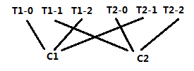

### messages1.基础

#### zookeeper在kafka中作用

kafka使用zookeeper保存集群的元数据信息和消费者信息。

>  zookeeper在实际测试中kafka_2.11-1.1.1版本中zk关闭，还是可以读、可以写。目前在192.168.9.37上下载了好几个版本，使用单节点准备有时间测试下0.8、0.9、10版本

kafka顺序消费问题：

>  能保证，首先生产者保证只有一个，控制消费者生产个数为1，max.in.flight.requests.per.connection=1，同时retries >  0
>
> 详细说明：
>
> 一个topic单个partition(可以通过创建topic的时候设置一个partition或者使用分区器Partitioner分区器来指定一类的消息发送到一个partition)，也不能保证生产的顺序一致。因为有可能在send到kafka的时候，失败会进行重试，从而打破了理论上的顺序。因此需要保证in-flight的消息数量为1，那么前面的如果没有sender成功，进行重试，后面的就只能等待。
>
> 参数：`max.in.flights.requests.per.session=1`  #,严重限制生产者的吞吐量，因此只在订单很重要时才使用它。
>
> 并且`retries`设置不为0，也就是失败了要重试。

kafka重复消费问题（kafka数据不丢问题能解决（实际就生产环境以及broker持久化保证就可以了，和消费者没啥关系），生产者通过ack=all以及重试即可还需要broker设置in.insync.replicas最少同步副本大于1，broker实时从pagecache刷新到磁盘）：

>  本身无法解决（但是可以依赖外部如redis来业务去重达到），生产者很难保证生产一次，因为可能存储数据发送了，但是没有收到ack，无法判断数据是保持到broker还是没有保存，如果此时重试，那么可能会造成数据被生产2次。如果不重试，可能存在数据并没有在broker中保存成功。
>
> 消费者很难保证消费一次，同步、异步、同步异步结合，也无法保证就消费一次，也是因为消费后，如果此时kafka集群宕机，那么offset没有提交成功，下次消费还会有重复数据。
>
> 补充：log.cleaner.enabled=true  使用清理数据功能，类似墓碑消息（value为null的消息，然后业务程序忽略value为null数据）可以对重复的key进行清理（实现了重复清理效果），这样如果当出现相同key，能及时被kafka 清理，那么就不会有生产者重复问题，但是！！！目前清理只会在segment脏数据达到50%才启动！！！而且该功能并不是为解决重复问题而存在。这里我也只是脑洞大开下。。。


1. 修改vim颜色
```sh
:colorscheme darkblue
```
2. kafka中config配置中有个listener监听端口，可以带上ip相当于绑定主机。默认9092端口。

3. 后台启动`bin/kafka-server-start.sh -daemon config/server.properties` 

4. 清空kafka在zk信息：zk中删除（极大风险）：

   `/cluster `

   `/brokers`

   ` /admin` 

   ` /isr_change_notification` 

   ` /log_dir_event_notification` 

   ` /controller_epoch` 

   `/controller`

   ` /consumers` 

   ` /latest_producer_id_block` 

   `/config`

####  搭建配置：

1. broker.id=使用主机ip后三位

2. zookeeper.connect=flu01:2181,flu02:2181,flu03:2181/kafka  # 最后加一个目录即可！使用了目录之后，以后连接zk都需要带上目录

3. log.dirs 可以使用多个目录，逗号分隔，单个partition只会在一个目录里面，而不会被分开存放。磁盘阵列使用多目录比较合适的。一个parition的segments被存放在相同的目录。

4. num.recovery.threads.per.datadir 配置线程池来处理log segments。当前主要功能，仅在启动和关闭时工作，适当提高，能增加处理的并行度：1，启动kafka时打开每个parition的log segments。2.当启动失败，去检查和截断partition的log segment。3.关闭的kafka，去清空和关闭log segments。4.默认一个目录，一个线程。
5. **auto.create.topics.enable**默认自动创建topics！建议关闭！不要开启.因为自动创建topic的parititon/replication都是默认的，非预期的。

#### broker、partition个数设置

根据磁盘和网络能力来考虑。broker相当于能把生产和消费分散开。

1. num.partitions

> partitions个数能调高消费的吞吐量，如每秒需要写入1G数据，读取也应该是每秒1G数据，但是每个消费者每秒只能消费50MB，那么至少需要20个分区，就能让20个消费者同时消费，从而达到1G吞吐量。根据经验，把partition大小限制在25G以内是比较理想效果。
>
> 但是如果partition过多，选举leader耗时也会越多。

2. log.retention.ms

 > 针对broker，segment关闭后保留时间，默认log.retention.hours=168，即168小时，7天一周。还有log.retention.minutes，如果设置了多个，kafka采用最小值。时间保留根据文件的最后修改时间。如果使用管理工具移动分区，最后修改时间就不准确了。

3. log.retention.bytes

   >  通过消息字节数，来判断消息是否过期 ，控制topic单个partition能保留的最大数据。如果配置1G有8个分区，你们topic最大8G数据。配合log.retention.ms来控制数据保留。

4. log.segment.bytes  

   >  单个segment达到执行大小，会创建一个新的。被关闭的segment日志，就会等待过期。默认1G。
   >
   > 会影响使用时间戳获取偏移量的准确性。kafka返回修改时间大于指定时间戳的日志片段，然后返回该日志片段开头的偏移量。对于使用时间戳获取偏移量，日志片段越小，结果越准确。

5. log.segment.ms 

   > 指定日志片段关闭的时间。和log.segment.bytes  配合使用。默认不设置，则只根据大小来关闭segment。该参数使用时，需要考虑并行关闭多个日志片段对磁盘性能的影响。因此计时是从broker启动之后开始，那么那些数据量小的分区来说，日志片段关闭操作总是同时发生。

6. **message.max.bytes** 

   > 默认1 000 000，1MB。消息最大的大小，超过大小会被拒绝接受，并且broker返回错误消息。该参数是指压缩后的消息大小，只要压缩后小于该值，那么就没问题！这个要注意！

**pagechache相关刷新**（宕机数据丢失，消息保证刷新到磁盘，但是实际上通过默认值也能发现，其实刷新sync操作实际作者并不希望有kafka来主动发起，而由操作系统负责）：缓存刷新到磁盘配置

- `log.flush.interval.messages` 消息在partition多大才刷新到磁盘，默认9223372036854775807基本等于不会由kafka发起主动刷新到磁盘，而使用操作系统默认  
- `log.flush.interval.ms` 消息多久刷新到磁盘，默认是没有设置，也就是默认值为null，此时是使用log.flush.scheduler.interval.ms这个，默认值是：9223372036854775807，也是无限大，都是说明由操作系统负责刷新时机  

**以下2个checkpoint应该是重启恢复时使用：**

- `log.flush.offset.checkpoint.interval.ms` 更新上次刷新的持久记录的频率，该记录充当日志恢复点
- `log.flush.start.offset.checkpoint.interval.ms` 更新日志开始偏移的持久记录的频率

#### 操作系统调优

##### 内存调优

1. vm.swappiness=1

   > 建议vm.swappines=1，表示系统内存不够，可以使用内存交换，防止系统内存不足，进程终止。0表示不实用内存交换。

2. vm.dirty_background_ration =5

   > 该值是指系统内存的百分比，大部分情况为5即可。影响刷新进程将脏页写入磁盘。可以减少脏页的数量，通过设置该参数小于10。不应该设置为0 ，0表示促使内核频繁刷新页面，讲题了磁盘写入提供缓存的能力。

3. vm.dirty_ration

   > 增加被内核进程刷新到磁盘之前的脏页数量，设置大于20，60-80是个比较合理区间。如果系统崩溃可能造成数据没有被刷新到磁盘。设置该值较高，建议启动kafka复制功能。

设置这些参数，最好是在kafka运行期间检查脏页的数量，可以在/proc/vmstat文件查看脏页数量：

```sh
cat /proc/vmstat | grep "dirty|writeback"
```

##### 磁盘

XFS > EXT4

#### 生产环境注意事项

1. JVM垃圾回收器

   **MaxGCPauseMillis**: 

   >  每次垃圾回收默认挺短时间。默认200ms，该值不固定，G1可以根据需要使用更长的时间。G1会决定垃圾收集的评率和每一轮回收的region数量，控制每一轮大概需要200ms的时间

   **InitiatingHeapOccupancyPercent**：

   >  G1启动新一轮垃圾回收之前可以使用的堆内存百分比，默认45.也就是说在堆内存使用率达到45%之前，不会启动垃圾回收。该百分比包括新生代和老年代。

   kafka对堆内存使用率非常高，容易产生GC，所以可以设置小一些，如64G内存：并且使用5G堆内存来运行kafka可以设置：`MaxGCPauseMillis=20ms` ，`InitiatingHeapOccupancyPercent=35`，

   这样让垃圾回收比默认要早一些启动。

   默认使用Parallel New 和CMS，修改为G1，修改`kafka-server-start.sh`

   ```sh
   export JAVA_HOME=${xxx}
   export KAFKA_JVM_PERFORMANCE_OPTS="-SERVER -XX:+UseG1GC -XX:MaxGCPauseMillis=20 
   -XX:InitiatingHeapOccupancyPercent=35 -XX:+DisableExplicitGC 
   -Djava.awt.headless=true"
   ```

### 2.Producer


#### 强制属性：

```java
"bootstrap.servers"->"flu02:9092,flu03:9092,flu04:9092"
"key.serializer"->"org.apache.kafka.common.serialization.StringSerializer"
"value.serializer"->"org.apache.kafka.common.serialization.StringSerializer"
```

#### 配置：

1. acks

   > 0 不关心是否发送成功，1 leader返回了发送成功， all 所有isr（in-sync replicas）都需要返回接收成功

2. buffer.memory /max.block.ms

   >  Producer发送端缓存大小，kafka先接收放到缓存里面，然后再分批存储。当中有个in-flight概念，有个Sender类，负责将buffer中数据分批发送到kafka service，in-flight表示每批次发送多少条数据，会等待ack响应。
   >
   >  如果服务器来不及接收buff中数据，那么send()会被阻塞，或者抛出异常，通过block.on.buffer.full配置（0.9.0版本后被替换成max.block.ms）表示抛出异常前阻塞一段时间。

3. compression.type 

   > 默认nocompression，kafka发送消息瓶颈一般都是网络引起，使用压缩可以降低网络开销和存储开销。
   >
   > 可以设置三种：lz4
   >
   > snappy， google开发，推荐使用，占cpu少。
   >
   > gzip，比snappy压缩效率更高，但是更消耗cpu，网络带宽不好选择。

4. retries(针对临时性错误，如分区暂时没找到首领)

   > 失败重发次数，默认重新发送时间间隔为100ms，retry.backoff.ms设置。

5. batch.size 

   > Sender每次从Producer缓存中发送到kafka 分区的大小，如果没达到等到，配合linger.ms等待时间

6. linger.ms

   > 当前时间达到或者批次满了，发送message到kafka

7. client.id

   > brokers识别消息来源id，可以用来记录和统计以及配额

8. max.in.flight.requests.per.connection（保证顺序生产！！！主要是因为生产会有重试情况，导致顺序不一致）

   > 指定生产者在收到服务器响应之前可以发送多少个消息。值越高，会占用越多内存，不过也会提升吞吐率。
   >
   > **设置为1将确保消息将按照发送消息的顺序写入broker，即使在重试发生时也是如此，但降低吞吐量。**

9. timeout.ms, request.timeout.ms,  metadata.fetch.timeout.ms

   > timeout.ms 指定broker等待同步副本返回消息确认的时间，与ack的配置相匹配，如果指定是时间内没有收到同步副本的确认，那么broker就会返回一个错误。
   >
   > request.timeout.ms 生产者在发送数据是，等待服务器返回响应时间，如果超时，那么生产者要么重试，要么返回一个错误（跑出异常或执行回调）
   >
   > metadata.fetch.timeout.ms 生产者获取元数据（比如目标分区的首领是谁）等待服务器返回的响应时间，如果超时，那么生产者要么重试，要么返回一个错误（跑出异常或执行回调）

10. max.block.ms

    > send()或partitionFor()获取元数据时，生产者阻塞时间。当生产者发送缓冲区已满，或者没有可用的元数据时，方法阻塞，超时，抛出超时异常

11. max.request.size

    > 控制生产者发送请求的大小，注意和broker对可接受消息最大值message.max.bytes匹配

12. receive.buffer.bytes，send.buffer.bytes

   > 分别指定了 TCP socket 接收和发送数据包的缓冲区大小 。-1，则使用操作系统默认。
   >
   > 如果是生产者或消费者与broker处于不同数据中心，可以适当调大，这样一次TCP连接就能发送更多数据，而且不同数据中心延迟一般都有较高延迟和较低带宽。

#### 顺序保证

一个topic单个partition，也不能保证生产的顺序一致。因为有可能在send到kafka的时候，失败会进行重试，从而打破了理论上的顺序。因此需要保证in-flight的消息数量为1，那么前面的如果没有sender成功，进行重试，后面的就只能等待。

参数：`max.in.flights.requests.per.session=1`  #,严重限制生产者的吞吐量，因此只在订单很重要时才使用它。

并且`retries`设置不为0，也就是失败了要重试。

#### Partitions

kafka生产着，默认一条message包含：topic/partition/key/value（其中partition是可选的）

有partition则，直接发送到partition。

当key为null并使用默认分区器时，记录将随机发送到partition，将使用循环算法来平衡分区之间的消息。

如果存在key，则根据对key hash并取模来判断message进入哪个partition

#### 生产者代码：

send发送

> 三种形式发送：
>
> 1. 送并忘记：fire-and-forget 不关系是否正常到达，大不多都会到达，因为kafka高可用。不过这种方式有时候会丢失一些数据
>
> 2. 同步发送：send方法，返回Futrue对象，调用get方法进行等待，就可以知道是否发送成功
> 3. 异步发送：send方法，并制定回调函数，服务器在返回相应时调用该函数。

发送不关注结果：

```java
public class FireAndForgetSender {
    private static final Logger LOGGER = LoggerFactory.getLogger(FireAndForgetSender.class);

    public static void main(String[] args) {
        Properties properties = initPros();
        KafkaProducer<String, String> producer = new KafkaProducer<>(properties);
        IntStream.range(0, 10).forEach(i -> {
            ProducerRecord<String, String> record = new ProducerRecord<String, String>("fire_and_forget_sender", String.valueOf(i), "hello " + i);
            producer.send(record);
            LOGGER.info("The message is send done and the key is {}", i);

//            producer.close();
        });
        producer.flush();
    }

    private static Properties initPros() {
        final Properties properties = new Properties();
        properties.put("bootstrap.servers", "flu02:9093,flu03:9093,flu04:9093");
        properties.put("key.serializer", "org.apache.kafka.common.serialization.StringSerializer");
        properties.put("value.serializer", "org.apache.kafka.common.serialization.StringSerializer");
//        properties.put("batch.size","1000000");
//        properties.put("linger.ms","5000");
        properties.put("client.id","linjh");
        return properties;
    }
}
```

同步发送：

```java
 public static void main(String[] args) {
        Properties properties = initPros();
        KafkaProducer<String, String> producer = new KafkaProducer<>(properties);
        IntStream.range(0, 10).forEach(i -> {
            ProducerRecord<String, String> record = new ProducerRecord<String, String>("fire_and_forget_sender", String.valueOf(i), "hello " + i);
            Future<RecordMetadata> future = producer.send(record);
            try {
                RecordMetadata recordMetadata = future.get();
                LOGGER.info("key is {},offset {}", i, recordMetadata.offset());
            } catch (InterruptedException e) {
                e.printStackTrace();
            } catch (ExecutionException e) {
                e.printStackTrace();
            }
            producer.flush();
//            producer.close();
        });
```

异步发送：

```java
// 异步回调方法
producer.send(record, (recordMetadata, execption) -> {
            // 发送成功
            if (execption == null) {
                LOGGER.info("key is {},offset {}", i, recordMetadata.offset());
            }
        }
);
```

Ack发送：

```java
properties.put("acks", "all"); // 0-时间消耗3727   1-时间消耗15663  时间消耗31319
```

#### 重写Partitioner

> 默认在创建ProducerRecord时，不指定partition，那么将使用默认的分区器：`Round Robin`算法均衡发送消息到各个分区

```java
public class MyPartitioner implements Partitioner {
    private final String LOGOIN = "LOGOIN";
    private final String LOGOFF = "LOGOFF";
    private final String ORDER = "ORDER";

    @Override
    public int partition(String topic, Object key, byte[] keyBytes, Object value, byte[] valueBytes, Cluster cluster) {
        if (keyBytes == null || keyBytes.length == 0) {
            throw new IllegalArgumentException("The key is required for BIZ");
        }
        switch (key.toString().toUpperCase()) {
            case LOGOIN:
                return 0;
            case LOGOFF:
                return 1;
            case ORDER:
                return 2;
            default:
                throw new IllegalArgumentException("The key is required for BIZ");
        }
    }
    @Override
    public void close() {
    }
    @Override
    public void configure(Map<String, ?> map) {
        // 在partition之前全局运行一次，可以完成一些获取配置文件的作用
    }
}
```

```java
public class PartitionerSender {
    private static final Logger LOGGER = LoggerFactory.getLogger(PartitionerSender.class);
    private static String[] bizType = {"LOGOIN", "LOGOFF", "ORDER"};

    public static void main(String[] args) {
        Properties properties = initPros();
        KafkaProducer<String, String> producer = new KafkaProducer<>(properties);
        IntStream.range(0, 10).forEach(i -> {
            String key = bizType[new Random().nextInt(3)];
            String value = "hello " + i;
            ProducerRecord<String, String> record = new ProducerRecord<String, String>("fire_and_forget_sender", key, value);
            producer.send(record, (metadata, exception) -> {
                LOGGER.info("key : {},value : {}, partition : {}", key, value  , metadata.partition());
            });
        });
        producer.flush();
    }

    private static Properties initPros() {
        final Properties properties = new Properties();
        properties.put("bootstrap.servers", "flu02:9093,flu03:9093,flu04:9093");
        properties.put("key.serializer", "org.apache.kafka.common.serialization.StringSerializer");
        properties.put("value.serializer", "org.apache.kafka.common.serialization.StringSerializer");
        properties.put("partitioner.class", "com.lin.producer.MyPartitioner");
        return properties;
    }
}
```

#### 序列化

##### 自定义序列化

(该方式在升级时比较困难，不推荐使用，使用avro)：

使用CustomerSerializer，可以将Customer对象发送给kafka，但是消费者的时候需要注意反序列化兼容性，一旦序列化器发生改动，消费端都需要改动，如果出现兼容性问题，需要用户去调式字节数组，使用avro会给出具体的出错信息，所以一般不建议自定义序列化器，而使用比如：JSON、Avro、Thrift或Protobuf。

Customer类：

```java
public class Customer {
    private int customerID;
    private String customerName;
    public void getID()
    public void getName()
    ...
```

重写序列化：

```java
ublic class CustomerSerializer implements Serializer<Customer> {
    @Override
    public void configure(Map<String, ?> configs, boolean isKey) {
        // 不做任何配置
    }

    @Override
    /**
     * Customer对象被序列化成：
     * 表示customerID的4字节整数
     * 表示customerName长度的4字节整数（如果customerName为空，则长度为0）
     * 表示customerName的N个字节
     */
    public byte[] serialize(String topic, Customer data) {
        try {
            byte[] serializedName;
            int stringSize;
            if (data == null) {
                return null;
            } else {
                if (data.getCustomerName() != null) {
                    serializedName = data.getCustomerName().getBytes("UTF-8");
                    stringSize = serializedName.length;
                } else {
                    serializedName = new byte[0];
                    stringSize = 0;
                }
            }
            ByteBuffer buffer = ByteBuffer.allocate(4 + 4 + stringSize);
            buffer.putInt(data.getCustomerID());
            buffer.putInt(stringSize);
            buffer.put(serializedName);

            return buffer.array();
        } catch (UnsupportedEncodingException e) {
            throw new SerializationException("Error when serializing Customer to byte[] "+ e);
        }
    }

    @Override
    public void close() {
        // 不需要关闭任何东西
    }
}
```

使用：

```java
properties.put("key.serializer", "org.apache.kafka.common.serialization.StringSerializer");
properties.put("value.serializer", "com.lin.producer.serialize.CustomerSerializer");
```


##### Avro序列化

Doug Cutting创建的项目，提供一种共享数据文件的方式，与编程语言无法的序列化格式。

需要使用“schema注册表”，可以使用[Confluent Schema Registry](https://docs.confluent.io/3.0.0/schema-registry/docs/intro.html#schemaregistry-intro)    有关介绍：[Confluent介绍](https://www.cnblogs.com/zdfjf/p/5646525.html)

需要安装！之后过程相当于把schema存放在Schema注册表当中


补充：maven仓库：

> 存在问题！！！直接修改pom文件，无法下载：kafka-avro-serializer。有2个解决办法：
>
> 一，手动下载jar包（那就不是maven管理了，所以选第二种方法）
>
> 二，将repository添加到maven安装目录的setting.xml
>
> <mirror>
>   <id>confluent</id>
>   <mirrorOf>confluent</mirrorOf>
>   <name>Nexus public mirror</name>
>   <url>http://packages.confluent.io/maven/</url>
> </mirror>

```xml
<repositories>
    <repository>
        <id>confluent</id>
        <url>http://packages.confluent.io/maven/</url>
        <releases>
            <enabled>true</enabled>
        </releases>
        <snapshots>
            <enabled>true</enabled>
        </snapshots>
    </repository>
</repositories>

<dependency>
    <groupId>org.apache.avro</groupId>
    <artifactId>avro</artifactId>
    <version>1.8.2</version>
</dependency>

<dependency>
    <groupId>io.confluent</groupId>
    <artifactId>kafka-avro-serializer</artifactId>
    <version>3.0.0</version>
    <exclusions>
        <exclusion>
            <groupId>org.apache.avro</groupId>
            <artifactId>avro</artifactId>
        </exclusion>
        <exclusion>
            <groupId>org.slf4j</groupId>
            <artifactId>slf4j-log4j12</artifactId>
        </exclusion>
        <exclusion>
            <groupId>com.101tec</groupId>
            <artifactId>zkclient</artifactId>
        </exclusion>
    </exclusions>
</dependency>
```


使用：

```java
properties.put("key.serializer", "io.confluent.kafka.serializers.KafkaAvroSerializer");
properties.put("value.serializer", "io.confluent.kafka.serializers.KafkaAvroSerializer");
properties.put("schema.registry.url",schemaUrl); 
```

这里key也用了这个序列化，构建ProducerRecord：

```java
new ProducerRecord<>("test-a", customer.getID(),customer)
```

具体使用：

>  avro的schema使用字符串，通过Schema来格式化，使用GenericRecord创建record，并最终封装成ProducerRecord

```java
public class AvroSender {
    private final static Logger LOG = LoggerFactory.getLogger(MySerializeSender.class);

    public static Properties init() {
        Properties properties = new Properties();
        properties.put("bootstrap.servers", "flu02:9093,flu03:9093,flu04:9093");

        properties.put("key.serializer", "org.apache.kafka.common.serialization.IntegerSerializer");
        properties.put("value.serializer", "io.confluent.kafka.serializers.KafkaAvroSerializer");
        properties.put("schema.registry.url","http://flu03:8081");
        return properties;
    }

    public static void main(String[] args) {
        String schemaString = "{\n" +
                "  \"namespace\": \"customerManagerment.avro\",\n" +
                "  \"type\": \"record\",\n" +
                "  \"name\": \"Customer\",\n" +
                "  \"fields\":[\n" +
                "    {\"name\":\"id\",\"type\":\"int\"},\n" +
                "    {\"name\":\"name\",\"type\":\"string\"}\n" +
                "  ]\n" +
                "}";

        KafkaProducer<Integer, GenericRecord> producer = new KafkaProducer<>(init());
        Schema.Parser parser = new Schema.Parser();
        Schema schema = parser.parse(schemaString);

        // 序列化器会将schema提取，并保存到注册表中，并用它序列化对象
        GenericRecord customer = new GenericData.Record(schema);
        customer.put("id",1);
        customer.put("name","lin");
        ProducerRecord<Integer, GenericRecord> data = new ProducerRecord<>("customer-schema", 1, customer);
        producer.send(data);
        producer.flush();
        producer.close();
    }
}
```


### 3.补充avro

引入maven依赖和插件

```xml
<dependency>
    <groupId>org.apache.avro</groupId>
    <artifactId>avro</artifactId>
    <version>1.8.2</version>
</dependency>
<!--avro 插件-->
<plugin>
    <groupId>org.apache.avro</groupId>
    <artifactId>avro-maven-plugin</artifactId>
    <version>1.8.2</version>
    <executions>
        <execution>
            <phase>generate-sources</phase>
            <goals>
                <goal>schema</goal>
            </goals>
            <configuration>
                <sourceDirectory>${project.basedir}/src/main/java/avro/</sourceDirectory>
                <outputDirectory>${project.basedir}/src/main/java/</outputDirectory>
            </configuration>
        </execution>
    </executions>
</plugin>
```

在指定的sourceDirectory目录下：（注意目录）增加schema:

```json
{"namespace": "example.avro",
  "type": "record",
  "name": "User",
  "fields": [
    {"name": "name", "type": "string"},
    {"name": "favorite_number",  "type": ["int", "null"]},
    {"name": "favorite_color", "type": ["string", "null"]}
  ]
}
```

avro支持编译成代码，也可以不编译成代码：

1.编译成代码：

直接点击mavne，运行compile，即可


如果是jar包形式，需要 avro-1.8.2.jar and avro-tools-1.8.2.jar以及Jackson

运行：java -jar /path/to/avro-tools-1.8.2.jar compile schema <schema file> <destination>


使用代码：

创建对象：可以使用常规方式，构造函数以及set字段或者使用Avro的Builder：

 // 三种方式都能创建对象，使用builder会自动设置默认值，builder会在set的时候验证数据，

而直接new出来，只有在序列化时才能发现是否出错。一般使用构造函数性能更好，因为builder在创建对象需要创建数据结构相关对象。

```java
User user1 = new User();
user1.setName("Alyssa");
user1.setFavoriteNumber(256);
// Leave favorite color null

// Alternate constructor
User user2 = new User("Ben", 7, "red");

// Construct via builder
User user3 = User.newBuilder()
        .setName("Charlie")
        .setFavoriteColor("blue")
        .setFavoriteNumber(null)
        .build();
```

序列化：

```java
DatumWriter<User> userDatumWriter = new SpecificDatumWriter<User>(User.class);
DataFileWriter<User> dataFileWriter = new DataFileWriter<>(userDatumWriter);
// 指定序列化的写的文件
dataFileWriter.create(user1.getSchema(), new File("D:\\java-project\\kafka-master\\src\\main\\resources\\test"));
dataFileWriter.append(user1);
dataFileWriter.append(user2);
dataFileWriter.append(user3);
dataFileWriter.close();
```

反序列化：

```java
// 反序列化
DatumReader<User> datumReader = new SpecificDatumReader<>(User.class);
DataFileReader<User> dataFileReader = new DataFileReader<User>(new File("D:\\java-project\\kafka-master\\src\\main\\resources\\test"), datumReader);
User user = null;
while (dataFileReader.hasNext()) {
    // Reuse user object by passing it to next(). This saves us from
    // allocating and garbage collecting many objects for files with
     // many items.
    user = dataFileReader.next(user);
    System.out.println(user);
}
```

2.不编译成代码：

完整代码：

```java
public class AvroWithoutCompileCode {
    public static void main(String[] args) throws IOException {
        Schema schema = new Schema.Parser().parse(new File("D:\\java-project\\kafka-master\\src\\main\\java\\avro\\user.avsc"));
        GenericRecord user1 = new GenericData.Record(schema);
        user1.put("name", "Alyssa");
        user1.put("favorite_number", 256);

        // Leave favorite color null
        GenericRecord user2 = new GenericData.Record(schema);
        user2.put("name", "Ben");
        user2.put("favorite_number", 7);
        
        user2.put("favorite_color", "red");
        // 如果put不存在的field，会抛出AvroRuntimeException
        user2.put("XXXXX", "red");

        // 序列化到磁盘
       File file = new File("D:\\java-project\\kafka-master\\src\\main\\resources\\without_code_test");
         DatumWriter<GenericRecord> datumWriter = new GenericDatumWriter<GenericRecord>(schema);
        DataFileWriter<GenericRecord> dataFileWriter = new DataFileWriter<GenericRecord>(datumWriter);
        dataFileWriter.create(schema, file);
        dataFileWriter.append(user1);
        dataFileWriter.append(user2);
        dataFileWriter.close();

        // 从磁盘读取
        DatumReader<GenericRecord> datumReader = new GenericDatumReader<GenericRecord>(schema);
        DataFileReader<GenericRecord> dataFileReader = new DataFileReader<GenericRecord>(file, datumReader);
        GenericRecord user = null;
        while (dataFileReader.hasNext()) {
            user = dataFileReader.next(user);
            System.out.println(user);
        }
    }
}
```


### 4.Consumers

#### group & rebalance

在一个消费者组中会分享每个topic的partitions的所属消费者，当组中消费者变动，会进行消费者rebalance操作，重新分配consumer对应的partition。

Reblance为consumer提供了高可用和可扩展。

Rebalance期间，消费者无法读取消息，造成整个群组一小段时间不可用。另外，当分区被重新分配给另一个消费者时，消费者当前的读取状态会丢失，它有可能还需要去刷新缓存，在它重新恢复状态之前会拖慢应用程序。


消费者通过向**群组协调器**的broker（不同群组可以有不同的协调器）发送心跳，来维持它们和群组的从属关系以及它们对应分区的所有权关系。

新版本**0.10.1**，引入了独立的心跳线程（消费者发送心跳给被指定为**群组协调器**所在的的broker，来表明自己是存活的），这样心跳的频率和消息轮询的频率相互独立。之前版本是通过消息的轮询来表明自己存活，否则被认为死亡。

在新版本的kafka里，可以指定消费者在离开群组并触发reblance之前可以有多长时间不进行消息轮询，这样可以避免出现`活锁livelock`，比如有时候应用程序并没有奔溃，只是由于某些原因导致无法正常工作。这个配置与`session.timeout.ms（用于控制检测消费者发送奔溃的时间和停止发送心跳的时间，）`相互独立。

>  session.timeout.ms 该属性指定了消费者在被认为死亡之前可以与服务器断开的连接时间，默认3s。和心跳时间heartbeat.interval.ms紧密相关。一般心跳为超时时间的1/3，默认1s。session.timeout.ms小可以更快发现消费者死亡，设置大，可以减少意外rebalance

如果使用较新版本kafka，并需要处理耗时较长，只需要加大`max.poll.interval.ms`增加轮询间隔的时长，而不用关心群组协调器认为消息费死亡，因为还有个心跳线程是独立的。

> 分配分区过程：
>
> 当消费者要加入群组时，会向群组协调器(Group Coordinator)发送JoinGroup请求。第一个加入群组的消费者将成为“群主”。群主从协调器获取群组成员列表（列表包含最近发送心跳的消费者，它们被认为是活跃的），并负责给每一个消费者分配分区。群主使用一个实现了`PartitionAssignor`接口来决定哪个分区分配给哪个消费者。
>
> kafka内置2种分配策略，Range(默认)和RoundRobin，分配完毕，群主把分配情况列表发送给群组协调器，协调器再把这些信息发送给所有消费者。每个消费者只能看到自己的分配信息，只有群主知道群组里所有消费者的分配信息。这个过程会在每次`rebalance `重复发生

线程安全：

在同一个群组里，无法让一个线程运行多个消费者，也无法让多个线程安全共享一个消费者。按照规则，一个消费者使用一个线程。

org.apache.kafka.clients.consumer.KafkaConsumer

```java
//一个消费者只能一个线程来消费
private void acquire() {
    ensureNotClosed();
    long threadId = Thread.currentThread().getId();
    if (threadId != currentThread.get() && !currentThread.compareAndSet(NO_CURRENT_THREAD, threadId))
        throw new ConcurrentModificationException("KafkaConsumer is not safe for multi-threaded access");
    refcount.incrementAndGet();
}
```

#### 强制属性

```java
"bootstrap.servers"->"flu02:9092,flu03:9092,flu04:9092"
"key.serializer"->"org.apache.kafka.common.serialization.StringDeserializer"
"value.serializer"->"org.apache.kafka.common.serialization.StringDeserializer"
 // 一般还会加上group.id 以及client.id（这样能在kafka知道消费的机器）
```

#### 配置

fetch.min.bytes

> 消费者接收的最小数据量。broker只到达到最小量才会返回给consumer，该参数可以降低消费者和broker的工作负载，如果消费者在topic没啥数据cpu使用还是很高的情况下，可以把这个值调大。

fetch.max.wait.ms

> 消费者等待的最长时间，和fetch.min.bytes配合使用。默认500ms

max.partition.fetch.bytes

> 每个partition返回的最大数据量，消费者可用内存必须大于这个值。默认1M。
>
> 也就是说KafkaConsumer.poll()方法从每个分区返回的记录不超过该值，该值必须比max.message.size大，否则消费者可能无法读取这些数据，导致消费者一直挂起重试。
>
> 如果消息过大，导致消费者处理较慢，可能无法及时进行下一个轮询避免会话过期，可以调小该值，或者延长session.timeout.ms。

session.timeout.ms

> consumer的超时时间，默认3s。超时coordinator协处理器还没收到心跳将触发rebalance。
>
> 通常和heartbeat.interval.ms一起修改。

heartbeat.interval.ms

> 心跳时间，用于判断消费者是否还存在会导致rebalance。一般设置session超时时间的1/3。

auto.offset.reset

> 默认latest，如果没有group.id的offset，则消费最新的数据，如果有offset，则根据offset来消费。
>
> earliest从最早开始消费。

enable.auto.commit

> 默认true，false，则不自动提交offset。如果设置为true，一般还会搭配auto.commit.interval.ms来控制提交的时间间隔。**不管是同步、异步提交offset，kafka还是会重复消费到数据，无法做到不重复消费！如果JVM等级、断电，肯定会消费到重复的数据！**

partition.assignment.strategy

> 分区分配给群组里的消费者分配策略，默认是：org.apache.kafka.clients.consumer.RangeAssignor
>
> 也可以改成：org.apache.kafka.clients.consumer.RoundRobinAssignor或者自定义。
>
> Range(默认)（相当于一个Topic一行，行程一个矩阵）
>
> 
>
> 该策略会把topic的若干个连续的partition分配给消费者。
>
> 如2个消费者C1，C2，订阅多个主题，这里订阅  2个主题T1，T2， 每个主题3个分区。
>
> 那么C1可以分配到T1 中0，1分区，T2中0，1分区。C2分配到T1的2分区，T2的2分区。
>
> 当分区数量无法被消费者整除，就会出现这种情况。
>
> RoundRobin（相当于所以partition弄成一行，然后一人一个来分）
>
> 
>
> 把topic所有分区逐个分配给消费者。会分配相同或者最多相差一个分区。
>
> C1分配到T1的0、2分区，以及T2的1分区。
>
> C2分配到T1的1分区，T2的0，2分区。

client.id

> 可以是任意字符串，broker标识从客户端发过来的消息，通常被用在日志和度量指标和配额里。

max.poll.records

> 控制单次调用poll()方法能够返回的记录数量，可以控制轮询里需要处理的数据量

receive.buffer.bytes和send.buffer.bytes

> socket在读写数据时用到的TCP缓冲区大小。-1，使用操作系统默认。如果生产者或者消费者与broker处理不同的数据中心内，可以适当增大，因为跨数据中心一般延迟较高，带宽较低。

#### 消费者代码

```java
public class SimpleConsumer {
    private static final Logger LOGGER = LoggerFactory.getLogger(SimpleConsumer.class);

    public static void main(String[] args) {
        KafkaConsumer<String, String> consumer = new KafkaConsumer<String, String>(loadProp());
        // 支持正则表达式：如test-*,那么就匹配所有test-开头
        consumer.subscribe(Collections.singletonList("test_c"));
        try {
          
            for (; ; ) {
                // 第一次调用poll会负责查找GroupCoordinator
                ConsumerRecords<String, String> records = consumer.poll(100);

                records.forEach(record -> {
                    // record.timestamp()消息发送到kafka的时间
                    LOGGER.info("record.key()={}, record.offset()={}, record.partition()={}, record.timestamp()={}, " +
                            "record.value()={} ", record.key(), record.offset(), record.partition(), record.timestamp(), record.value());
                });
                try {
                
                 ////////
                 //这个位置插入偏移量提交
                 //同步提交当前偏移量，该偏移量是poll返回的最新的偏移量，如果失败，会一直重试
                  consumer.commitSync();
                  // 还有异步、同步异步结合
                 ////////
            }
        } finally {
            // 关闭立即出发rebalance。
            consumer.close();
        }
    }

    private static Properties loadProp() {
        Properties properties = new Properties();
        properties.put("bootstrap.servers", "flu02:9093,flu03:9093,flu04:9093");
        properties.put("key.deserializer", "org.apache.kafka.common.serialization.StringDeserializer");
        properties.put("value.deserializer", "org.apache.kafka.common.serialization.StringDeserializer");
        properties.put("group.id", "test_group-1");
        properties.put("auto.offset.reset", "earliest");
        // 非自动提交offset
        properties.put("enable.auto.commit", "false");
        return properties;
    }
}
```

#### 提交偏移量

kafka不像其他JMS需要得到消费者的确认。相反消费者可以使用kafka来追踪message在partition中的offset。

消费者如何提交offset？

> consumer往`_consumser_offset`的特殊主体发送带有分区偏移量的消息。当触发rebalance后，消费者根据offset来从指定的地方继续消费。

提交偏移量有：

> 1. 同步提交  
> 2. 异步提交  ,异步带回调函数提交（回调重试，需要保证顺序）
> 3. 同步和异步结合  
> 4. 提交特定偏移量

具体代码：（在上面案例的）

##### 1. 同步提交：

```java
// 同步提交当前偏移量，该偏移量是poll返回的最新的偏移量，如果失败，会一直重试
try{
	consumer.commitSync();
}  catch (CommitFailedException e) {
    LOGGER.error("commit failed", e);
 }
```

##### 2. 异步提交：

> 异步提交，不会重试。
>
> 如果会重试，就有可能会出现，提交偏移量2000的还没返回值，此时提交偏移量3000的返回值就回来了，那么如果重试，就相当于2000的又要重新提交，就重复消费了！

```java
// 异步提交，不会重试。如果会重试，就有可能会出现，提交2000的还没返回值，提交3000的返回值就回来了，那么如果重试，就相当于2000的又要重新提交，就重复消费了！
consumer.commitAsync();
```

异步提交支持回调函数：

>  回调函数中如果要实现重试，那么特别要注意顺序问题！一般经常用在记录提交错误或生成度量指标，而不是重试提交！
>
>  tips：如果要实现重试异步提交，那么可以使用一个单步递增序列号来维护异步提交的顺序，在每次提交偏移量之后或在回调里提交偏移量时递增序列号， 在重试前，先检查回调序列号和即将提交的偏移量是否等,相等则重试，小于，则说明已经后面有新的提交了，就不需要重试了

```java

consumer.commitAsync(new OffsetCommitCallback() {
    @Override
    public void onComplete(Map<TopicPartition, OffsetAndMetadata> offsets, Exception exception) {
        if (exception != null) {
            LOGGER.error("Commit failed for offsets {} ", offsets, exception);
        }
}
```

##### 3. 同步异步组合提交

改进上的代码，先正常消费后异步提交，保证速度，如果出错了，那么在关闭consumer之前使用同步提交，保证能一直重试，直到成功

```java
public static void main(String[] args) {
    KafkaConsumer<String, String> consumer = new KafkaConsumer<String, String>(loadProp());
    consumer.subscribe(Collections.singletonList("test_c"));
    try {
        for (; ; ) {
            // 第一次调用poll会负责查找GroupCoordinator
            ConsumerRecords<String, String> records = consumer.poll(100);
            records.forEach(record -> {
                // record.timestamp()消息发送到kafka的时间
                LOGGER.info("record.key()={}, record.offset()={}, record.partition()={}, record.timestamp()={}, " +
                        "record.value()={} ", record.key(), record.offset(), record.partition(), record.timestamp(), record.value());
            });
            // 这里先直接异步提交，速度更快，这里即使失败了，下一次提交很可能会成功。
            consumer.commitAsync();
        }
    }catch (Exception e){
        LOGGER.error("Unexpected error",e);
    }finally {
        try {
            // 如果上面失败了，直接关闭consumer，那么就没有所谓的下一次提交了，这里使用同步，肯定会在这里一直重试
            consumer.commitSync();
        }finally {
            // 关闭立即出发rebalance。
            consumer.close();
        }
    }
}
```

##### 4. 提交特定的偏移

   有些消费者处理比较耗时，可以分批提交指定的偏移量，使用：Map<TopicPartition, OffsetAndMetadata>

```java
int count = 0;
Map<TopicPartition, OffsetAndMetadata> currentOffsets = new HashMap<>();
try {
    for (; ; ) {
        ConsumerRecords<String, String> records = consumer.poll(100);
        for (ConsumerRecord<String, String> record : records) {
            // record.timestamp()消息发送到kafka的时间
            LOGGER.info("record.value()={} ", record.value());
            // //封装对应topic中对应partition的offset
            currentOffsets.put(new TopicPartition(record.topic(), record.partition()),
                    new OffsetAndMetadata(record.offset() + 1, "no metadata"));
            // 每处理1000条，提交一次
            if (count % 1000 == 0) {
                // 假设这里返回的批次数据很多，需要处理很久，那么可以分批提交，而不用等到处理完毕再提交
                consumer.commitAsync(currentOffsets, null);
                count++;
            }
        }
        consumer.commitAsync();
    }
} catch (Exception e) {
    LOGGER.error("Unexpected error", e);
} finally {
    try {
        consumer.commitSync();
    } finally {
        consumer.close();
    }
}
```

#### rebalance监听

消费者订阅Topic时，重写`ConsumerRebalanceListener`里面有2个方法：

```java
//rebalance之前和consumer停止读取消息之后被调用
//在此提交偏移量，下一个接管分区的消费者就知道从哪里开始读取了
public void onPartitionsRevoked(Collection<TopicPartition> partitions)
//rebalance之后和消费者开始读取消息之前被调用
public void onPartitionsAssigned(Collection<TopicPartition> partitions)
```

##### 演示提交最后处理的偏移量

> 使用ConsumerRebalanceListener监听消费者在rebalance之前和consumer停止读取之后，也就是消费者最后提交偏移量

```java
public class RebalanceConsumer {
    private static final Logger LOGGER = LoggerFactory.getLogger(RebalanceConsumer.class);
    private static Map<TopicPartition, OffsetAndMetadata> currentOffsets = new HashMap<>();

    public static void main(String[] args) {
        KafkaConsumer<String, String> consumer = new KafkaConsumer<String, String>(loadProp());
        
        // 增加监听
        consumer.subscribe(Collections.singletonList("test-c"), new ConsumerRebalanceListener() {
            @Override
            public void onPartitionsRevoked(Collection<TopicPartition> partitions) {
                LOGGER.info("Lost partitinos in rebalance. Committing current offsets: " + currentOffsets);
                // 如果发生rebalance，需要提交的是处理过的分区对应的偏移量，所以这里需要使用currentOffsets
                consumer.commitSync(currentOffsets);
            }

            @Override
            /**
             * rebalance之后和消费者开始读取消息之前被调用
             */
           public void onPartitionsAssigned(Collection<TopicPartition> partitions) {
               // 空 ，这里只演示rebalance之前，消费者停止之后onPartitionsRevoked方法
            }
        });

        try {
            for (; ; ) {
                ConsumerRecords<String, String> records = consumer.poll(100);
             
                int num = 0;
                for (ConsumerRecord<String, String> record : records) {
                 
                    // 处理数据，这里指示简单打印
                    LOGGER.info("record.partition()={} , record.value()={} ", record.partition(), record.value());
                
                    // 处理完毕后，提交到map里面
                    currentOffsets.put(new TopicPartition(record.topic(), record.partition()),
                            new OffsetAndMetadata(record.offset() + 1, "no metadata"));
                    // 提交偏移量
                    consumer.commitAsync(currentOffsets, null);
                }
            }
        } catch (WakeupException e) {
            // 忽略异常，正在关闭消费者
        } catch (Exception e) {
            LOGGER.error("Unexpected error", e);
        } finally {
            try {
                consumer.commitSync(currentOffsets);
            } finally {
                consumer.close();
                LOGGER.info("Closed consumer and we are done");
            }
        }
    }

    private static Properties loadProp() {
        Properties properties = new Properties();
        properties.put("bootstrap.servers", "flu02:9093,flu03:9093,flu04:9093");
        properties.put("key.deserializer", "org.apache.kafka.common.serialization.StringDeserializer");
        properties.put("value.deserializer", "org.apache.kafka.common.serialization.StringDeserializer");
        properties.put("group.id", "goods-group");
        properties.put("auto.offset.reset", "earliest");
        // 非自动提交offset
        properties.put("enable.auto.commit", "false");
        return properties;
    }
}
```

##### 演示从指定位置开始消费

场景：假设偏移量保存在数据库，那么启动的时候需要从数据库中读取offset：

Consumer提供了三个指定偏移量消费方法，配合这三个方法使用，如果不在ConsumerRebalanceListener中使用，则需要先：`consumer.poll(0)`让GroupCoordinate分配分区，然后：`consumer.assignment()`

```java
seekToBeginning(Collection<TopicPartition> partitions) // 从头
seekToEnd(Collection<TopicPartition> partitions) // 从最新
seek(TopicPartition partition, long offset) // 指定位置
```

伪代码：

> commitDbTransaction()保证数据事务提交到数据库

```java
KafkaConsumer<String, String> consumer = new KafkaConsumer<String, String>(loadProp());
consumer.subscribe(Collections.singletonList("test-c"), new ConsumerRebalanceListener() {
    @Override
    public void onPartitionsRevoked(Collection<TopicPartition> partitions) {
        // consumer停止消费之后，提交offset到数据库
       commitDbTransaction();
    }

    @Override
    public void onPartitionsAssigned(Collection<TopicPartition> partitions) {
        for (TopicPartition partition : partitions) {
            // 获取偏移量
            consumer.seek(partition,getOffsetFromDB(partition));
        }
    }
});
// 第一次poll，让消费者加入到group中，获取到相应分区，0表示不超时，必须poll成功
// 因为后面会seek重置偏移量，所以这里即使poll也不影响数据消费
consumer.poll(0);
for (TopicPartition topicPartition : consumer.assignment()) {
    consumer.seek(topicPartition,getOffsetFromDB(topicPartition));
}
while (true){
    ConsumerRecords<String, String> records = consumer.poll(100);
    for (ConsumerRecord<String, String> record : records) {
        processRecored(record);
        storeRecordInDB(record);
        // 这里假定保存数据库非常快，分则，可以采用指定提交偏移量方法，来优化
        storeOffsetInDb(record.topic(),record.partition(),record.offset());
    }
    commitDbTransaction();
}
```

#### Consumer退出

在另一个线程调用`consumer.wakeup()`即可。

在消费线程捕获：WakeupException，并且不需要处理即可。

场景：1，当消费者需要退出`for(;;)`无限循环，在另一个线程调用wakeup方法

配合使用`Runtime.getRuntime().addShutdownHook(new Thread())`增加一个shutdown回调，可以完成消费者关闭操作。

2.另一个线程控制消费者退出

案例：另一个线程等待10s后，控制consumer退出：

```java
public class ExitConsumer {
    private static final Logger LOGGER = LoggerFactory.getLogger(ExitConsumer.class);
    private static KafkaConsumer<String, String> consumer;

    public static void main(String[] args) {
        consumer = new KafkaConsumer<String, String>(loadProp());
        consumer.subscribe(Collections.singletonList("test-d"));

        // 第一种方式，这里是使用线程主动10s后停止消费
        final Thread mainThread = Thread.currentThread();
        new Thread() {
            @Override
            public void run() {
                try {
                    Thread.sleep(10000);
                } catch (InterruptedException e) {
                    e.printStackTrace();
                }
                LOGGER.info("Starting exit....");
                // 控制退出，退出时，还是非常有必要在finally中对consumer.close()
                consumer.wakeup();
            }
        }.start();
        // 第二种方式，这里是类似用户使用ctrl+c或kill停止（非kill -9）
        Runtime.getRuntime().addShutdownHook(代码同上new Thread)

        try {
            consumer.poll(0);
            for (TopicPartition topicPartition : consumer.assignment()) {
                consumer.seek(topicPartition, 1);
            }

            for (; ; ) {
                ConsumerRecords<String, String> records = consumer.poll(100);
                records.forEach(record -> {
                    LOGGER.info("record.key()={}, record.offset()={}, record.partition()={}, record.timestamp()={}, " +
                            "record.value()={} ", record.key(), record.offset(), record.partition(), record.timestamp(), record.value());
                });
                consumer.commitAsync();
            }
        } catch (WakeupException e) {
            // ignore for shutdown
        } catch (Exception e) {
            LOGGER.error("Unexpected error", e);
        } finally {
            try {
                consumer.commitSync();
            } finally {
                consumer.close();
                LOGGER.info("consumer close");
            }
        }
    }

    private static Properties loadProp() {
        Properties properties = new Properties();
        properties.put("bootstrap.servers", "flu02:9093,flu03:9093,flu04:9093");
        properties.put("key.deserializer", "org.apache.kafka.common.serialization.StringDeserializer");
        properties.put("value.deserializer", "org.apache.kafka.common.serialization.StringDeserializer");
        properties.put("group.id", "test_group");
        properties.put("auto.offset.reset", "earliest");
        properties.put("enable.auto.commit", "false");
        return properties;
    }
}
```

 #### 序列化

定义参考：producer部分

#####　自定义反序列化

```java
public class CustomerDeserializer implements Deserializer<Customer> {
    @Override
    public void configure(Map<String, ?> configs, boolean isKey) {
        // 需要做任何配置
    }

    @Override
    public Customer deserialize(String topic, byte[] data) {
        int id;
        int nameSize;
        String name;
        try {
            if (data == null) {
                return null;
            }
            if (data.length < 8) {
                throw new SerializationException("Size of data received by integerDeserializer is shorter than expected");
            }
            ByteBuffer buffer = ByteBuffer.wrap(data);
            id = buffer.getInt();
            nameSize = buffer.getInt();
            byte[] nameBytes = new byte[nameSize];
            buffer.get(nameBytes);
            name = new String(nameBytes, "UTF-8");
            return new Customer(id, name);
        } catch (Exception e) {
            throw new SerializationException("Error when serializing Customer to byte[]" + e);
        }
    }

    @Override
    public void close() {
        // 不需要关闭任何
    }
}
```

使用：

```java
public class MySerializeConsumer {
    private final static Logger LOG = LoggerFactory.getLogger(MySerializeConsumer.class);
    public static Properties init() {
        Properties properties = new Properties();
        properties.put("bootstrap.servers", "flu02:9093,flu03:9093,flu04:9093");
        properties.put("key.deserializer", "org.apache.kafka.common.serialization.StringDeserializer");
        properties.put("value.deserializer", "com.lin.consumer.seralize.CustomerDeserializer");
        properties.put("group.id", "goods-group");
        properties.put("auto.offset.reset", "earliest");
        return properties;
    }

    public static void main(String[] args) {
        KafkaConsumer<String,Customer> consumer = new KafkaConsumer<String, Customer>(init());
        consumer.subscribe(Collections.singletonList("my-s"));

        try {
            for (; ; ) {
                ConsumerRecords<String, Customer> records = consumer.poll(100);
                for (ConsumerRecord<String, Customer> record : records) {
                    LOG.info("record.partition()={} ,record.offset()={} ,record.value()={}", record.partition(), record.offset(), record.value().toString());
                }
                consumer.commitAsync();
            }
        }catch (WakeupException e){
            //ignore shutdown
        }catch (Exception e){
            LOG.error("Unexpected error",e);
        }finally {
            try {
                consumer.commitSync();
            }catch (Exception e){
                consumer.close();
            }
        }
    }
}
```

##### Avro反序列化

具体案例：

```java
public class AvroConsumer {
    private final static Logger LOG = LoggerFactory.getLogger(AvroConsumer.class);
    public static Properties init() {
        Properties properties = new Properties();
        properties.put("bootstrap.servers", "flu02:9093,flu03:9093,flu04:9093");
        properties.put(ConsumerConfig.KEY_DESERIALIZER_CLASS_CONFIG, "org.apache.kafka.common.serialization.IntegerDeserializer");
        properties.put(ConsumerConfig.VALUE_DESERIALIZER_CLASS_CONFIG, "io.confluent.kafka.serializers.KafkaAvroDeserializer");
        properties.put("group.id", "goods-group");
        properties.put("schema.registry.url","http://flu03:8081");
        return properties;
    }

    public static void main(String[] args) {
        KafkaConsumer<Integer,GenericRecord> consumer = new KafkaConsumer<>(init());
        consumer.subscribe(Collections.singletonList("customer-schema"));

        try {
            for (; ; ) {
                ConsumerRecords<Integer, GenericRecord> records = consumer.poll(100);
                for (ConsumerRecord<Integer, GenericRecord> record : records) {
                    // 这里接收还是得使用Avro提供的，好像可以强制转换，案例中没有报错
                    Customer value = (Customer) record.value();
                    LOG.info("record.partition()={} ,record.offset()={} ,record.value()={}", record.partition(), record.offset(), value.toString());
                }
                consumer.commitAsync();
            }
        }catch (WakeupException e){
            //ignore shutdown
        }catch (Exception e){
            LOG.error("Unexpected error",e);
        }finally {
            try {
                consumer.commitSync();
            }catch (Exception e){
                consumer.close();
            }
        }
    }
}
```

#### 手动分配分区，不需要group.id

手动指定分区后，不会再发生rebalance。同时存在的问题是：如果topic增加了partition，那么消费者不会收到通知，所以需要周期性调用`consumer.partitinosFor()`获取元数据信息

```java
// 如果topic新增了partition，不会主动通知，而需要用户周期调用partitionsFor
List<PartitionInfo> partitionInfoList = consumer.partitionsFor("test-c");
//构建一个topic和partitino的对象的列表
List<TopicPartition> topicPartition = new ArrayList<>();
if (partitionInfoList != null) {
    for (PartitionInfo partition : partitionInfoList) {
        topicPartition.add(new TopicPartition(partition.topic(), partition.partition()));
    }
}
// 给消费者分配指定partition，这样就不需要使用group.id
consumer.assign(topicPartition);
```

### 消息拦截器

#### 生产者拦截器：

```java
public class MyProduerInterceptor implements ProducerInterceptor<String, String> {
    /**
     * ProducerConfig.INTERCEPTOR_CLASSES_CONFIG
     * interceptor.class来配置
     */
    @Override
    public ProducerRecord<String, String> onSend(ProducerRecord<String, String> record) {
        // 对消息的处理,这里全部转为大写
        return new ProducerRecord<String, String>(record.topic(), record.partition(), record.timestamp(), record.key()
                , record.value().toUpperCase());
    }

    @Override
    public void onAcknowledgement(RecordMetadata metadata, Exception exception) {
        // 收到应道处理
        if(exception == null) {
            System.out.println("应答！！！");
        }else {
            exception.printStackTrace();
        }
    }
```

使用：

```java
properties.put(ProducerConfig.INTERCEPTOR_CLASSES_CONFIG,"com.lin.producer.MyProduerInterceptor");
```

#### 消费者拦截器

> 被拦截器拦截的消息，也会提交offset，下次消费不会出现。其中提交方法如果是默认，那么按照默认间隔时间就会运行。

```java
public class MyConsumerInterceptor implements ConsumerInterceptor<String,String> {
    @Override
    public ConsumerRecords<String, String> onConsume(ConsumerRecords<String, String> records) {
        Map<TopicPartition, List<ConsumerRecord<String,String>>> results = new HashMap<>();
        Set<TopicPartition> partitions = records.partitions();
        partitions.forEach(p->
        {
            List<ConsumerRecord<String, String>> result = records.records(p).stream().filter(record->record.value().equals("HELLO 1")).collect(Collectors.toList());
            results.put(p,result);
        });
        return new ConsumerRecords<>(results);
    }

    @Override
    public void onCommit(Map<TopicPartition, OffsetAndMetadata> offsets) {

        // 如果是自动提交offset，那么这个方法会按照配置的时间间隔运行：
//        System.out.println("=========");
//        System.out.println(offsets);
//        System.out.println("=========");
    }
```

使用：

```java
 properties.put(ConsumerConfig.INTERCEPTOR_CLASSES_CONFIG,"com.lin.consumer.MyConsumerInterceptor");
```


### 5.深入Kafka

#### 1.控制器Controller

Controller也是broker，除了broker功能之外，还负责partition leader的选举。主要使用zookeeper创建临时节点/controller来控制，并且使用epoch来避免“脑裂”，epoch就是一个递增的序号。(参考zookeeper选举)

#### 2.副本Replication

**Leader replica**（即所说的partitino的leader）

> 每个分区都有一个，为保证一致性，所有生产者和消费者请求都会经过这个副本。

**Follower replica**

> leader replica以外的都是副本，保持和leader的一致状态。10s请求到最新数据，被认为不同步，不同步不可能成为新leader。
>
> 同步的副本（isr ：in-sync replicas）有可能成为新leader

follower 正常不活跃时间或在成为不同步副本之前的时间设置：

```sh
# 该时间间隔直接影响leader选举期间的客户端行为和数据保留机制，即是设置上面10s
replica.lag.time.max.ms 
```

**首选leader**

> 创建topic时选定的leader就是首选leader。之所有叫做首选leader，是因为创建分区时，需要在broker之间均衡首领（涉及broker间分布副本和leader的算法）。因此，在首选首领成为真正leader时，broker间的负载最终会得到均衡。（意思是：创建topic会临时选出一个首选leader，因为broker会对partition副本进行负载均衡，所以，还会选出一个首领，如果首选首领数据是同步的，那么最终就成为leader否则会触发leader选举。）
>
> auto.leader.rebalance.enable=true #检查首选首领是否为当前首领。


#### 3.处理请求

broker大部分工作是**处理客户端、分区副本和控制器发送给分区首领的请求**。Kafka提供了一个二进制协议（基于TCP），指定了请求消息的格式以及broker如何对请求做出响应——包括成功处理请求或处理请求过程中遇到错误。

所有的请求消息都包含一个标准的**消息头**：

- Request type （也就是API Key）
- Request version （broker可以处理不同版本的客户端请求，并根据客户端版本做出不同的响应）
- Correlation ID 一个具有唯一性的数字，用于标识请求消息，同时也会出现在响应消息和错误日志里用于诊断问题(比如你发出发，你要知道收到的也是你的)
- Client ID 用于标识发送请求的客户端

broker如何处理请求：

> broker会在它所监听的每一个端口上运行一个Acceptor线程，这个线程会创建一个连接，并把它交给Processor线程去处理。
>
> Processor线程（也叫“网络线程”）的数量是可以配置的。网络线程负责从客户端获取请求消息，把它们放进**请求队列**，请求消息被放到请求队列后，**IO线程**会负责处理它们
>
> 然后从**响应队列**获取响应消息，把它们发送给客户端。

常见请求类型：

- 生产请求：生产者发送的请求，包含客户端要写入broker的消息。
- 获取请求：在消费者（用于消费）和跟随者（用于复制）副本需要从broker读取消息时发送的请求。


Kafka生产请求和获取请求都必须发送给分区的leader，如果Broker上没有当前主题的分区的leader，但是客户端发送过来了，那么将返回 “非分区首领” 错误。（客户端获取到该处理后，就会立即发送元数据请求，来刷新元数据信息）

**Kafka客户端负责将请求发送到正确的broker，如果请求发错地址，broker给出的错误响应！（Not a Leader for Partition）**

客户端如何知道往哪个broker发送请求？

> 客户端使用元数据请求，这种请求包含了客户端感兴趣的topic列表，服务端的响应返回主题的分区信息，以及每个分区的副本、以及leader情况。每个broker都缓存了这些信息，所有客户端发给任意一个都行！


客户端会存储元数据信息，并时不时通过发送**元数据请求**来获取**元数据响应**
```sh
metadata.max.age.mx # 客户端刷新元数据的时间间隔，从而获取到元数据是否发生变化，如新broker加入，副本移动到新的broker
```

##### 1.生产请求

leader副本的broker在收到生产请求时，会对请求做一些验证。
- 发送数据的用户是否有主题的写入权限
- 请求包含acks值是否有效（只能是0、1、all）
- 如果acks=all，是否有足够多的同步副本保证消息已经被安全写入？（可以对broker配置，如果同步副本不足，broker可以拒绝处理新消息（和es的shard，replica都差不多））

消息被写到 Linux 的文件系统缓存里，kafka不保证消息刷新到磁盘，而是依赖复制功能来保证消息的持久性。如果`acks=all`，请求会被保存在`purgatory `(炼狱)缓冲区，直到leader发现所有follower都复制了消息，才返回给client。

##### 2.获取请求

broker处理获取请求与处理生产请求方式相似。客户端发送请求，向broker请求主题分区里具有特定偏移量的消息。
如请求topic分区0的偏移量53开始、分区1的偏移量64开始的消息的返回。
还可以指定broker最多可以从一个分区里返回多少数据。也可以设置最少（配合超时时间）。


**零拷贝**:

Kafka使用**零拷贝**技术想客户端发送消息，直接从文件或者Linux文件系统缓存发送到网络通道。

**没有被所有同步副本ISR写入的消息，不会被消费者消费！**

> 消息没有被足够多副本复制（主要是同步副本必须要复制消息，因为只有它们能成为leader），被认为是“不安全”，如果leader宕机，没有一个副本能成为新leader，你们会导致消息丢失。如果允许消费，那么会破坏一致性。比如：一个消费者消费到了数据，并处理了。单另一个消费者发现这个消息其实并不存在，导致一致性破坏

```sh
replica.lag.time.max.ms # 指定副本在复制消息时可被允许的最大延迟时间，如果还没被复制完毕，那么消息认为是丢失了，client重试。也意味着client写入数据后，在该配置的时间之后，如果没有丢失，那么肯定就能被消费到。
```

如果：只有在高水位上的消息才能被消费者消费（图中三个副本是ISR副本）


##### 3.其他请求

Kafka使用二进制协议与broker通信。实现的客户端有Java、c、python、go等等。

Kafka在0.9.0.1版本中可以处理20多种不同类型请求。协议在持续演化。

如：之前版本偏移量保存在zookeeper上，新版本保存在Kafka的Topic：`__consumer_offsets`


除了增加新的请求类型，同时kafka也在修改已有的请求类型来增加新功能。

所以建议升级客户端之前先升级broker，因为新的broker知道如何处理旧的请求。

#### 4.物理存储

```sh
log.dirs  # 指定目录存储partition
```

##### 1.分区分配

leader分区先拿出来分配给不同 的broker，然后再0分区的副本开始逐个分配，1分区，2分区...

如果配置了机架信息，那么按照交替机架的方式来选择broker。

分配完broker，再分配分区应该使用的目录。新的分区总是被添加到数量最小的那个目录。

在位broker分配分区时，kafka不会考虑可用空间和工作负载的问题，但在将分区分配到磁盘时会考虑分区的数量，不过不考虑分区的大小。

##### 2.文件管理

没被关闭的文件segment叫做活跃片段。活跃片段永远不会被删除！

可用配置大小来关闭文件，配置时间来删除文件

##### 3.文件格式

上面是未压缩的消息格式，下面是压缩了三条消息的格式：

> 时间戳可以是生产者发送消息的时间，也可以是消息到到broker的时间，可以配置。


显示每个消息的偏移量，检验和、魔术数字节、消息大小和压缩算法

```sh
kafka_2.11-0.11.0.2/bin/kafka-run-class.sh kafka.tools.DumpLogSegments --files 00000000000000000000.log
```


##### 4.索引

为帮助broker更快地定位到指定的偏移量位置，kafka为每个分区维护了一索引，索引把偏移量映射到segment文件和偏移量在文件里的位置。

##### 5.清理（压缩）

每个日志片段可以分为2个部分：

- 干净部的部分：key只有一个对应的值，重复的值被清理掉了

- 污浊的部分：上一次清理后写入的

  

kafka启动清理功能：

```sh
log.cleaner.enabled=true  
```

kafka清理线程创建一个map，mao里的每个元素包含了消息键的散列值和消息的偏移量，键的散列值16B，加上偏移量总共24B，如果要清理一个1GB的日志片段，假设每个消息是1KB，那么这个片段就有100万个消息，需要使用24MB的map来清理这个片段。

如下：清理后保留key对应的最新的值。如K1，有V1和V2，V2值比V1更新，那么清理线程会删除V1这个值。


**墓碑消息：**

> 需要压缩开启配合使用

用户要删除特定的key，那么生产一个值为null，key为要删除的值即可。清理线程发现该值会进行常规清理，只保留值为nul的消息。

kafka会保留该值为null的key，时间长短可以配置。比如：用户需要知道后续哪个值是需要删除的，只需要在消费的时候对value进行判断，如果为空，则从数据库删除，在这场景下，需要配置足够多的时间，让用户能消费到这个墓碑消息。

**何时进行清理（压缩）？**

> 0.10.0以及更早的版本，Kafka会在包含脏记录的主题数据达到50%时进行清理。这样做的目的是避免太多频繁的清理（清理会影响主题的读写性能），同时也避免太多脏记录。
>
> 后续的版本计划在未来加入宽限期，在宽限期，保证消息不会被清理。


### 6.可靠的数据传递

#### 1. 可靠性保证

 - Kafka 可以保证分区消息的顺序。如果使用同一个生产者往同一个分区写入消息，而且消息 B 在悄息 A 之后写入，那么 Kafka 可以保证消息B的偏移量比消息 A 的偏移量大，而且消费者会先读取消息 A 再读取消息B。

- 只有当消息被写入分区的所有同步副本时（但不一定要写入磁盘），它才被认为是“ 已提交”的。生产者可以选择接收不同类型的确认，比如在消息被完全提交时的确认，或者在消息被写入首领副本时的确认，或者在消息被发送到网络时的确认。

- 只要还有一个副本是活跃的，那么已经提交的消息就不会丢失。

- 消费者只能读取已经提交的悄息。

#### 2.ISR副本

分区Leader是ISR（同步副本），对于Follower Replica ，它需要满足以下才被认为是ISR：

- 与 Zookeeper 之间有 一 个活跃的会话，也就是说，它在过去的6s（可配置）内向Zookeeper 发送过心跳。
- 在过去的 10s 内（可配置）从首领那里获取过消息。
- 在过去的 10s 内从首领那里获取过最新的消息。光从首领那里获取消息是不够的，它还必须是儿乎零延迟的。


一个不同步的副本通过与 Zookeeper 重新建立连接，井从首领那里获取最新消息，可以重新变成同步的。

> 如果一个或多个副本在同步和非同步状态之间快速切换，说明集群内部出现了问题，通常是 Java 不恰当的垃圾回收配置导致的。不恰当的垃圾回收配置会造成几秒钟的停顿，从而让 broker 与 Zookeeper 之间断开连接，最后变成不同步的，进而发生状态切换。

#### 3.Broker配置

```sh
broker.rack  #配置broker的机架名称
replication.factor #副本系数，默认3
```

> kafka_2.11-0.11.0.2版本中创建topic，必须指定：partitions和replication-factor，否则报错如下：
>
> Missing required argument "[partitions]"
>
> Missing required argument "[replication-factor]"

**不完全的首领选举：**

0.10.X默认true，允许`不完全选举`意味着当分区不是同步分区，也能成为leader，这有可能导致数据丢失。

> 假设分区副本0写入0-100偏移量数据时变不可用，副本1写入100-200变不可用，此时副本0变可用选为leader，那么副本1中100-200数据丢失。

在数据保证要求严格的情况下，必须设置false，但是可用性下降。

```sh
unclean.leader.election.enable=true # 允许不同步的副本成为leader，0.10.0版本默认是faluse，0.10.x默认是true，开启降低了高可用，保证了数据一致性和数据尽可能不丢失
```

**最少同步副本：**

>  Kafka认为消息只有在被写入到所有同步副本之后才被认为是已提交的。
>
> 配合acks=all演示produer生产，消费者不受影响。
>
> 比如：如果broker3个，这里配置最小2个，关闭2个，那么ack=all，无法produce消息，但是可以消费。

```sh
min.insync.replicas=2 #最少同步副本数为2，才能写入数据，否则报错：NotEnoughReplicasException
```

#### 4.生产者可靠性

基于2点：

1. acks=all
2. 当出现错误，需要重新发送消息

**发送确认**

ack=0，只管发送，一定会丢失数据。

ack=1，当leader在接收到消息后，就重新选举了，那么丢失数据。

ack=all，配合`min.insync.replicas`，可以决定在返回确认前至少多少个副本能够同步消息，那么能保证数据不丢。

**重试参数**

retries=0 ，默认是0

生产者自动重试：如LEADER_NOT_AVAILABLE错误，生产者会自动重试。

异常种类可参考Producer.sender的回调接口中的说明:`org.apache.kafka.clients.producer.Callback`

如果是INVALID_CONFIG，就需要用户自定义重试

> 重试多少次？ 绝不丢失：retries=MAX_INT，如Kafka跨数据中心复制工具（MirrorMaker）


重试可能会带来风险，比如因网络波动，生产者没有接受到broker确认，而重试，就会导致消息被写入多次**，**

**当前0.10.0版本还无法保证每个消息 “只保存一次” ，只能做到 “至少被保存一次”**

需要在消息里加入唯一标识，用于检测重复消息。用于保证 “幂等” 操作。


非重试错误处理，比如记录出错消息，保存错误消息到本地，回调另一个应用程序等。

如果错误处理只是重试发送，最好使用生产者内置的重试机制。

#### 5.消费者可靠性

> 主要在于消息偏移量提交的时间点，避免出现消息还没处理完就提交了偏移量，立马程序又报错，导致数据丢失。

**可靠性配置**

```sh
group.id #消费者组
auto.offset.reset #没有偏移量时消费的地方(有消费过就会读offset)，默认latest，消费最新的。或者earliest，从头开始
enable.auto.commit # 消费者基于任务调度自动提交偏移量，优点是可以保证只提交以及各处理过的偏移量。
# 缺点是：无法控制重处理消息（比如消费者在自动提交偏移量之前停止处理消息），
#而且如果把消息给另外一个后台线程去处理，自动提交机制可能会在消息还没处理完毕就提交提交偏移量了。

auto.commit.interval.ms # 自动提交偏移量的间隔，默认5s。调小增加开销，但降低重复处理消息的概率。
```

**显示提交偏移量**

1. 在处理完再提交偏移量

   > 如果还不需要在轮询之间维护转改，那么可以使用自动提交，或者在轮询结束时手动提交

2. 提交频度和重复消息数量之前的权衡

   > 比如在循环里多次提交偏移量，或者多个循环只提交一次

3. 确保对提交的偏移量心里有数

   > 要清楚知道消息确定被处理后再提交偏移量

4. 再均衡rebalance（在项目中目前还没使用过）

   > 在rebalance分区撤销之前（重写onPartitionsRevoked()）提交偏移量

5. 消费者可能需要重试

   > 第一种，在遇到可重试错误时，提交最后一个处理成功的偏移量，然后把还没处理的消息保存到缓冲区。调用消费者的`pauser()`来确保其他轮询不会返回数据，在保持轮询的同时尝试重新处理。如果重试成功，或者重试次数达到上限，那么记录错误，并丢失消息，然后调用`resume()`方法让消费者继续从轮询获取数据。
   >
   > 第二种，在遇到可重试错误时，把错误写入到独立的Topic，然后继续。一个独立的消费者群组负责从该主题上读取错误消息，并进行重试。

6. 消费者可能需要维护状态

   > 希望在多个轮询之间维护状态，如求平均数，窗口函数，一般可以使用KafkaStreams为聚合、连接、时间窗口和其他复杂的分析提供了高级的DSL API

7. 长时间处理

   > 需要长时间处理消息，暂停轮询不能超过几秒钟，要保证客户端往broker发送心跳。可以暂停消费者，但是得保持轮询，使用多线程去处理。只要消费者一直保持轮询，心跳会正常发送，就不会发生rabalance

8. 仅一次传递

   > Kafka现在还不能完全支持仅一次语义（exatly-once）。可以借助类型数据库完成`幂等性写入`保证消息被消费一次。


#### 6.验证系统可靠性

**环境配置验证**

- 首领选举：如果我停掉Leader会发送什么事情，生产者和消费者重新恢复正常状态需要多长时间？
- Controller选举：重启Controller系统需要多久恢复状态
- 依次重启：可以依次重启broker而不丢失任何数据吗？
- 不完全Leader选举测试：依次停止所有副本（确保每个副本都变成非ISR），然后启动一个不同步broker会发生什么？要怎样恢复正常？这样做是否可接受？

**应用程序验证**

故障测试尽量覆盖，确保测试场景都有期望行为：

- 客户端从服务器断开连接（比如网络故障）
- Leader选举
- 依次重启broker
- 依次重启消费者
- 依次重启生产者

**生产环境监控可靠性**

监控建群状况。

对生产者最重要需要监控：error-rate和retry-reate，除此之外还有错误日志等

对消费者最重要：consumer-lag，该指标表名消费者处理速度和最近提交到分区的偏移量之间还有多少差距。理想是0，表示生产了数据就被消费掉。[Burrow](https://github.com/linkedin/Burrow)工具由LinkedIn开源用于consumer-lag监测。

0.10.0版本kafka消息里加入了时间戳，表明消息的生成时间。更早版本的客户端：建议在消息里加入时间戳、应用程序的名字和机器名。

#### 7. kafka内置测试工具

> 生产者搭配消费者用来测试，省去自己编写

生产者：

> 如：bin/kafka-verifiable-producer.sh --topic benchmark1 --broker-list flu02:9093,flu03:9093,flu04:9093 --max-messages 100 --throughput 10 --acks 1 --value-prefix 1

```sh
bin/kafka-run-class.sh org.apache.kafka.tools.VerifiableProducer
#kafka-console-producer.sh

optional arguments:
  -h, --help             show this help message and exit
  --topic TOPIC          Produce messages to this topic.
  --broker-list HOST1:PORT1[,HOST2:PORT2[...]]
                         Comma-separated list of Kafka brokers in the form HOST1:PORT1,HOST2:PORT2,...
  --max-messages MAX-MESSAGES # 生产多少条
                         Produce this many messages. If -1, produce messages until the process is killed externally. (default: -1)
  --throughput THROUGHPUT  # 吞吐量，每秒钟发送条数
                         If set >= 0, throttle maximum message throughput to *approximately* THROUGHPUT messages/sec. (default: -1)
  --acks ACKS            Acks required on each produced message. See Kafka docs on request.required.acks for details. (default: -1)
  --producer.config CONFIG_FILE
                         Producer config properties file.
  --value-prefix VALUE-PREFIX # (消息前置以点分割，只能是Integer)
                         If specified, each produced value will have this prefix with a dot separator

```

消费者:

```sh
# kafka-console-consumer.sh
bin/kafka-run-class.sh org.apache.kafka.tools.VerifiableConsumer
```


### 7.数据管道Connect

#### 1.构建数据管道需要考虑的问题

及时性

> Kafka本身使用了回压策略（必要时可以延后向生产者发送确认）

可靠性

> kafka只保证至少一次传递，仅一次传递需要使用外部来保证。
>
> Connect API可以提供仅一次传递到端到端的数据管道（因为大部分断点都是数据存储系统，它们自身有仅一次传递支持）

高吞吐量和动态吞吐量

数据格式

安全性

故障处理

耦合性和灵活性

#### 2.如何在Connect API和Client API作出选择

> 如果是kafka对象存储系统，不需要自己实现的系统就使用Connect API。

如果要将kafka连接到数据存储系统，可以使用Connect，因为系统不是自己开发的。

如果要连接的数据存储系统没有相应的连接器，可以考虑使用客户端API或Connect API开发一个应用程序。

这种场景下建议使用Connect，因为提供了比如配置管理、偏移量存储、并行处理、错误处理，而且支持多种数据类型和标准的REST管理API。

使用客户端就需要处理更多纤细比如数据类型和配置选项，加到了开发的复杂性。

#### 3.配置和启动

配置:

```sh
bootstrap.servers=flu02:9093,flu03:9093,flu04:9093  # Connect 工作的broker服务器,一般建议至少配置3个，高可用
group.id=connect-cluster  # 具有相同group.id的worker属于同一Connect集群
```

```sh
# 默认使用json，json中可以包含schema
key.converter=org.apache.kafka.connect.json.JsonConverter
value.converter=org.apache.kafka.connect.json.JsonConverter
key.converter.schemas.enable=true
value.converter.schemas.enable=true

#如果使用Avro还需要添加
key.converter.schema.registry.url
value.converter.schema.registry.url
```

```sh
# 配置rest api的地址，默认不需要配置就是localhost和8083
#rest.host.name=
#rest.port=8083
```

启动：

>  这里试验最好只起一台，否则出现不了效果，猜测：可能是因为数据批次刷新原因，或其他

```sh
# 前台启动
bin/connect-distributed.sh config/connect-distributed.properties
# 后台启动加上：-daemon
bin/connect-distributed.sh -daemon config/connect-distributed.properties
```

> 如果单机启动使用：connect-standalone.sh，运行在一个woker上，同时配置config可以通过rest api传入

zookeeper上默认创建的topic:


验证是否运行正常：

```sh
curl http://localhost:8083
{"version":"0.11.0.2","commit":"73be1e1168f91ee2"}
```

查看当前安装好的连接器插件：

```sh
curl http://flu02:8083/connector-plugins
[{"class":"org.apache.kafka.connect.file.FileStreamSinkConnector","type":"sink","version":"0.11.0.2"},{"class":"org.apache.kafka.connect.file.FileStreamSourceConnector","type":"source","version":"0.11.0.2"}]
```

####  4.示例

> 做这个试验可能会用到的命令：
>
> ps -ef | grep kafka | grep -v grep | cut -b10-15 | xargs kill -9
> rm -rf /HELOWIN/kafka/kafka_2.11-0.11.0.2/logs/*
> rm -rf /HELOWIN/var/tmp/kafka-logs-011
> bin/kafka-server-start.sh -daemon config/server.properties
> curl -X GET http://flu03:8083/connectors
> curl -X DELETE http://flu03:8083/connectors/load-kafka-config

##### 1.将Kafka配置文件发送到Topic上：

```sh
[root@flu03 kafka_2.11-0.11.0.2]# echo '{"name":"load-kafka-config","config":{"connector.class":"FileStreamSource","file":"config/server.properties","topic":"kafka-config-topic"}}' | curl -X POST -d @- http://localhost:8083/connectors --header "content-Type:application/json"
# 返回：
{"name":"load-kafka-config","config":{"connector.class":"FileStreamSource","file":"config/server.properties","topic":"kafka-config-topic","name":"load-kafka-config"},"tasks":[]}
```

**console消费：**

```sh
bin/kafka-console-consumer.sh  --bootstrap-server=flu03:9093 --topic kafka-config-topic --from-beginning
```

消费出来的数据：server.properties文件被一行行的转为json数据。payload是具体数据。

```json
{"schema":{"type":"string","optional":false},"payload":"# Licensed to the Apache Software Foundation (ASF) under one or more"}
{"schema":{"type":"string","optional":false},"payload":"# contributor license agreements.  See the NOTICE file distributed with"}
{"schema":{"type":"string","optional":false},"payload":"# this work for additional information regarding copyright ownership."}
{"schema":{"type":"string","optional":false},"payload":"# The ASF licenses this file to You under the Apache License, Version 2.0"}
{"schema":{"type":"string","optional":false},"payload":"# (the \"License\"); you may not use this file except in compliance with"}
{"schema":{"type":"string","optional":false},"payload":"# the License.  You may obtain a copy of the License at"}
{"schema":{"type":"string","optional":false},"payload":"#"}
{"schema":{"type":"string","optional":false},"payload":"#    http://www.apache.org/licenses/LICENSE-2.0"}
{"schema":{"type":"string","optional":false},"payload":"#"}
{"schema":{"type":"string","optional":false},"payload":"# Unless required by applicable law or agreed to in writing, software"}
```

##### 2.写入到文件系统：

> 这里是topics，可以将多个topic数据写到一个文件，所以是topics。但是生产，只能生产到一个topic里面。

```sh
[root@flu03 kafka_2.11-0.11.0.2]# echo '{"name":"dump-kafka-config","config":{"connector.class":"FileStreamSink","file":"copy-of-server-properties","topics":"kafka-config-topic"}}' | curl -X POST -d @- http://localhost:8083/connectors --header "content-Type:application/json"

```

 返回：

```sh
{"name":"dump-kafka-config","config":{"connector.class":"FileStreamSink","file":"copy-of-server-properties","topic":"kafka-config-topic","name":"dump-kafka-config"},"tasks":[]}
```

#### [REST API](https://kafka.apache.org/0110/documentation.html#connect_rest)

```sh
curl -X DELETE http://flu03:8083/connectors/dump-kafka-config


```

- `GET /connectors` - 返回connector列表
- `POST /connectors` - 创建一个新的connector; 请求主体应该是包含字符串`name`字段的JSON对象和包含`config`连接器配置参数的对象字段
- `GET /connectors/{name}` - 获取信息
- `GET /connectors/{name}/config` - 获取配置参数
- `PUT /connectors/{name}/config` - 更新配置参数
- `GET /connectors/{name}/status` - 获取当前状态，包括它是否正在运行，失败，暂停等，分配给哪个工作人员，错误信息（如果失败）以及所有任务的状态
- `GET /connectors/{name}/tasks` - 获取当前为连接器运行的任务列表
- `GET /connectors/{name}/tasks/{taskid}/status` - 获取任务的当前状态，包括它是否正在运行，失败，暂停等，分配给哪个工作人员，以及错误信息是否失败
- `PUT /connectors/{name}/pause` - 暂停连接器及其任务，这将停止消息处理，直到恢复连接器
- `PUT /connectors/{name}/resume` - 恢复暂停的连接器（如果连接器未暂停，则不执行任何操作）
- `POST /connectors/{name}/restart` - 重新启动连接器（通常是因为它已经失败）
- `POST /connectors/{name}/tasks/{taskId}/restart` - 重启个别任务（通常因为失败）
- `DELETE /connectors/{name}` - 删除连接器，暂停所有任务并删除其配置

Kafka Connect还提供了一个REST API，用于获取有关连接器插件的信息：

- `GET /connector-plugins` - 返回Kafka Connect群集中安装的连接器插件列表。请注意，API仅检查处理请求的worker上的连接器，这意味着您可能会看到不一致的结果，尤其是在滚动升级期间，如果添加新的连接器jar
- `PUT /connector-plugins/{connector-type}/config/validate` - 根据配置定义验证提供的配置值。此API执行每个配置验证，在验证期间返回建议值和错误消息。

#### 3.从MySQL到ElasticSearch

编译：[参考博客](https://blog.csdn.net/mar_ljh/article/details/86535588)

将2个jar包放入libs下：

```sh
kafka-connect-elasticsearch-5.1.0.jar
kafka-connect-jdbc-3.0.1.jar
```

验证是否成功：

`curl http://localhost:8083/connector-plugins`

```json
[
    {
        "class": "io.confluent.connect.elasticsearch.ElasticsearchSinkConnector",
        "type": "sink",
        "version": "5.1.0"
    },
    {
        "class": "io.confluent.connect.jdbc.JdbcSourceConnector",
        "type": "source",
        "version": "3.0.1"
    },
    {
        "class": "org.apache.kafka.connect.file.FileStreamSinkConnector",
        "type": "sink",
        "version": "0.11.0.2"
    },
    {
        "class": "org.apache.kafka.connect.file.FileStreamSourceConnector",
        "type": "source",
        "version": "0.11.0.2"
    }

```

es sink要运行，还需要其他jar包，在编译的路径：`flu03: /opt/kafka-connect-elasticsearch-5.1.0-post/target/kafka-connect-elasticsearch-5.1.0-development/share/java/kafka-connect-elasticsearch`将部分jar包都考到每个节点的libs下。


排除4个jar包:(添加这4个jar包会引起其他报错)

```sh
-rw-r--r-- 1 root root  434678 1月  18 11:09 commons-lang3-3.4.jar
-rw-r--r-- 1 root root 2256213 1月  18 11:09 guava-18.0.jar
-rw-r--r-- 1 root root   74798 1月  18 10:55 zkclient-0.10.jar
-rw-r--r-- 1 root root  906708 1月  18 10:55 zookeeper-3.4.13.jar
```

具体拷贝需要的jar清单如下：

```sh 
scp audience-annotations-0.5.0.jar commons-codec-1.9.jar commons-logging-1.2.jar common-utils-5.1.0.jar gson-2.6.2.jar httpasyncclient-4.1.1.jar httpclient-4.5.2.jar httpcore-4.4.4.jar httpcore-nio-4.4.4.jar jest-2.4.0.jar jest-common-2.4.0.jar jline-0.9.94.jar kafka-connect-elasticsearch-5.1.0.jar netty-3.10.6.Final.jar slf4j-api-1.7.25.jar root@flu02:/HELOWIN/kafka/kafka_2.11-0.11.0.2/libs
```

重启：

```sh
 bin/connect-distributed.sh -daemon config/connect-distributed.properties
```

查看日志：

```sh

(org.apache.kafka.connect.runtime.ConnectorConfig$EnrichedConnectorConfig:223)
[2019-01-23 20:24:17,214] INFO Finished starting connectors and tasks (org.apache.kafka.connect.runtime.distributed.DistributedHerder:825)
[2019-01-23 20:24:17,284] INFO Using default GSON instance (io.searchbox.client.JestClientFactory:69)
[2019-01-23 20:24:17,284] INFO Node Discovery disabled... (io.searchbox.client.JestClientFactory:86)
[2019-01-23 20:24:17,284] INFO Idle connection reaping disabled... (io.searchbox.client.JestClientFactory:98)
----这里成功启动了！！！
[2019-01-23 20:24:17,373] INFO Sink task WorkerSinkTask{id=elastic-login-connector-0} finished initialization and start 
---
(org.apache.kafka.connect.runtime.WorkerSinkTask:247)
[2019-01-23 20:24:17,380] INFO Discovered coordinator flu03:9093 (id: 2147483646 rack: null) for group connect-elastic-login-connector. (org.apache.kafka.clients.consumer.internals.AbstractCoordinator:607)
[2019-01-23 20:24:17,381] INFO Revoking previously assigned partitions [] for group connect-elastic-login-connector (org.apache.kafka.clients.consumer.internals.ConsumerCoordinator:419)
[2019-01-23 20:24:17,381] INFO (Re-)joining group connect-elastic-login-connector (org.apache.kafka.clients.consumer.internals.AbstractCoordinator:442)
[2019-01-23 20:24:17,395] INFO Successfully joined group connect-elastic-login-connector with generation 3 (org.apache.kafka.clients.consumer.internals.AbstractCoordinator:409)
[2019-01-23 20:24:17,395] INFO Setting newly assigned partitions [mysql-20190123login-0] for group connect-elastic-login-connector (org.apache.kafka.clients.consumer.internals.ConsumerCoordinator:262)
```

创建topic：(每个表对应一个topic，默认kafka创建规则是：前缀+表名，所以这里建议名字改为：mysql-表名  ）

```sh
bin/kafka-topics.sh --create --topic mysql-每个表一个topic --partitions 3 --replication-factor 3 --zookeeper flu03:2181/kafka011
```

添加JdbcSourceConnector：

> 可以使用工具验证下json是否正确：echo json | python -m json.tool
>
> 注意这里有个配置：topic.prefix 这个后面还会带上表名，所有要好看点，最好命名成mysql-，尽量不要在topic中使用点和下划线，因为度量里面会使用到，容易混淆

```sh
echo '{"name":"mysql-login-connector","config":{ "connector.class":"JdbcSourceConnector","connection.url":"jdbc:mysql://flu03:3306/test?user=root&password=root","mode":"timestamp","table.whitelist":"login","validate.non.null":"false","timestamp.column.name":"login_time","topic.prefix":"mysql-20190123"}}' | curl -X POST -d @- http://localhost:8083/connectors --header "content-Type:application/json" 
# 返回值
{"name":"mysql-login-connector","config":{"connector.class":"JdbcSourceConnector","connection.url":"jdbc:mysql://flu03:3306/test?user=root&password=root","mode":"timestamp","table.whitelist":"login","validate.non.null":"false","timestamp.column.name":"login_time","topic.prefix":"mysql-","name":"mysql-login-connector"},"tasks":[]}
```

测试source是否成功：

> 这里有问题！上面的topic.prefix是前缀，会自动在前缀后面加上表名，才是最终topic名字，这里最初我使用mysql-20190123无法消费到数据，后面隔了一会zk上多了个topic：mysql-20190123login，也就是说用这个connector会在topic后面加上表名以示区分。

```sh
[root@flu04 kafka_2.11-0.11.0.2]# bin/kafka-console-consumer.sh --topic mysql-20190123login --bootstrap-server flu02:9093,flu03:9093,flu04:9093
```

输出：

```sh
{"schema":{"type":"struct","fields":[{"type":"string","optional":true,"field":"name"},{"type":"int64","optional":true,"name":"org.apache.kafka.connect.data.Timestamp","version":1,"field":"login_time"}],"optional":false,"name":"login"},"payload":{"name":"aa","login_time":1548230334000}}
{"schema":{"type":"struct","fields":[{"type":"string","optional":true,"field":"name"},{"type":"int64","optional":true,"name":"org.apache.kafka.connect.data.Timestamp","version":1,"field":"login_time"}],"optional":false,"name":"login"},"payload":{"name":"aa","login_time":1548230334000}}
{"schema":{"type":"struct","fields":[{"type":"string","optional":true,"field":"name"},{"type":"int64","optional":true,"name":"org.apache.kafka.connect.data.Timestamp","version":1,"field":"login_time"}],"optional":false,"name":"login"},"payload":{"name":"bbb","login_time":1548231180000}}
```

添加ElasticsearchSinkConnector：

配置es sink：（每个topic对应es中一个index）

```sh
echo '{"name":"elastic-login-connector","config":{"connector.class":"ElasticsearchSinkConnector","connection.url":"http://flu03:9200","type.name":"mysql-data","topics":"mysql-20190123login","key.ignore":true}}' | curl -X POST -d @- http://flu03:8083/connectors --header "content-type:application/json"
```

在es-header中可查看数据：


### 8.跨集群数据镜像

#### 1.多种架构

> 因为Kafka的各种镜像解决方案都是异步的，所以DR集群不会拥有来自主集群的最新消息。您应该始终监视DR集群的落后程度，永远不要让它落后太多。

1.  中心汇总分区（•Hub-and-Spokes Architecture）


2.  双备份，节点相互同步数据


3.  主备


#### 2.非计划下：数据丢失和一致性保障

1. 复制消费的offset

> 从0.9版本，offset存放在：`__consumer_offsets`，复制该topic，保证后面启动的消费正能尽量少的重复消费

2. 基于时间：定位到具体失败的时间点，来寻找正确的消费offset点

> 0.10及以上每个消息都包含了时间戳字段。
>
> 0.10.1.0版本新增了根据时间戳查找offset API：`[offsetsForTimes]`

3. 额外的offset mapping

> 镜像偏移量主题的一个最大问题在于主集群和灾备集群的偏移量会发生偏差。一些组织选择使用外部数据存储（比如 Apache Cassandra ） 来保存集群之间的偏移量映射。他们自己开发镜像工具，在一个数据被镜像到灾备集群之后，主集群和灾备集群的偏移量被保存到外部数据存储上。或者只有当两边的偏移量差值发生变化时，才保存这两个偏移量。  
>
> 这种比较复杂，更推荐更新到新版本，使用基于时间戳的解决方案

#### 3.集群发现

> 当 Kafka 集群发生失效时，可以将应用程序重定向到另一个集群上 

#### 4.MirrorMaker


MM可以是单独的kafka也可以是内嵌在其中一台，具体执行命令：

> 一般作为后台命令而且是nohup启动，同时提供`-daemon`，但是目前版本，该参数存在一些问题。
>
> 因为MM是完全无状态，且不需要磁盘存储，所以放docker运行是个不错的选择。
>
> MM尽量运行在目标数据中心，因为长距离网络相对更不可靠。
>
> 如果数据需要加密传输，消费者通过SSL连接到kafka对性能有一定影响，可以放源数据中心。

```sh
bin/kafka-mirror-maker --consumer.config etc/kafka/consumer.properties -- producer.config etc/kafka/producer.properties --new.consumer --num.streams=2 --whitelist ".*"

Continuously copy data between two Kafka clusters.
Option                                   Description                           
------                                   -----------                           
--abort.on.send.failure <String: Stop    Configure the mirror maker to exit on 
  the entire mirror maker when a send      a failed send. (default: true)      
  failure occurs>                                                              
--blacklist <String: Java regex          Blacklist of topics to mirror. Only   
  (String)>                                old consumer supports blacklist.    
--consumer.config <String: config file>  Embedded consumer config for consuming
                                           from the source cluster.            
--consumer.rebalance.listener <String:   The consumer rebalance listener to use
  A custom rebalance listener of type      for mirror maker consumer.          
  ConsumerRebalanceListener>                                                   
--help                                   Print this message.                   
--message.handler <String: A custom      Message handler which will process    
  message handler of type                  every record in-between consumer and
  MirrorMakerMessageHandler>               producer.                           
--message.handler.args <String:          Arguments used by custom message      
  Arguments passed to message handler      handler for mirror maker.           
  constructor.>                                                                
--new.consumer                           Use new consumer in mirror maker (this
                                           is the default).                    
--num.streams <Integer: Number of        Number of consumption streams.        
  threads>                                 (default: 1)                        
--offset.commit.interval.ms <Integer:    Offset commit interval in ms.         
  offset commit interval in                (default: 60000)                    
  millisecond>                                                                 
--producer.config <String: config file>  Embedded producer config.             
--rebalance.listener.args <String:       Arguments used by custom rebalance    
  Arguments passed to custom rebalance     listener for mirror maker consumer. 
  listener constructor as a string.>                                           
--whitelist <String: Java regex          Whitelist of topics to mirror.        
  (String)>                                                                    

```

##### 案例：

**配置consumer**，用于读取`spark-log` 数据，写入到目标数据中心（9093端口）

```sh
bootstrap.servers=flu02:9092,flu03:9092,flu04:9092

key.deserializer=org.apache.kafka.common.serialization.StringDeserializer
value.deserializer=org.apache.kafka.common.serialization.StringDeserializer
# consumer group id
group.id=test-consumer-group

# What to do when there is no initial offset in Kafka or if the current
# offset does not exist any more on the server: latest, earliest, none
auto.offset.reset=latest
enable.auto.commit=true
auto.commit.interval.ms=500
```

**配置producer**，用于写入到目标数据库：

```sh
bootstrap.servers=flu02:9093,flu03:9093,flu04:9093
key.serializer=org.apache.kafka.common.serialization.StringSerializer
value.serializer=org.apache.kafka.common.serialization.StringSerializer
# specify the compression codec for all data generated: none, gzip, snappy, lz4
compression.type=none
```


**命令**：如果需要长期同步则后端运行：使用nohup，不建议使用`-daemon`

```sh
[root@flu03 kafka_2.11-1.1.1]# bin/kafka-mirror-maker.sh --consumer.config config/consumer.properties --producer.config config/producer.properties --new.consumer --num.streams=2 --whitelist "spark-log"
# 日志
WARNING: The default partition assignment strategy of the new-consumer-based mirror maker will change from 'range' to 'roundrobin' in an upcoming release (so that better load balancing can be achieved). If you prefer to make this switch in advance of that release add the following to the corresponding new-consumer config: 'partition.assignment.strategy=org.apache.kafka.clients.consumer.RoundRobinAssignor'


```

### 9.管理Kafka

分区管理：

> 无法减少分区数量，要减少只能删除topic，然后重新创建

```sh
# 修改分区数量
bin/kafka-topics.sh --alter --topic mysql-20190123 --zookeeper flu03:2181/kafka011 --partitions 16
# 列出包含不同步副本的分区
bin/kafka-topics.sh --describe --under-replicated-partitions --zookeeper flu03:2181/kafka011
# 没有leader的分区
bin/kafka-topics.sh --describe --unavailable-partitions --zookeeper flu03:2181/kafka011
```


### 10.监控kafka

开源监控工具：

https://github.com/linkedin/kafka-monitor

https://github.com/quantifind/KafkaOffsetMonitor


#### 1.JMX监控

在  `bin/kafka-run-class.sh` 第一行新增：`JMX_PORT=9999`

或者启动：`JMX_PORT=9999 bin/kafka-server-start.sh config/server.properties &`

博客参考：[如何使用JMX监控Kafka](https://blog.csdn.net/u013256816/article/details/53524884)

开启成功后，在zk上`kafka011/brokers/ids/1`:

```sh
{"listener_security_protocol_map":{"PLAINTEXT":"PLAINTEXT"},"endpoints":["PLAINTEXT://flu02:9093"],"jmx_port":9999,"host":"flu02","timestamp":"1548207712364","port":9093,"version":4}
```

#### 2.broker度量指标

##### 1.非同步分区

```sh
kafka.server:type=ReplicaManager,name=UnderReplicatedPartitions
值：非负整数
```

理想0，大于0表示有broker分区处于非同步状态。如果多个broker的非同步分区一直保持不变，说明集群中有个broker节点已经离线了。

如果多个broker都出现非同步分区，可以是集群问题，也可能是单个broker问题。这时可能是因为一个broker无法从其他broker复制数据，使用`kafka-topic.sh`工具获取非同步分区清单，检查共性来排查。

这里我有3台机器，刚开始执行如下命令，没有数据，因为没有非同步分区，我手动kill掉flu04：

`bin/kafka-topics.sh --zookeeper flu03:2181/kafka011 --describe --under-replicated-partitions`


##### 2.活跃controller数量

```sh
kafka.controller:type=KafkaController,name=ActiveControllerCount
值：0和1 
```

0表示当前broker不是当前集群控制器，1表示broker就是当前控制器。  

一个集群只有一个broker控制器，如果多个就是脑裂现象了。

##### 3.请求处理器空闲率

```sh
kafka.server:type=KafkaRequestHandlerPool,name=RequestHandlerAvgIdlePercent
值： 从0到1的浮点数（包括1在内）
```

请求处理器平均空闲百分比这个度量指标表示请求处理器空闲时间的百分比。

数值越低，表示broker的负载越高。经验表明，如果空闲百分比低于20%，说明存在潜在问题。如果低于10%，说明出现了性能问题。除了集群规模太小，还有其他2个原因会增大这个线程池的使用来。一般来说，请求处理器线程的数量应该与系统的处理器核数一样（包括多线程处理器）。

另一个常见的原因是线程做了不该做的事。比如0.10之前，请求处理器线程负责解压传入的消息批次、验证消息、分配偏移量，并在写入磁盘之前重新压缩消息。糟糕的是，压缩方法使用了同步锁。升级0.10版本性能有显著改进。

MeanRate：启动到当前的平均值


##### 4.Topic流写入/出字节

```sh 
写入：kafka.server:type=BrokerTopicMetrics,name=BytesInPerSec,topic=XXXX
写出：kafka.server:type=BrokerTopicMetrics,name=BytesOutPerSec
值： 速率为双精度浮点数，计数为整数
能监控到topic，也能监控所有
```

> 分区复制也包括在该流出度量指标(也算是个消费者)。
>
> 如果主题设置复制系数为2，在没有消费者客户端的情况下，流入、流出速率是一样的。

EventType：字节单位

RateUnit：秒

OneMinuteRate：前一分钟平均值

MeanRate：从broker启动到目前为止平均值


##### 5. Message流入的消息

```sh 
kafka.server:type=BrokerTopicMetrics,name=MessagesInPerSec
值： 速率为双精度浮点数，计数为整数
```

前面的是以字节，这里是每秒生成消息个数方式俩标识流量。

> 为什么没有消息的流出速率？
>
> 因为消息被读取，broker将整个消息批次发送给消费者，并没有展开批次，也就不会去计算每个批次包含多少个消息。所以broker也就不知道发送多少个消息。broker为此提供了一个度量指标：每秒获取次数，它指的是请求速率，而不是消息个数。

##### 6.分区数量

```sh
kafka.server:type=ReplicaManager,name=PartitionCount
值：非负整数，分配给broker的分区总数，一般不会经常发生变化
```

##### 7.Leader数量

```sh
kafka.server:type=ReplicaManager,name=LeaderCount
值：非负整数，当前broker拥有Leader分区数量
```

##### 8.离线分区数量

```sh
kafka.controller:type=KafkaController,name=OfflinePartitionsCount
非负整数，离线分区影响生产者客户端，导致消息丢失，或造成回压，需要立即解决
```

##### 9.请求度量指标

```sh
kafka.network:type=RequestMetrics,name=LocalTimeMs,request=请求类型
每种请求都有度量指标
```

百分位：Percentile：一个99百分位度量标识整租取样有99%的值小于度量指标，也就是有1%大于指标的值。

Count：broker启动至今处理的请求数量

Min/max/Mean：请求最小/最大值/平均值

StdDev:整体的请求时间标准偏差


#### 2.主题和分区度量指标

topic实例的度量指标

```sh
kafka.server:type=BrokerTopicMetrics,name=指标名称
```

分区实例的度量指标

```sh
kafka.log:type=Log,name=LogEndOffset,topic=主题,partition=分区
```

#### 3.Java虚拟机监控

##### 1. 垃圾回收

```sh 
java.lang:type=GarbageCollector,name=G1 Young Generation
java.lang:type=GarbageCollector,name=G1 Old Generation
```

old和Full一样，监控主要2个指标：CollectionCount、CollectionTime：  

CollectionCount：从JVM启动开始算起，垃圾回收次数  

CollectionTime：从JVM启动开始算起的垃圾回收时间，以ms为单位  

LastGcInfo：最后一次GC的信息，duration单位ms，最后一次GC花费的时间。

### 11.流式处理

pom.xml

```xml
<dependencies>
    <!-- https://mvnrepository.com/artifact/org.apache.kafka/kafka-streams -->
    <dependency>
        <groupId>org.apache.kafka</groupId>
        <artifactId>kafka-streams</artifactId>
        <version>0.11.0.2</version>
    </dependency>
    <!-- https://mvnrepository.com/artifact/org.slf4j/slf4j-log4j12 -->
    <dependency>
        <groupId>org.slf4j</groupId>
        <artifactId>slf4j-log4j12</artifactId>
        <version>1.7.25</version>
    </dependency>
</dependencies>
<build>
    <plugins>
        <plugin>
            <groupId>org.apache.maven.plugins</groupId>
            <artifactId>maven-compiler-plugin</artifactId>
            <version>3.5.1</version>
            <configuration>
                <source>1.8</source>
                <target>1.8</target>
            </configuration>
        </plugin>
        <plugin>
            <groupId>org.apache.maven.plugins</groupId>
            <artifactId>maven-shade-plugin</artifactId>
            <executions>
                <execution>
                    <phase>package</phase>
                    <goals>
                        <goal>shade</goal>
                    </goals>
                </execution>
            </executions>
            <configuration>
                <finalName>uber-${artifactId}-${version}</finalName>
            </configuration>
        </plugin>
    </plugins>
</build>
```

log4j.properties

```sh
log4j.rootLogger=INFO, stderr

log4j.appender.stderr=org.apache.log4j.ConsoleAppender
log4j.appender.stderr.layout=org.apache.log4j.PatternLayout
log4j.appender.stderr.layout.ConversionPattern=[%d] %p %m (%c)%n
log4j.appender.stderr.Target=System.err
```

案例：

将proudcer消息转为大写，转入另一个topic

```java
public class UpperWordExample {
    public static void main(String[] args) {
        Properties props = new Properties();
        props.put(StreamsConfig.APPLICATION_ID_CONFIG, "upper word");
        props.put(StreamsConfig.BOOTSTRAP_SERVERS_CONFIG, "flu02:9093,flu03:9093,flu04:9093");

        props.put(StreamsConfig.DEFAULT_KEY_SERDE_CLASS_CONFIG, Serdes.String().getClass().getName());
        props.put(StreamsConfig.DEFAULT_VALUE_SERDE_CLASS_CONFIG, Serdes.String().getClass().getName());
        props.put(ConsumerConfig.AUTO_OFFSET_RESET_CONFIG, "earliest");

        KStreamBuilder builder = new KStreamBuilder();
        KStream<String, String> stream = builder.stream("in-1");
        //stream.print();
        stream.mapValues(String::toUpperCase).to("out-1");
        KafkaStreams kafkaStreams = new KafkaStreams(builder, props);
        kafkaStreams.start();
    }
}
```

先构建一个`TopologyBuilder`，然后使用`KafkaStreams`来启动`topology`。

其中`KStream`里面编写逻辑处理,主要返回值分三种：

- KGroupedStream

  > 如groupBy、groupByKey等

- KStream

  > flatMap、mapValues、join、map等

- void

  > to结果写到topic，print直接打印


案例2：wordcount（累加wordcount，而不是一个批次）

> 注意这里kafka会自动创建2个topic来保存wordcount的中间状态，并实时更新里面的count，topic的命名方式为：appid-用户代码中count中字段-changelog、appid-用户代码中count中字段-repartition
> 因此，在代码中不要和上面一样使用空格分隔：upper word，应该为upperword

```java
public class UpperWordExample {
    public static void main(String[] args) {
        Properties props = new Properties();
        props.put(StreamsConfig.APPLICATION_ID_CONFIG, "wd");
        props.put(StreamsConfig.BOOTSTRAP_SERVERS_CONFIG, "flu02:9093,flu03:9093,flu04:9093");

        props.put(StreamsConfig.DEFAULT_KEY_SERDE_CLASS_CONFIG, Serdes.String().getClass().getName());
        props.put(StreamsConfig.DEFAULT_VALUE_SERDE_CLASS_CONFIG, Serdes.String().getClass().getName());
        props.put(ConsumerConfig.AUTO_OFFSET_RESET_CONFIG, "earliest");

        KStreamBuilder builder = new KStreamBuilder();
        KStream<String, String> stream = builder.stream("in-1");

        stream.flatMapValues(value -> Arrays.asList(value.split(" ")))
                .map((key,value)->new KeyValue<>(value,value))
                .groupByKey()
                .count("mywd").mapValues(value -> Long.toString(value))
                .toStream()
                .to("out-1");
        KafkaStreams kafkaStreams = new KafkaStreams(builder, props);
        kafkaStreams.start();
    }
}
```

创建2个topic：in-1、out-1

测试：发送数据

```sh
[root@flu02 kafka_2.11-0.11.0.2]# bin/kafka-console-producer.sh --broker-list flu03:9093,flu02:9093,flu04:9093 --topic in-1
```

消费数据：

```sh
[root@flu03 kafka_2.11-0.11.0.2]# bin/kafka-console-consumer.sh --topic out-1 --bootstrap-server flu03:9093 --property print.key=true
```

其他方法：

```sh
branch() 分流
```


### 安装schema.registry

不推荐使用yum，以及rpm包，因为目录难找！

#### 安装

##### 本次测试用yum安装

安装参考：https://docs.confluent.io/3.0.0/installation.html#installation

// RHEL/Centos/Oracle 7

添加yum repo文件：`/etc/yum.repos.d/confluent.repo`

```sh
[Confluent.dist]
name=Confluent repository (dist)
baseurl=http://packages.confluent.io/rpm/3.0/7
gpgcheck=1
gpgkey=http://packages.confluent.io/rpm/3.0/archive.key
enabled=1

[Confluent]
name=Confluent repository
baseurl=http://packages.confluent.io/rpm/3.0
gpgcheck=1
gpgkey=http://packages.confluent.io/rpm/3.0/archive.key
enabled=1
```


```sh
sudo yum clean all
yum install confluent-platform-2.11
```

##### zip安装：

```sh
$ wget http://packages.confluent.io/archive/3.0/confluent-3.0.0-2.11.zip
$ unzip confluent-3.0.0-2.11.zip
$ cd confluent-3.0.0
```

目录说明：

```sh
# zip安装
confluent-3.0.0/bin/        # Driver scripts for starting/stopping services
confluent-3.0.0/etc/        # Configuration files
confluent-3.0.0/share/java/ # Jars
# deb or rpm安装
/usr/bin/                  # Driver scripts for starting/stopping services, prefixed with <package> names
/etc/<package>/            # Configuration files
/usr/share/java/<package>/ # Jars
```

如果是单机测试，后续直接参考：https://docs.confluent.io/3.0.0/quickstart.html#quickstart

#### 配置

参考：https://docs.confluent.io/3.0.0/schema-registry/docs/deployment.html

配置项大全：https://docs.confluent.io/3.0.0/schema-registry/docs/config.html#schemaregistry-config

vim /etc/schema-registry/schema-registry.properties

```sh
listeners=http://0.0.0.0:8081
# 和kafka一致的zk地址
kafkastore.connection.url=flu01:2181,flu02:2181,flu03:2181/kafka011
# 强制的topic，不要修改
kafkastore.topic=_schemas
debug=false
port=8081
# 默认会使用java.net.InetAddress.getCanonicalHostName(),实际是不配置则报错
host.name=flu03
```

#### 启动：

```sh
schema-registry-start /etc/schema-registry/schema-registry.properties
```


kafka目录下新增目录：

```sh
/schema_registry/schema_registry_master
/schema_registry/schema_id_counter
```


#### 测试：

```sh
kafka-topics.sh --create --topic schema --partitions 3 --replication-factor 3 --zookeeper flu02:2181/kafka011

kafka-avro-console-producer --broker-list flu03:9093 --topic schema \
--property value.schema='{"type":"record","name":"myrecord","fields":[{"name":"f1","type":"string"}]}'

kafka-avro-console-consumer --topic schema \
         --zookeeper flu02:2181/kafka011 \
         --from-beginning
```
如果使用错误的schema，那么会给出明确的报错信息：
```sh
kafka-avro-console-producer \
         --broker-list localhost:9093 --topic schema \
         --property value.schema='{"type":"int"}'
```

明确的报错信息：


