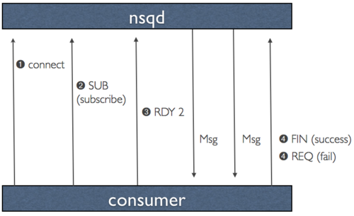
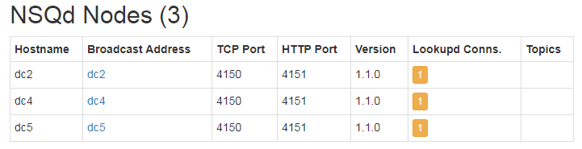

#### 1.安装

1. 下载解压：https://s3.amazonaws.com/bitly-downloads/nsq/nsq-1.1.0.linux-amd64.go1.10.3.tar.gz 安装完毕
2. 启动nsqlookupd服务
```
nsqlookupd
```
3. 启动nsqd服务
```
nsqd --lookupd-tcp-address=127.0.0.1:4160
```
4. 启动nsqadmin服务
```
nsqadmin --lookupd-http-address=127.0.0.1:4161
```
5. 生产数据
```
curl -d 'hello world 1' 'http://127.0.0.1:4151/pub?topic=test'
curl -d 'hello world 2' 'http://127.0.0.1:4151/pub?topic=test'
curl -d 'hello world 3' 'http://127.0.0.1:4151/pub?topic=test'
```
6. 读取数据并写到file
```
nsq_to_file --topic=test --output-dir=/tmp --lookupd-http-address=127.0.0.1:4161
```
7. 打开ui控制台查看
```
http://127.0.0.1:4171/
```

#### 2.功能和特性

##### 功能
- 支持没有SPOF的分布式拓扑（单点故障：single point of failure）
- 可水平扩展（无代理，无缝地向集群添加更多节点）
- 基于低延迟推送的消息传递（[性能](https://nsq.io/overview/performance.html)）
- 组合负载均衡*和*多播样式消息路由
- 擅长流媒体（高吞吐量）和面向工作（低吞吐量）工作负载
- 主要在内存中（超出高水位标记的消息透明地保存在磁盘上）
- 消费者查找生产者的运行时发现服务（[nsqlookupd](https://github.com/nsqio/nsq/tree/master/nsqlookupd/README.md)）
- 传输层安全性（TLS）
- 数据格式不可知
- 几个依赖项（易于部署）和一个理智，有界，默认配置
- 简单的TCP协议，支持任何语言的客户端库
- 统计信息，管理操作和生成器的HTTP接口（*无需发布客户端库*）
- 与[statsd](https://github.com/etsy/statsd/)集成用于实时仪器
- 强大的集群管理界面（[nsqadmin](https://github.com/nsqio/nsq/tree/master/nsqadmin/README.md)）

#####  消息保证

- 消息不是持久的（默认情况下）：消息不是持久的
> 超出内存队列大小配置（--mem-queue-size，默认1w条），数据刷新到磁盘，如果设置为0，则所有消息刷入磁盘
> 消息在分布式节点之间不相互复制备份，也就是说无法保证

- 消息至少传递一次：消息至少传递一次
> 与上述密切相关，这假定给定nsqd节点不会失败。
> 这意味着，由于各种原因，消息可以传送多个次（客户端超时，断开，重新排队，等）。客户有责任执行幂等操作或重复数据删除。

- 收到的消息无序：收到的消息是无序
> 与消息传递语义类似，这是重新队列的结果，内存和磁盘存储的组合，以及每个nsqd节点不共享的事实。


- 数据最终一致性：消费者最终找到所有主题生产者
> 发现服务（nsqlookupd）旨在最终保持一致。 nsqlookupd节点不协调以维护状态或回答查询。

#### 3.FAQ
topic命名推荐使用下划线

#### 4.设计
##### 简化配置和管理

1. nsqlookupd它提供了一个目录服务，消费者通过nsqlookupd查找订阅的主题的实例的nsql地址，从而达到消费者和生产者分离，只需要知道nsqlookupd位置即可。
2. 在较低级别，每个nsqd都有一个长期的TCP连接，nsqlookupd通过它可以定期推送其状态。此数据用于通知哪些nsqd地址nsqlookupd将提供给消费者。对于消费者，/lookup会公开HTTP 端点进行轮询。
3. 名称以字符串结尾的主题/频道#ephemeral不会缓存到磁盘，而是在传递后丢弃消息mem-queue-size

##### 消除SPOF
nsqlookupd，通过运行多个实例来实现高可用性。它们不直接相互通信，数据被认为最终是一致的。

`nsqlookupd`实例不共享或协调其数据，客户端库应该将从所有`nsqlookupd`查询收到的列表联合起来构建`nsqd`要连接的最终列表

非最新数据、不可访问或其他故障节点不会使系统停止运行。

##### 消息传递保证
此保证作为协议的一部分强制执行：（也就是说实现客户端必须满足如下三条件，特别是本地缓存临时数据，知道成功）
1. 客户端表示他们已准备好接收消息
2. NSQ发送消息并在本地临时存储数据（在重新排队或超时的情况下）
3. 强制返回成功或失败：客户端分别回复指示成功或失败的FIN（完成）或REQ（重新排队）。如果客户端没有回复NSQ将在可配置的持续时间后超时并自动重新排队消息）

##### 有界内存占用
`--mem-queue-size` 设置单个nsqd内存，多个nsqd实例总内存为：`mem-queue-size * #_of_channels_and_topics`

**注意：**channel名称 以`#ephemeral`结尾是临时channel，不会缓存到磁盘
这使得不需要消息保证的消费者能够订阅频道。在最后一个客户端断开连接后，这些短暂的通道也将消失。对于短暂的主题，这意味着已经创建，使用和删除了至少一个频道（通常是短暂的频道）。

##### 临时 channel

名称以**#ephemeral**结尾的channel在消费者完成后关闭后，会自动删除channel（topic即使加了这个也没用，topic是持久的）

##### 效率

nsqd使用push推来代替pull拉数据，使用RDY状态来控制。
客户端连接成功 RDY=0
客户端准备接收数据RDY= `100`，表示能接受100条数据推送过来，默认2500



#### 4. 组件配置
整理参考：https://nsq.io/components/nsqd.html
##### nsqd
nsqd 是守护进程，它接收，排队并向客户端发送消息。
**启动命令：**
nsqd --lookupd-tcp-address=127.0.0.1:4160  

​	 含义：查找tcp地址 (may be given multiple times)

**比较重要：**

**端口：4151为http接受数据、4152为https接受、4150为tcp接受**（java代码生产者接受数据端口4150）

**-max-rdy-count int     
    rdy值为能推送到客户端的消息条数 (default 2500)**

**-data-path string    
    数据保存到磁盘位置**  

**-max-msg-size int**
    **最大消息 1M (default 1048576)**

**-mem-queue-size int
    在内存中最大队列长度，默认存放1万条消息，超出部分如果不作其他处理，会丢失(per topic/channel) (default 10000)**

```
-http-address string
   监听http请求端口，生产者端口(默认4151)
-auth-http-address value
    auth认证服务器地址 (may be given multiple times)
-broadcast-address string
    注册到查找服务器，默认是主机名address 
-config string
    配置文件路径（可以使用配置文件）
-data-path string
    数据保存到磁盘位置  
-deflate
    开启压缩(default true)
-e2e-processing-latency-percentile value
    message processing time percentiles (as float (0, 1.0]) to track (can be specified multiple times or comma separated '1.0,0.99,0.95', default none)
-e2e-processing-latency-window-time duration
    calculate end to end latency quantiles for this duration of time (ie: 60s would only show quantile calculations from the past 60 seconds) (default 10m0s)

-http-client-connect-timeout duration
   连接超时(default 2s)
-http-client-request-timeout duration
    请求超时 (default 5s)
-https-address string
    监听https客户端 (default "0.0.0.0:4152")
-log-prefix string
    消息前缀(default "[nsqd] ")
-lookupd-tcp-address value
    查看nsqlookupd服务的地址，用于注册自己的信息（可以配置多个地址，也就是说在多个nsqlookupd上注册自己信息）
-max-body-size int
    单个命令体大小5M (default 5242880)
-max-bytes-per-file int
	每个磁盘队列文件在滚动之前的字节数 (default 104857600)
-max-deflate-level int
    max deflate compression level a client can negotiate (> values == > nsqd CPU usage) (default 6)
-max-heartbeat-interval duration
    客户端最大心跳间隔 (default 1m0s)
-max-msg-size int
    最大消息 1M (default 1048576)
-max-msg-timeout duration
    消息超时间隔 (default 15m0s)
-max-output-buffer-size int
    maximum client configurable size (in bytes) for a client output buffer (default 65536)
-max-output-buffer-timeout duration
    maximum client configurable duration of time between flushing to a client (default 1s)
-max-rdy-count int
    rdy值为能推送到客户端的消息条数 (default 2500)
-max-req-timeout duration
    maximum requeuing timeout for a message (default 1h0m0s)
-mem-queue-size int
    在内存中最大队列长度，默认存放1万条消息，超出部分如果不作其他处理，会丢失(per topic/channel) (default 10000)
-msg-timeout string
    duration to wait before auto-requeing a message (default "1m0s")
-node-id int
    unique part for message IDs, (int) in range [0,1024) (default is hash of hostname) (default 616)
-snappy
    enable snappy feature negotiation (client compression) (default true)
-statsd-address string
    UDP <addr>:<port> of a statsd daemon for pushing stats
-statsd-interval string
    duration between pushing to statsd (default "1m0s")
-statsd-mem-stats
    toggle sending memory and GC stats to statsd (default true)
-statsd-prefix string
    prefix used for keys sent to statsd (%s for host replacement) (default "nsq.%s")
-sync-every int
    number of messages per diskqueue fsync (default 2500)
-sync-timeout duration
    duration of time per diskqueue fsync (default 2s)
-tcp-address string
    <addr>:<port> to listen on for TCP clients (default "0.0.0.0:4150")
-tls-cert string
    path to certificate file
-tls-client-auth-policy string
    client certificate auth policy ('require' or 'require-verify')
-tls-key string
    path to key file
-tls-min-version value
    minimum SSL/TLS version acceptable ('ssl3.0', 'tls1.0', 'tls1.1', or 'tls1.2') (default 769)
-tls-required
    require TLS for client connections (true, false, tcp-https)
-tls-root-ca-file string
    path to certificate authority file
-verbose
    enable verbose logging
-version
    print version string
-worker-id
    do NOT use this, use --node-id
```

##### nsqlookupd
nsqlookupd是管理拓扑信息的守护程序。客户端查询nsqlookupd以发现 nsqd特定主题的生产者，并且nsqd节点广播主题和信道信息。

`nsqlookupd`实例不共享或协调其数据，客户端库应该将从所有`nsqlookupd`查询收到的列表联合起来构建`nsqd`要连接的最终列表

```
-broadcast-address string
    address of this lookupd node, (default to the OS hostname) (default "PROSNAKES.local")
-config string
    path to config file
-http-address string
    <addr>:<port> to listen on for HTTP clients (default "0.0.0.0:4161")
-inactive-producer-timeout duration
    duration of time a producer will remain in the active list since its last ping (default 5m0s)
-log-prefix string
    log message prefix (default "[nsqlookupd] ")
-tcp-address string
    <addr>:<port> to listen on for TCP clients (default "0.0.0.0:4160")
-tombstone-lifetime duration
    duration of time a producer will remain tombstoned if registration remains (default 45s)
-verbose
    enable verbose logging
-version
    print version string
```
##### nsqdadmin
##### 公共配置

统计topic 某channel消息情况：./nsq_stat --topic test --channel nsq_to_file --nsqd-http-address localhost:4151

直接打印出数据到控制台（tail -f效果）：./nsq_tail -topic aaa#ephemeral --channel tail --nsqd-tcp-address localhost:4150

##### 工具

nsq_stat
为所有的话题（topic）和通道（channel）的生产者轮询 `/stats`，并显示统计数据

nsq_tail
消费指定的话题（topic）/通道（channel），并写到 stdout (和 tail(1) 类似)

nsq_to_file
消费指定的话题（topic）/通道（channel），并写到文件中，有选择的滚动和/或压缩文件。

nsq_to_http
消费指定的话题（topic）/通道（channel）和执行 HTTP requests (GET/POST) 到指定的端点。

nsq_to_nsq
消费者指定的话题/通道和重发布消息到目的地 nsqd 通过 TCP。

to_nsq
采用 stdin 流，并分解到新行（默认），通过 TCP 重新发布到目的地 nsqd。


#### 5.集群搭建

三台机器：
dc5安装nsqlookupd 、nsqd、nsqdamdin

```
bin/nsqlookupd
bin/nsqd --lookupd-tcp-address=dc5:4160 --data-path=/nsq/nsq/data --mem-queue-size=100
bin/nsqadmin --lookupd-http-address=dc5:4161
```
dc4、dc2安装nsqd
```
bin/nsqd --lookupd-tcp-address=dc5:4160 --data-path=/nsq/nsq/data --mem-queue-size=100
```
`--lookupd-tcp-address=` 用于查找nsqlookupd服务
启动后在dc5上，能看到，ping信息：


登录管理界面查看：

http://dc5:4171/



#### 6.生产消费以及补充
生产代码：
生产者指定nsqd节点发送，如下，只会在dc5节点上有数据，而不会均衡到三台节点上。

> 存在疑问：生产指定节点接收消息，那么无法做到数据的单点故障，nsq中采用拓扑模式来处理，比如将消息nsq_to_file来做持久化备份。
> nsqd节点之间数据也不会复制，通过使用nsq_to_nsq来复制数据。

```java
public class NsqProduer {
    public static void main(String[] args) throws NSQException, TimeoutException {
        NSQProducer nsqProducer = new NSQProducer().addAddress("dc5", 4150).start();
        IntStream.range(1,15).forEach(i -> {
                    try {
                        nsqProducer.produce("topic-a", ("hello " + i).getBytes());
                    } catch (Exception e) {
                        e.printStackTrace();
                    }
                }
        );
        nsqProducer.shutdown();
    }
}
```

消费者：channel-a#ephemeral 临时channel，在客户端断开后自动被nsqd删除

```java
 public class NsqClient {
    public static void main(String[] args) {
        NSQLookup lookup = new DefaultNSQLookup();
        lookup.addLookupAddress("dc5", 4161);
        NSQConfig nsqConfig = new NSQConfig();
        NSQConsumer consumer = new NSQConsumer(lookup, "topic-a", "channel-a#ephemeral", (message) -> {
            try {
                System.out.println("received: " + new String(message.getMessage(), "ISO-8859-1"));
            } catch (Exception e) {
                e.printStackTrace();
            }
            message.finished();
        }, nsqConfig, (e) -> {
            e.printStackTrace();
        });
        consumer.start();
    }
}
```


队列：先进先出，所有，当消费者还来不及消费数据，生产者生成超出max-queue-size，那么后面的数据会被丢弃。

比如：设置max-queue-size=10，发送1-15个数字到nsqd，那么1-10将会被保留，11-15将会被丢弃。


#### 7.其他

参考：https://segmentfault.com/a/1190000012882466

**nsqd ：**

负责接收消息，存储队列和将消息发送给客户端，nsqd 可以多机器部署，当你使用客户端向一个topic发送消息时，可以配置多个nsqd地址，消息会随机的分配到各个nsqd上，nsqd优先把消息存储到内存channel中，当内存channel满了之后，则把消息写到磁盘文件中。他监听了两个tcp端口，一个用来服务客户端，一个用来提供http的接口 ，nsqd 启动时置顶下nsqlookupd地址即可：

```
nsqd –lookupd-tcp-address=127.0.0.1:4160
```

也可以指定端口 与数据目录

```
nsqd –lookupd-tcp-address=127.0.0.1:4160 --broadcast-address=127.0.0.1 -tcp-address=127.0.0.1:4154 -http-address=”0.0.0.0:4155″ –data-path=/data/nsqdata
```

其他配置项可详见官网

**nsqlookupd**：
主要负责服务发现 负责nsqd的心跳、状态监测，给客户端、nsqadmin提供nsqd地址与状态

**nsqadmin：**
nsqadmin是一个web管理界面 启动方式如下：

```
nsqadmin –lookupd-http-address=127.0.0.1:4161
```


channel详情页示例图如下 ，empty可以清空当前channel的信息，delete删除当前channel, pause是暂停消息消费。

图中也有几个比较重要的参数：

​	 depth当前的积压量；

​	in-flight代表已经投递还未消费掉的消息；

​	deferred是未消费的定时（延时）消息数；

​	ready count比较重要，go的客户端是通过设置max-in-flight 除以客户端连接数得到的，代表一次推给客户端多少条消息，或者客户端准备一次性接受多少条消息，谨慎设置其值，因为可能造成服务器压力，如果消费能力比较弱，rdy建议设置的低一点比如3


**这里提下延时消息：**

nsq支持延时消息的投递，比如我想这条消息5分钟之后才被投递出去被客户端消费，较于普通的消息投递，多了个毫秒数，默认支持最大的毫秒数为3600000毫秒也就是60分钟，不过这个值可以在nsqd 启动的时候 用 -max-req-timeout参数修改最大值。

延时消息可用于以下场景，比如一个订单超过30分钟未付款，修改其状态 或者给客户发短信提醒，比如之前看到的滴滴打车订单完成后 一定时间内未评价的可以未其设置默认值，再比如用户的积分过期，等等场景避免了全表扫描，异步处理，kafka不支持延时消息的投递，目前知道支持的有rabbitmq rocketmq,但是rabbitmq 有坑，有可能会超时投递，而rocketmq只有阿里云付费版支持的比较好。

nsq延时消息的实现是用最小堆算法完成，作者继承实现heap的一系类接口，专门写了一个pqueque最小堆的优先队列，在internal/pequeque 目录可以看到相关实现，pub的时候如果chanMsg.deferred != 0则会调用channel.PutMessageDeferred方法，最终会调用继承了go heap接口的pqueque.push方法

延时消息的处理 和普通消息一样都是 nsqd/protocol_v2.go下messagePump 中把消息发送给客户端 然后在queueScanWorker中分别处理，pop是peekAndShift方法中，拿当前时间 和 deferred[0]对比如果大于 就弹出发送给客户端 如下代码：


```go
func (n *NSQD) queueScanWorker(workCh chan *Channel, responseCh chan bool, closeCh chan int) {
    for {
        select {
        case c := <-workCh:
            now := time.Now().UnixNano()
            dirty := false
            if c.processInFlightQueue(now) {
                dirty = true
            }
            if c.processDeferredQueue(now) {
                dirty = true
            }
            responseCh <- dirty
        case <-closeCh:
            return
        }
    }
}

func (c *Channel) processDeferredQueue(t int64) bool {
    c.exitMutex.RLock()
    defer c.exitMutex.RUnlock()

    if c.Exiting() {
        return false
    }

    dirty := false
    for {
        c.deferredMutex.Lock()
        item, _ := c.deferredPQ.PeekAndShift(t)
        c.deferredMutex.Unlock()

        if item == nil {
            goto exit
        }
        dirty = true

        msg := item.Value.(*Message)
        _, err := c.popDeferredMessage(msg.ID)
        if err != nil {
            goto exit
        }
        c.put(msg)
    }

exit:
    return dirty
}

func (pq *PriorityQueue) PeekAndShift(max int64) (*Item, int64) {
    if pq.Len() == 0 {
        return nil, 0
    }

    item := (*pq)[0]
    if item.Priority > max {
        return nil, item.Priority - max
    }
    heap.Remove(pq, 0)

    return item, 0
}
```

