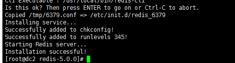
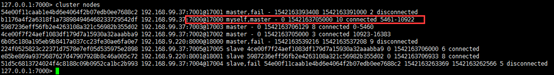

#  1        介绍

作者Salvatore Sanfilippo
github：<a>https://github.com/antirez</a>

有windows版本，非官方，提交的被作者拒接了，C语言。
很活跃，新手直接上5.0版本。2018年11月5日 17:10:42

Redis 默认支持16个数据库：默认使用0，简要代码：
```sh
Select 1  # 选择对应数据库
SET resource:lock "Redis Demo"  
EXPIRE resource:lock 120 # 设置过期时间，120秒
TTL resource:lock => 113  # 查看过期时间，-1永不过期，-2，过期。
```
安装：
```sh
wget wget http://download.redis.io/releases/redis-5.0.0.tar.gz
tar -zxvf redis-5.0.0.tar.gz 
cd redis-5.0.0/
make & make test &make install   （这里make install 执行会安装到/usr/local/bin/）

# 执行测试，runtest、runtest-cluster、runtest-sentinel
#需要提前安装tcl 8.5 或者以上 
./runtest
./src/install_server.sh  主要是开启启动等，成功见下方截图
```
**报错：**查看README.md中有说明错误原因。


关于分配器allocator， 如果有MALLOC  这个 环境变量， 会有用这个环境变量的 去建立Redis。

 

而且libc 并不是默认的 分配器， 默认的是 jemalloc, 因为 jemalloc 被证明 有更少的 fragmentation problems 比libc。

但是如果你又没有jemalloc 而只有 libc 当然 make 出错。 所以加这么一个参数。

解决办法：执行： make MALLOC=libc

**install_server.sh执行成功提示：**



修改能被远程访问：

```sh
bind 127.0.0.1  #注释掉这句
protected-mode no
daemonize yes  # 设置后台启动，后台启动由这个控制，而不需要使用&
```
增加为开启启动：
```sh
$redis-5.0.0/utils/install_server.sh
```
启动：
```sh
cd src
src/redis-server redis.config   #默认端口6379  ，后台启动配置daemonize
```
连接
```shl
src/redis-cli   
```
测试是否成功：
```sh
127.0.0.1:6379> ping   
PONG   
127.0.0.1:6379> echo hi   
"hi"   
```

# 2         基础

**可存放数据结构：**

字符串 string

散列 hash

列表 list

集合 set

有序集合 sorted set

其他命令：

```sh
info # 可以看到所有库的key数量;
dbsize # 则是当前库key的数量;
keys *  # 这种数据量小还可以，大的时候可以直接搞死生产环境，同样还有SMEMBERS
FLUSHALL [ASYNC] # 清空数据库

# 对KEY操作命令
DEL key  #删除key，不支持通配符
# 删除多个的2个方法： 如需要删除user开头的key
redis-cli keys "user:*" | xargs redis=cli del  #使用xargs配合
redis-cli del `redis-cli keys "user:*"`   # 这种性能更优，因为一次发送

DUMP key #序列化key  
EXISTS key  #key是否存在
EXPIRE KEY seconds(秒为单位)   #给key设定过期时间，秒为单位
EXPIREAT KEY TIMESTAMP #expire at  指定时间戳过期
PEXPIRE KEY MILLISECONDS  #  过期时间为毫秒
PEXPIREAT KEY MILLISECONDS   # at 指定过期时间
MOVE KEY DB  # 移动key到其他db
PERSIST KEY # 持久化key，那么过期时间会失效，相当于删除过期时间
PTTL KEY  # 返回剩余过期时间戳  ，-1永不过期，-2已经过期
TTL KEY  # 返回剩余过期时间秒
RANDOMKEY #随机返回一个key
RENAME KEY NEWKEY #key改名 ，如果newkey存在，则相当于把key的值赋值给b
RENAMENX KEY NEWKEY #如果newkey不存在，则更新成功，返回1，否则，更新失败返回0，啥也没做。。。
TYPE KEY #返回key类型
```
## 2.1  String
数值操作：
```sh
127.0.0.1:6379> set key hello
OK
127.0.0.1:6379> get key
"hello"
127.0.0.1:6379> incr key  # 必须数字类型，float使用incrbyfloat key 增加的量
(error) ERR value is not an integer or out of range
127.0.0.1:6379> set num 1
OK
127.0.0.1:6379> get num
"1"
127.0.0.1:6379> incr num  # 递增
(integer) 2 
127.0.0.1:6379> incrby num 5  # 指定增加的数值
(integer) 7
127.0.0.1:6379> decr num  # 递减
(integer) 6
127.0.0.1:6379> decrby num 5  # 指定减少量
(integer) 1
```
字符串操作：
```sh
127.0.0.1:6379> set ljh hello   #不加双引号，trim然后保存，加双引号会保留双引号内出空格
OK
127.0.0.1:6379> append ljh world # 追加字符到末尾
(integer) 10
127.0.0.1:6379> get ljh
"helloworld"
```
bit操作，将每个位拿出来操作

```sh
set foo bar
getbit foo 0  # 拿出二进制的第一个，一个字节8个二进制位组成，
setbit foo  6 0 # 第6个位置设置为0
bitcount foo  # 统计foo中位为1的个数
bitop or 结果存放key  key1 key2  # 将key1，2执行or操作，结果存放key里面。支持and、or、xor和not操作
bitos foo 1 #获取foo的位中第一个为1的偏移量
bitos foo 0 100 1 #获取foot中0到100之间，第一个为1的偏移量
```


提示：

> Key的命名规则任意，一般建议：对象类型：对象id，对象属性。

## 2.2  list

列表是一系列有序值，一些与列表交互的重要的命令是RPUSH，LPUSH，LLEN， LRANGE，LPOP和RPOP。
```sh
# RPUSH将新值放在列表的末尾。
RPUSH friends "Alice"
RPUSH friends "Bob"
# LPUSH将新值放在列表的开头。
LPUSH friends "Sam"
#LRANGE给出了列表的子集。它将您要检索的第一个元素的索引作为其第一个参数，并将要检索的最后一个元素的索引作为其第二个参数。第二个参数的值为-1表示检索元素直到列表的末尾。
LRANGE friends 0 -1 => 1) "Sam", 2) "Alice", 3) "Bob"
LRANGE friends 0 1 => 1) "Sam", 2) "Alice"
LRANGE friends 1 2 => 1) "Alice", 2) "Bob"
# LLEN返回列表的当前长度。
LLEN friends => 3
# LPOP从列表中删除第一个元素并返回它:
LPOP friends => "Sam"
# RPOP从列表中删除最后一个元素并返回它。
RPOP friends => "Bob"
#　请注意，列表现在只有一个元素：
LLEN friends => 1
LRANGE friends 0 -1 => 1) "Alice"
```
## 2.3  Set
集合类似于列表，除了它没有特定的顺序，每个元素只能出现一次。
使用集合的一些重要命令是SADD，SREM， SISMEMBER，SMEMBERS和SUNION。
```sh
# SADD 增加给定值
SADD superpowers "flight"
SADD superpowers "x-ray vision"
SADD superpowers "reflexes"
# SREM 删除给定的值
SREM superpowers "reflexes"
# SISMEMBER测试给定值是否在集合中。返回1存在，否则返回0。
SISMEMBER superpowers "flight" => 1
SISMEMBER superpowers "reflexes" => 0
# SMEMBERS返回此集合的所有成员的列表（禁止使用）
SMEMBERS superpowers => 1) "flight", 2) "x-ray vision"
```
集合运算：
```sh
SUNION 组合返回1+个集合的列表
SADD birdpowers "pecking"
SADD birdpowers "flight"
SUNION superpowers birdpowers => 1) "pecking", 2) "x-ray vision", 3) "flight"
SDIFF 差集
SINTER 交集
```
## 2.4  Sorted Sets 

有序的Set。
添加数据，黑客和出生年，出生年月浮点数，用于排序
```sh
ZADD hackers 1940 "Alan Kay"
ZADD hackers 1906 "Grace Hopper"
ZADD hackers 1953 "Richard Stallman"
ZADD hackers 1965 "Yukihiro Matsumoto"
ZADD hackers 1916 "Claude Shannon"
ZADD hackers 1969 "Linus Torvalds"
ZADD hackers 1957 "Sophie Wilson"
ZADD hackers 1912 "Alan Turing"

# 这里会以出生年进行排序：

ZRANGE hackers 2 4 => 1) "Claude Shannon", 2) "Alan Kay", 3) "Richard Stallman"
```
## 2.5  Hashes 
Redis的list、set、zset、hash均不支持数据嵌套格式，如Hashes里面值存放set、list等
往用户1000，添加name、email、password数据：
```sh
HSET user:1000 name "John Smith"
HSET user:1000 email "john.smith@example.com"
HSET user:1000 password "s3cret"
# HETALL 获取数据
HGETALL user:1000
# 一下子设置多个值
HMSET user:1001 name "Mary Jones" password "hidden" email "mjones@example.com"
# 获取单个值：
HGET user:1001 name => "Mary Jones"
# 散列字段中的数值处理与简单字符串中的数字值完全相同，并且存在以原子方式递增此值的操作。
HSET user:1000 visits 10
HINCRBY user:1000 visits 1 => 11
HINCRBY user:1000 visits 10 => 21
HDEL user:1000 visits  # DEL 全部删除
HINCRBY user:1000 visits 1 => 1
```
总共100多个，常用十几个，命令参考：
<a> https://redis.io/commands </a>

```sh
Key * #  获取所有key，? 匹配一个字符，* 匹配任意个字符，a[a-z]匹配a[a-z],\x转义
#Key当key较多，生产环境慎用。
Exists bar  # 判断数据是否存在，1存在，0不存在
Del bar  # 删除bar，可带多个key
TYPE key # 获取类型，返回值：string、hash、list、set、zset
```
# 3         进阶

## 3.1  事务
[MULTI](https://redis.io/commands/multi),[EXEC](https://redis.io/commands/exec), [DISCARD](https://redis.io/commands/discard),[WATCH](https://redis.io/commands/watch) 是transactions的基础
事务中的所有命令都被序列化并按顺序执行。在执行Redis事务**的过程中**，不会发生由另一个客户端发出的请求。这可以保证命令作为单个隔离操作执行。
要么处理所有命令，要么都不处理，因此Redis事物是原子性操作。

**事物错误，分两种：**
1. 如果是事物当中，命令有语法错误，exec会直接退出。（2.6.5之前会执行正确的命令）；
2. 如果事务当中，出现运行错误，如给string incr，那么其他正常的命令会被执行。

**Redis事务不会回滚！**
**官方说法是：通常回滚也不能解决编程错误带来的问题，并且这类错误不会在生产中出现。所以采用简单、快速的方式。**
先不要执行，缓存到queued，exec的时候执行，discard取消退出multi
```sh
127.0.0.1:6379> multi
OK
127.0.0.1:6379> sadd "user:1:following" 2
QUEUED
127.0.0.1:6379> sadd "user:2:following" 1
QUEUED
127.0.0.1:6379> exec
1) (integer) 1
2) (integer) 1
```

### 3.1.1            Watch/unwatch命令

watch命令可以监控一个或多个键，一旦其中有一个键被修改（或删除），之后的事务就不会执行，针对最近的一个事务，如果这个事务运行的时候，这个key没有被修改，那么事物能成功，此时，key再被修改，再来一个事务不受影响（也就是说，影响的是第一个exec命令即最近的一个事务）。
Unwatch取消监视。

> 注：在multi内部可以修改watch监视的key。因为multi是exec之后执行的。


### 3.1.2            简易版本秒杀方案

Pom.xml 
```
<dependencies>  	
    <!-- https://mvnrepository.com/artifact/redis.clients/jedis -->  	
    <dependency>  
        <groupId>redis.clients</groupId>  
        <artifactId>jedis</artifactId>  
        <version>2.9.0</version>  
    </dependency>  
</dependencies>  
<build>  
    <plugins>  
        <!-- 指定jdk -->  
        <plugin>  
            <groupId>org.apache.maven.plugins</groupId>  
            <artifactId>maven-compiler-plugin</artifactId>  
            <configuration>  
                <source>1.8</source>  
                <target>1.8</target>  
            </configuration>  
        </plugin>  
    </plugins>  
</build>  
```
简单的连接池实现：
RedisUtil.java
```java
public class RedisUtil {
    private static LinkedList<Jedis> jedisQueue;

    public synchronized static Jedis getJedis() {
        if (jedisQueue == null) {
            jedisQueue = new LinkedList<>();
            for (int i = 0; i < 10; i++) {
                Jedis jedis = new Jedis("dc2", 6379);
                jedisQueue.push(jedis);
            }
        }
        return jedisQueue.poll();
    }
    
    public static void returnJedis(Jedis jedis) {
        jedisQueue.push(jedis);
    }
    
    public static void main(String[] args) {
        Jedis jedis = RedisUtil.getJedis();
        String myKey = jedis.get("myKey");
        System.out.println(myKey);
    }
}
```
业务代码：MyThread

```java
public class MyThread extends Thread {
    private static final String KEY = "myKey";
    private Jedis jedis = null;

    @Override
    public void run() {
        while (true) {
            System.out.println(Thread.currentThread().getName());
            jedis = RedisUtil.getJedis();
    
            if (jedis == null) {
                System.out.println("jedis  为空~~~~~");
                break;
            }
            try {
                int stock = Optional.ofNullable(Integer.parseInt(jedis.get(KEY))).orElse(0);
                if (stock > 0) {
                    jedis.watch(KEY);
                    Transaction transaction = jedis.multi();
                    transaction.set(KEY, String.valueOf(stock - 1));
                    List<Object> result = transaction.exec();
                    if (result == null || result.isEmpty()) {
                        System.out.println("Transaction error ...");
                    } else {
                        System.out.println("命中啦！！");
                    }
                    /*String result = jedis.set(KEY, String.valueOf(stock - 1));
                    System.out.println("返回值" + result);
                    if (result == null || result.isEmpty()) {
                        System.out.println("Transaction error ...");
                    } else {
                        System.out.println("命中啦！！");
                    }*/
                } else {
                    System.out.println("库存为0");
                    break;
                }
            } catch (Exception e) {
                e.printStackTrace();
            } finally {
                RedisUtil.returnJedis(jedis);
            }
        }
    }
}
```
启动类：Main.java

```java
public class Main {
    public static void main(String[] args) {
        new MyThread().start();
        new MyThread().start();
        new MyThread().start();
        new MyThread().start();
        new MyThread().start();

        new MyThread().start();
        new MyThread().start();
        new MyThread().start();
        new MyThread().start();
        new MyThread().start();
    }
}

```
现象：在多线程竞争中有且只有一个命中。
过期时间


## 3.2  过期时间
```sh
Expire  # 设置秒
Pexpire  # 设置毫秒
Persist  # 取消过期
127.0.0.1:6379> set session:123 uuid9999
OK
127.0.0.1:6379> expire session:123 100  # 设置过期
(integer) 1
127.0.0.1:6379> ttl session:123 
(integer) 92
127.0.0.1:6379> persist session:123  # 取消过期 ,或者重新set/getset命令
(integer) 1
127.0.0.1:6379> ttl session:123 
(integer) -1
127.0.0.1:6379> ttl uuid
(integer) -2
```
### 3.2.1            实现访问频率限制

需求：限制一个ip一分钟内访问10次。
简易版本：
```sh
$isKeyExists = EXISTS ip
If $isKeyExists is 1 :
       $times = INCR ip
       If $times > 10
              Print 访问超频，退出
              Exit
Else:
       MULTI  // 防止第一次执行到incr ip的时候断开连接等
       INCR ip
       EXPIRE IP 60
       EXEC
```
窗口滑动存在的问题： 


改进： 

```sh
$listLength = Llen ip
If $listLength < 10:
       LPUSTH ip now()
Else:
       $time = LINDES IP -1
       If now() -$time < 60:
              Print 访问超频，请稍后再试。
       Else:
              LPUSH ip now()
              LTRIM ip 0 9
注：(如果A时间最多访问b次，b数值较大，比较占用空间。)
```
### 3.2.2            实现缓存
```sh 
# LRU means Least Recently Used 最近最少使用
# LFU means Least Frequently Used 最不经常使用
# volatile-lru -> Evict using approximated LRU among the keys with an expire set.
# allkeys-lru -> Evict any key using approximated LRU.**
# volatile-lfu -> Evict using approximated LFU among the keys with an expire set.
# allkeys-lfu -> Evict any key using approximated LFU.
# volatile-random -> Remove a random key among the ones with an expire set.
# allkeys-random -> Remove a random key, any key.
# volatile-ttl -> Remove the key with the nearest expire time (minor TTL)
# noeviction -> Don't evict anything, just return an error on write operations.**
```
## 3.3  排序

### 3.3.1            sorted set有序集合
```sh 
ZCARD key 返回元素个数
Zcount key min max 返回指定范围元素的个数
zunionstore并集，zinterstore交集操作的结果存放到一个新的key:
ZUNIONSTORE destination numkeys key [key ...] [WEIGHTS weight [weight ...]] [AGGREGATE SUM|MIN|MAX]
权重：集合中每个值对应分数的需要乘以权重，默认相加，如这里zset1
中one为1*2 + zset2中one为1*3 最终并集得分为5
```


```
同理ZINTERSTORE交集。语法相同。
```
### 3.3.2            sort排序[列表|集合|有序集合]
完整命令：sort key [BY pattern] [LIMIT offset count] [GET pattern [GET pattern ...]] [ASC|DESC] [ALPHA] [STORE destination]

```
127.0.0.1:6379> lpush mylistalpha a d g c g a
(integer) 6
```
#### 3.3.2.1      参数alpha
```
127.0.0.1:6379> sort mylistalpha desc alpha   // 以字典降序排序
1) "g"
2) "g"
3) "d"
4) "c"
5) "a"
6) "a"
```
#### 3.3.2.2      参数limit
```
127.0.0.1:6379> sort mylistalpha limit 2 5 desc alpha  // limit操作
```
#### 3.3.2.3      参数by
```
127.0.0.1:6379> lpush list 5 3 9
(integer) 3
127.0.0.1:6379> set it.5 30
OK
127.0.0.1:6379> set it.9 40
OK
127.0.0.1:6379> set it.3 90
OK
127.0.0.1:6379> sort list by it.* desc
1) "3"
2) "9"
3) "5"
```
> 解析：如上所示：sort对list列表进行排序，使用了by参数，那么就不是使用list中的值来排序了，而是将list中的值[9,3,5]替换到[it:*]这个*，替换关系：list[9,3,5]==[it:9,it:3,it:5]，然后对[it:9,it:3,it:5]这三个元素排序，以上可知：[it:9,it:3,it:5]对应的值为[it:9=40,it:3=90,it:5=30]，倒叙排列对应的关系即为[it:3=90,it:9=40,it:5=30],对应的[it:3=90,it:9=40,it:5=30] == list[3,9,5]，即得到list列表的顺序。

#### 3.3.2.4      参数get

```
127.0.0.1:6379> sort list by it.* desc get it.*
1) "90"
2) "40"
3) "30"
注意事项：
1）尽可能减少排序中元素的数量
2）使用limit参数只获取需要的数据
3）如果排序数据量较大，尽可能使用store将结果缓存
```
## 3.4  消息通知
使用list实现消息队列功能:
```sh
Lpush 队列头添加（Rpush末尾添加） 
rpop队列头消费（lpop末尾消费）
brpop队列头消费，需要超时时间参数（blpop）,支持同时监控多个key

优先级队列：如果多个队列 都有数据，那么从左往右，取第一个键中的一个元素。
127.0.0.1:6379> blpop queue:1 queue:2 queue:3 0
1) "queue:1"
2) "3"
```
### 3.4.1            发布订阅模式
```sh
subscribe channel.1 // 指定订阅
PSUBSCRIBE ch* // 通配符订阅，订阅ch* 以及cha* 匹配到2个channel就会接收到2次消息
Publish channel.1 “start~~~”  // 所有订阅者都会接收到
```

## 3.5  管道

客户端和redis使用TCP连接，速度慢。一组命令不依赖前面命令的执行结果，就可以使用管道。
```
Pipeline pipelined = jedis.pipelined();
pipelined.set("key1", "value1");
pipelined.set("key3", "value2");
pipelined.set("key3", "value3");
pipelined.sync();
pipelined.clear();  // close调用clear
```

# 4         脚本

## 4.1  Lua脚本
```
// 设置foo的值为bar
127.0.0.1:6379> eval "return redis.call('set',KEYS[1],ARGV[1])" 1 foo bar
OK
```
需求：10秒内访问3次：当访问频率在10秒内小于或等于3次时返回1，否则返回0。
[root@dc2 lua-5.3.5]# cat ratelimiting.lua 

```lua
local times = redis.call('incr',KEYS[1])
if times == 1 then
	redis.call('expire',KEYS[1],ARGV[1])
end
if times> tonumber(ARGV[2]) then
	return 0
end 
return 1
```
运行：
```
redis-cli --eval ratelimiting.lua rate.limitingl:127.0.0.1 , 10 3
```
# 5         持久化

## 5.1  RDB

Redis.conf配置：
```
save 900 1
save 300 10
save 60 10000
```
手动执行：
```
Save 同步进行快照SNAPSHOTTING,阻塞所有请求。
Bgsave 后台fork进程处理，lastsave获取unix时间戳表示最近一次执行SNAPSHOTTING时间。
```
快照过程：
```
1）redis使用fork函数复制一份当前进程的副本
2）父进程继续接收并处理客户端发来的命令，而子进程开始将内存中的数据写入磁盘
3）当子进程写入完所有数据，会用该临时文件替换旧rdb文件，完成快照操作。
```
> 说明：fork使用写时复制copy-on-write，即fork函数发生的一刻父子进程共享同一内存数据。写时策略也保证了内存不一定会增加一倍，如memeory总共2g，redis用掉1.5g，需要开启/etc/sysctl.conf 加入vm.overcommit_memory=1,然后执行sysctl vm.overcommit_memory= 1。但是如果fork时，仍有大量数据写入，会使得fork时间点的内存和时间点之后的内存都需要被保存，这时候就可能会造成内存用量超限。

Overcommit_memory内存分配策略：
```
 0， 表示内核将检查是否有足够的可用内存供应用进程使用；如果有足够的可用内存，内存申请允许；否则，内存申请失败，并把错误返回给应用进程。
 1， 表示内核允许分配所有的物理内存，而不管当前的内存状态如何。
 2， 表示内核允许分配超过所有物理内存和交换空间总和的内存
```
## 5.2  AOF
```
appendonly yes
appendfilename "appendonly.aof"
\# appendfsync always //每次收到写命令就立即强制写入磁盘，最慢的，但是保证完全的持久化，不推荐使用
appendfsync everysec //每秒钟强制写入磁盘一次，在性能和持久化方面做了很好的折中，推荐
\# appendfsync no // //完全依赖os，性能最好,持久化没保证

auto-aof-rewrite-percentage 100
auto-aof-rewrite-min-size 64mb
```
# 6         集群
## 6.1  复制
### 6.1.1            配置

三种方式配置：启动时候指定master，修改redis.conf，在redis-cli中指定。

1）命令：redis-server –port 6380 –slaveof 127.0.0.1 本地启动2个redis实例。以6380为从。

2）redis.conf配置：

replicaof 192.168.9.168 6379   //  指定后面这个为master

3) 127.0.0.1:6379> SLAVEOF 192.168.9.168 6379  // 该命令同replicaof，slaveof废弃使用replicaof

常用命令：
```
Info replication：在redis-cli中查看当前节点状态。
```
Master断开，slave报错：


replica-serve-stale-data yes断开master节点，仍可提供数据读取:


replica-serve-stale-data no

断开连接后，查询key，报错：


其他配置：

**replica-read-only yes**：默认yes，只读，写操作报错。如果为no，slave写之后，不会同步到master也不会同步到其他slave，只作为本地slave使用,但是在master向slave同步数据后会被删除，所以一般设置为yes。

### 6.1.2            原理

从数据库启动，发送sync到master，master接收到就在后台执行rdb snapshotting，在保存快照期间接收的数据会缓存启动。

完成快照后，redis会发送到slave。当slave接收到快照后会载入快照。

复制结束后，master接收到一条记录，会同步给slave，保证数据一致。

异常，如果主从连接断开重启后，slave如何接收数据？

2.6之前，master会将所有数据全部发送到slave

2.6之后，使用增量发送。

**Redis使用tcp协议通信，使用telnet伪装redis slave进行通信：**

在其他节点使用telnet命令执行：
```
ping
replconf listenging-port 6381
sync
#之后每隔10秒，master会自动同步数据
```

**乐观复制:optimistic replication容忍一定时间内主从输不一致。**

Master接收到数据后直接给client返回结果。然后异步同步都slave。如果此时slave断开连接，那么master和slave之间数据不一致。

Redis master无法得知某个命令最终同步给了多少个slave，但是提供了2个配置来限制只有当数据至少同步给指定数量的slave，master才是可写的：

```
# min-replicas-to-write 3 # 3个或以上slave连接到master，才可写   
# min-replicas-max-lag 10  # 相当于最长心跳时间   
```
### 6.1.3            从数据库持久化

持久化比较耗时，为提高性能，可以通过复制功能建立1+个从数据库，在从数据库中启用持久化，同时在master中禁用持久化。
slave崩溃重启master会自动将数据库同步过来。
Master崩溃，情况稍显复杂。手工通过slave恢复master的数据，需要严格按照以下两步：

1. 在slave使用slaveof no one将从数据库提升为master继续服务。

2. 启动崩溃的master，使用slaveof命令将其设置成slave。

> 注：master宕掉，不能直接重启，因为master关闭了持久化，那么master直接重启会导致数据被清空，同时又同步到slave，导致缓存数据整体被清。

### 6.1.4            无硬盘复制

**repl-diskless-sync no** : 两种同步策略：disk or socket。

> 注：非磁盘同步还在实验阶段（版本5.0）该功能2.8.18版本就提供了

1. Disk-backed:Redis master创建一个新的进程，在磁盘上写入RDB文件。稍后，文件由父进程递增地传递到副本。
2. Diskless:Redis master创建一个新进程，直接将RDB文件写入到socket，而不需要设计disk
使用Disk-backed，在生成RDB文件时，只要生成RDB文件的当前子文件完成其工作，就可以将更多副本排队并与RDB文件一起服务。
使用Diskless，一旦传输开始，新副本将排队等待，当前副本终止时将启动新的传输。
当磁盘慢，网速快，使用diskless效果更好.
**repl-diskless-sync-delay 5** :多久开始使用socket进行同步。因为如果多个rdb生成传输是需要排队的。

### 6.1.5            增量复制

重新连接到master，slave发送sync命令重新进行一次完整复制。2.8版本相对2.6最重要的更新之一就是实现断线重连情况下的增量复制。

**增量复制基于如下三点实现：**
a． slave会存储master运行id（run id）。每个redis运行实例均会拥有一个唯一的run id，重启会生成一个新的run id。
b．在复制同步阶段，master每将一个命令传送给slave时，都会同时把该命令存放到一个积压队列backlog，并记录下当前积压队列中存放的命令的偏移量范围。
c． 同时，slave收到master传来的命令，会记录该命令的偏移量。

**过程：**
当slave连接到master，发送psync（2.8之前是sync），格式为：psync master-runID 断开前的偏移量。
Master收到psync命令后，会执行以下判断来决定此次重连是否可以执行增量复制。
1.  判断runid是否和自己的runid相同。
2. 判断slave最后同步成功的命令偏移量是否在backlog中，如果在执行增量，否则全量同步。
Backlog：积压队列本质上是一个固定长度的循环队列，默认1mb
```
\# repl-backlog-size 1mb  # 队列默认1mb，根据实际生产中命令大小以及可能的断线时间估算。
\# repl-backlog-ttl 3600  # 默认断开1小时后，释放backlog空间。
```
## 6.2  哨兵


### 6.2.1            Sentinel.conf配置
配置哨兵:
启动master
启动两台slave
其中一台为哨兵
其中两台，redis-cli> replicaof masterurl 6379
修改哨兵这台服务器上：vim sentinel.conf
```
sentinel monitor mymaster 127.0.0.1 6379 1
sentinel down-after-milliseconds mymaster 30000  #主观掉线时间，后面有说明
sentinel failover-timeout mymaster 180000  #执行故障转移的timeout超时时长
sentinel parallel-syncs mymaster 1   # 同时连接新master的slave个数，越大则重新连接越快，但是存在无法提供读服务的问题，所以自己权衡。
```
**说明：**
```
sentinel monitor mymaster 192.168.9.168 6379 1  #最后这个数字1个哨兵写2将不会重启，因为没人投票。
```
> 格式：master名字，ip，端口，最后数字表示最低通过票数。

其中+sdown表示哨兵主观认为master停止服务；(subjectively down)
> sentinel down-after-milliseconds mymaster 30000 # 30秒，该配置小于1s，那么sentinel会指定时间发送ping，如果大于1s，则1秒发送ping到其他节点，如果指定的时间，还没收到回应，则认为主观下线。

+odown 表示哨兵客观认为master停止服务。(objectively down)

> 一个哨兵在指定时间内，收到了quorum指定数量的其他哨兵也认为那个master是sdown了，那么就认为是odown了，客观认为master宕机

+try-failover 哨兵开始进行故障恢复
+failover-end 哨兵完成故障恢复
+switch-master master的切换

### 6.2.2            Redis.conf配置

**防止脑裂：**
```
# min-replicas-to-write 3  
# min-replicas-max-lag 10
```
如果连接的副本少于N个，延迟小于或等于M秒，则master可以停止接受写操作。N个副本需要处于“在线”状态。

延迟(以秒为单位)，必须是<=指定值，它是从副本接收到的最后一次ping计算出来的，通常每秒钟发送一次。

这个选项并不保证N个副本会接受写操作，但是如果没有足够的副本可用，则会将丢失的写操作的暴露窗口限制在指定的秒数。

### 6.2.3            启动

**启动sentinel**：

src/redis-sentinel sentinel.conf

哨兵只需要监控master节点即可，会自动发现slave


Shutdown master或者kill redis，sentinel节点日志：


重新恢复：


失败的master重启后就变为了slave
一个哨兵节点可以监控多个redis主从节点
**注：**在测试中选举master失败：


原因：启动redis是以redis-server –replicaof ip port方式，而不是配置文件形式。可能同时把cluster-enabled恢复为no。

**检查哨兵状态**
[root@dc5 redis-5.0.0]# src/redis-cli -h 127.0.0.1 -p 26379
```
sentinel master mymaster
SENTINEL slaves mymaster
SENTINEL sentinels mymaster
SENTINEL get-master-addr-by-name mymaster
```

### 6.2.4            原理：

哨兵启动后，会与master建立两条连接：

其中一条连接订阅master的__sentinel__:hello频道以获取其他同样监控该maaster的哨兵节点。

另外也需要定期向master发送info（telnet 可以模拟）获取master本身的信息。(因为进入订阅后就不能执行其他命令，所以哨兵会使用另一条连接来发送这些命令。)

和master建立连接后，sentinel定时执行下面3个操作：

1.  每10秒sentinel发送info命令到master,获取master信息，以及slave连接信息，并同slave建立连接；


2. 每2秒sentinel向master和slave的__sentinel__:hello频道发送自己的信息；

3. 每1秒，sentinel向master、slave以及其他sentinel发送ping命令。

 

### 6.2.5            领头哨兵选举

如果一个master经过down-after-milliseconds时间后ping仍未回复，则sentinel认为其主观下线，如果是master主观下线，sentinel还会发送SENTINEL is-master-down-by-addr命令询问其他哨兵节点以确定是否也认为sdown，如果达到quorum指定数量，那么sentinel会认为odown，并选举leader-sentinel对主从系统发起故障恢复。

选举领导哨兵过程使用Raft算法，具体过程：
1)      发现master odown的sentinel节点A，向所有sentinel节点发送命令，要求对方选举自己为leader-sentinel。
2)      如果其他哨兵节点没有选过其他人，则会同意A设置成leader-sentinel。
3)      如果A发现有超过半数且超过quorum同意自己成为领头哨兵，则A成为leader-sentinel。
4)      当有多个哨兵同时参选，则会出现没有任何节点当选可能。此时每个参选节点将等待一个随机时间，重新发起参选请求，进行下一轮，直到选举成功。  
具体参考： [raft算法](https://www.jdon.com/artichect/raft.html)

### 6.2.6            Slave提升master选举算法

如果一个master odown了，而且majority哨兵都允许了主备切换，那么某个哨兵就会执行主备切换操作，此时首先要选举一个slave来

会考虑slave的一些信息
（1）跟master断开连接的时长
（2）slave优先级
（3）复制offset
（4）run id

如果一个slave跟master断开连接已经超过了down-after-milliseconds的10倍，外加master宕机的时长，那么slave就被认为不适合选举为master，时间公式如下：
> (down-after-milliseconds * 10) + milliseconds_since_master_is_in_SDOWN_state

接下来会对slave进行排序
1. 按照配置文件中replica-priority 100,(0表示不能作为master)slave优先级进行排序，slave priority越低，优先级就越高
2. 如果slave priority相同，那么看replica offset，哪个slave复制了越多的数据，offset越靠后，优先级就越高
3. 如果上面两个条件都相同，那么选择一个run id比较小的那个slave。
## 6.3  集群

> **Redis Cluster 作者建议的最大集群规模 1,000 节点**，目前查找的资料当中大部分都使用第三方工具，优酷使用Redis Cluster：蓝鲸项目中管理了超过 700 台节点

### 6.3.1            安装

最小集群3节点master，3节点slave：端口7000~7005
```
cp redis.conf 7000.conf…
mkdir 7000 7001 7002 7003 7004 7005
```
修改配置文件7000.conf:
```
#bind 127.0.0.1
protected-mode no  // 设置no，否则代码连接报错。
port 7000
daemonize yes
pidfile /home/redis-5.0.0/7000/redis_7000.pid
logfile "/home/redis-5.0.0/7000/redis_7000.log"
dir "/home/redis-5.0.0/7000"
appendonly yes
cluster-enabled yes
cluster-config-file nodes-7000.conf
cluster-node-timeout 5000
```
对应修改其他5个配置文件！！！
**分别对应启动：**
```
src/redis-server 7000/7000.conf 
src/redis-server 7001/7001.conf
src/redis-server 7002/7002.conf 
src/redis-server 7003/7003.conf
src/redis-server 7004/7004.conf 
src/redis-server 7005/7005.conf
```
日志信息：


验证：任意连接一台输入info cluster
[root@dc5 redis-5.0.0]# src/redis-cli -p 7000


对于Redis版本3或4：
使用redis-trib.rb脚本，进行集群安装配置初始化，先安装ruby。

```
./redis-trib.rb create --replicas 1 127.0.0.1:7000 127.0.0.1:7001 \
127.0.0.1:7002 127.0.0.1:7003 127.0.0.1:7004 127.0.0.1:7005
```
对于redis5：
```
redis-cli --cluster create 127.0.0.1:7000 127.0.0.1:7001 127.0.0.1:7002 127.0.0.1:7003 127.0.0.1:7004 127.0.0.1:7005 --cluster-replicas 1
```
> 注：
报错：Caused by: redis.clients.jedis.exceptions.JedisConnectionException: java.net.ConnectException: Connection refused: connect
>> 原因：使用127.0.0.1创建集群，连接的时候，也只能用127.0.0.1，所以创建时候使用ip地址！
同时因为测试

其中--replicas 1标识每个主数据库拥有1个从数据库，整体3master-3slave结构。


连接任意一台输入，查看节点情况：
127.0.0.1:6379> cluster nodes 


查看slots分配情况：cluster slots

### 6.3.2            Master节点增加
集群使用Gossip协议将新节点通知给集群中每一个节点。
设置cluster-enable yes
启动：src/redis-server redis.conf
添加：redis-cli：cluster meet 192.168.99.37 7000 （ip和port任意一台均可）
添加后角色为master：

  

### 6.3.3            Slave节点增加
在192.168.9.220三个端口启动三个节点，6379添加为master，800*作为它的slave，一master两slave结构：


将8000端口节点添加：
[root@flu01 redis-5.0.0]# src/redis-cli --cluster  add-node 192.168.9.220:8000 192.168.9.220:6379 --cluster-slave
日志：

```
>>> Configure node as replica of 192.168.9.220:6379.
[OK] New node added correctly.
```
查询下：


将8001端口节点添加：
[root@flu01 redis-5.0.0]# src/redis-cli --cluster  add-node 192.168.9.220:8001 192.168.9.220:6379 --cluster-slave


### 6.3.4            删除节点

需要先清空slot

如当前192.168.9.220:6379master有三个slot：0 、1、3，同时有2个slave


先清空slot，将slot移动到192.168.99.37:7003节点上：

```
[root@dc5 redis-5.0.0]# src/redis-cli --cluster reshard 192.168.99.37:7003
```
移动3个slot，总共也就3个slot 

   

Done之后开始移动：

   

移动之后节点slave情况：来源节点的slave全部都被转移挂载到接收节点上了！

 

然后执行删除：
命令格式：redis-cli –cluster del-node host:port nodeID

```
[root@dc5 redis-5.0.0]# src/redis-cli --cluster del-node 192.168.9.220:6379 afbf826eb521003d0187c7d97d43fb072673984e
```
删除成功信息：


### 6.3.5            Slot分配

有效键名的有效部分使用CRC16算法计算出散列值，然后取16384余数。
有效键名：
1. key中有{}，则有效键名为{}中间部分；
2. 不满足1，则整个键名
> 利用这一特性，可以将key分配到统一slot中，以支持类型Mget命令（该命令涉及多个键，只有键位于同一节点，才能正常支持）

**具体分配：**

**指定slot****分配到新节点，前提是slot****未分配：**

在新节点上执行redis-cli> cluster addslots 100 101 分配100，101slot到当前新节点，如果已经分配过，则报错：
```
(error) ERR Slot 100 is already busy
```
**换下面的方式：**

集群中任一节点：src/redis-cli  --cluster reshard host:ip（新节点的ip）
具体如下：
```
src/redis-cli --cluster reshard 192.168.9.220:6379
How many slots do you want to move (from 1 to 16384)? 1  #需要分配多个slot到220主机，这里输入1表示分配1个。
What is the receiving node ID? afbf826eb521003d0187c7d97d43fb072673984e
#slot分配给节点对应的id
Please enter all the source node IDs.
  Type 'all' to use all the nodes as source nodes for the hash slots.
  Type 'done' once you entered all the source nodes IDs.
Source node #1: all
# 这里输入all，slot的来源主机，all表示从所以机器里面提供slot，或者直接输入对应的提供主机的id，然后输入done结束。
最后输入yes，然后提示：
Moving slot 5461 from 192.168.99.37:7001 to 192.168.9.220:6379
```
如果要把slot还回去，执行：
```
Redis-cli：
cluster setslot 5461 node 54e00f11caab1e4bd6e4064f2b07edb0ee7688c2
之后再次分配可能提供16384slot没有完全覆盖，而报错：
src/redis-cli --cluster check 192.168.9.220 6379  #检查报错
src/redis-cli --cluster fix 192.168.9.220:6379    #修复报错
```
重新再次分配：
先看下slot 0，有多少数据：
```
127.0.0.1:7000> cluster getkeysinslot 0 100
1) "p:Thread-3-7939"
2) "p:Thread-8-5267"
3) "p:Thread-9-1144"
4) "p:Thread-9-4636"
5) "p:Thread-9-736"
```
这里总共5条记录。
分配slot 0到220主机：
```
src/redis-cli --cluster reshard 192.168.9.220 6379
```
返回结果：


查看下slot对应下键值，是否也一并过来：


5.0版本实际测试，当移动slot，slot对应的记录也一并被移动走了。老版本的话，可以需要手动移动值：
先查看slot有多少记录

```
Redis-cli：Cluster getkeysinslot 插槽号  要返回的键数量   
```
之后对每个键使用migrate命令迁移到目标节点：
```
Redis-cli：Migrate 目标节点地址 目标端口 键名 数据库号码 超时时间 [COPY][REPLACE]
```
> copy表示不删除当前移除的键，而是复制一份到目标；
Replace表示如果目标节点下有对应键，则覆盖。
数据库号码，默认是0.

### 6.3.6            迁移指定slot

需求：将slot 3从old：7000主机，迁移到new：6379主机，迁移的同时集群不下线。
当前slot分配情况：cluster nodes（cluster slots）


在old上查看slot拥有的key数量：
127.0.0.1:7000> cluster getkeysinslot 3 100


在new上执行：
1）cluster setslot 3 importing b1176a4f2a6318f1a738984946468233729542df


查看slot变化：slot 3在new上有了，同时old节点也依然存在


在old上执行：
2）cluster setslot 3 migrating afbf826eb521003d0187c7d97d43fb072673984e


3）查看old节点上slot 3拥有的key：


4）Old上开始迁移key：
MIGRATE 192.168.9.220 6379 p:Thread-4-3308 0 1500


New节点上查看到数据：


5）最后执行完成迁移：
cluster setslot 3 node afbf826eb521003d0187c7d97d43fb072673984e


6）…弄到这里心态有点崩了，看到上面slot带箭头类似快捷方式的那种……
这里直接使用：
src/redis-cli --cluster fix 127.0.0.1 6379
好了，数据也过来了~


### 6.3.7            获取与slot对应节点

127.0.0.1:7001> set p:Thread-7-8088 99


会返回一个move重定向请求，值在这个时候并没有插入进去！
开启自动重定向：-c 开启
src/redis-cli -c -p 7004


jedisCluster内部做封装，会根据key先判断slot，源码：
redis.clients.jedis.JedisClusterCommand

```
private T runWithRetries(byte[] key, int attempts, boolean tryRandomNode, boolean asking) {
  if (attempts <= 0) {
    throw new JedisClusterMaxRedirectionsException("Too many Cluster redirections?");
  }

  Jedis connection = null;
  try {

    if (asking) {
      // TODO: Pipeline asking with the original command to make it
      // faster....
      connection = askConnection.get();
      connection.asking();

      // if asking success, reset asking flag
      asking = false;
    } else {
      if (tryRandomNode) {
        connection = connectionHandler.getConnection();
      } else {
      // 关键代码
        connection = connectionHandler.getConnectionFromSlot(JedisClusterCRC16.getSlot(key));
      }
    }
    return execute(connection);
```
计算key slot算法：
redis.clients.util.JedisClusterCRC16
```
public static int getSlot(byte[] key) {
  int s = -1;
  int e = -1;
  boolean sFound = false;
  for (int i = 0; i < key.length; i++) {
    if (key[i] == '{' && !sFound) {   // 如有有成对{}，则有效key为{}内部
      s = i;
      sFound = true;
    }
    if (key[i] == '}' && sFound) {
      e = i;
      break;
    }
  }
  if (s > -1 && e > -1 && e != s + 1) {
    return getCRC16(key, s + 1, e) & (16384 - 1);
  }
  return getCRC16(key) & (16384 - 1);
}
```
调式信息：


### 6.3.8            故障恢复

算法同哨兵，基于raft算法。


7000 shutdown后，7003被选举成master


slave冗余下的故障恢复：
当一主一从节点都宕机，只要不是同时，那么其他master有多个slave的节点，会自动顶替过来。
如当前集群：
master7001->slave7004,
master7002->slave7005,
master7003->slave {7000, 8000, 8001}


Kill 7004节点：kill掉7001的slave：8000节点顶替过去了……


Kill 7001：kill掉master：8000节点由slave变master，同时7000变slave


此时整体集群结构：
Master8000->slave7000,
master7002->slave7005,
master7003->slave 8001
再kill 8000：kill掉新晋级的master：那么7000晋级master



现在结构已经不满足一主一从：
此时整体集群结构：
Master7000,
master7002->slave7005,
master7003->slave 8001
再kill 7000： **集群就丢slot了**


在集群内删除节点：

127.0.0.1:7002> cluster forget e85be869a9375687627d47907928b8c46a005c72

## 6.4  管理工具
### 6.4.1 RedisDesktopManager
http://docs.redisdesktop.com/en/0.9/install/
新版要捐款，下载老版本0.8版本。
### 6.4.2  phpredisadmin
Github地址：https://github.com/ErikDubbelboer/phpRedisAdmin
git clone <https://github.com/ErikDubbelboer/phpRedisAdmin.git>
修改docker-compose.yml
```
phpredisadmin:
  build: .
  environment:
    - ADMIN_USER=admin
    - ADMIN_PASS=admin
    - REDIS_1_HOST=192.168.99.37
    - REDIS_1_PORT=7001
  ports:
    - "80:80"
```
# 7         Redis Stream

添加数据：
```
XADD key ID field string [field string ...]
> XADD mystream * sensor-id 1234 temperature 19.8
1518951480106-0  #entry id格式为：<millisecondsTime>-<sequenceNumber>
*表示服务器为我们生成新的ID单调增加
```
查询：
```
127.0.0.1:6379> xrange mystream - + count 1  # - +分别代表最小和最大范围,count代表返回的条数。
127.0.0.1:6379> xrange mystream 1542106900092 1542107110599 [COUNT count]  # 通过时间范围查询
127.0.0.1:6379> xrange mystream 1542106897653-0 +  # 从某时间点起，到最新
127.0.0.1:6379> xrevrange mystream + 1542106897653-0  # 相当于xrange的反转顺序返回元素
```
使用xread收听items
```
xread [COUNT count] [BLOCK milliseconds] STREAMS key [key ...] ID [ID ...]
xread count 2 streams mystream 0
```
# 8         优化
## 8.1  Keys&Smembers
生成环境禁用keys 以及 smembers

## 8.2  fork耗时
RDB和AOF，生成rdb文件，以及aof rewrite，主进程fork子进程，子进程需要拷贝父进程的空间内存页表。
优化：数据量大fok耗时长，一般尽量控制在10GB以内。

## 8.3  AOF阻塞

Redis数据写入aof缓冲区，单独开一个线程做fsync操作，每秒一次。
但是redis主线程检查2次fsync的时间，如果fsync时间超过2秒，那么写请求就会阻塞，everysec，最多丢失2秒的数据。
一旦fsync超过2秒的演示，整个redis就被拖慢。
优化：优化磁盘写入速度，建议采用ssd，不要用普通机械硬盘。

# 9  redis底层

## 9.1 redis线程

redis处理请求是单进程单线程

参考：https://blog.csdn.net/chenyao1994/article/details/79491337

# 10 redis运行10大重要指标

**存活情况**

所有指标中最重要的当然是检查redis是否还活着，可以通过命令PING的响应是否是PONG来判断。

**连接数**

连接的客户端数量，可通过命令src/redis-cli info Clients | grep connected_clients得到，这个值跟使用redis的服务的连接池配置关系比较大，所以在监控这个字段的值时需要注意。另外这个值也不能太大，建议不要超过5000，如果太大可能是redis处理太慢，那么需要排除问题找出原因。

另外还有一个拒绝连接数（rejected_connections）也需要关注，这个值理想状态是0。如果大于0，说明创建的连接数超过了maxclients，需要排查原因。是redis连接池配置不合理还是连接这个redis实例的服务过多等。

**阻塞客户端数量**

blocked_clients，一般是执行了list数据类型的BLPOP或者BRPOP命令引起的，可通过命令src/redis-cli info Clients | grep blocked_clients得到，很明显，这个值最好应该为0。

**使用内存峰值**

监控redis使用内存的峰值，我们都知道Redis可以通过命令config set maxmemory 10737418240设置允许使用的最大内存（强烈建议不要超过20G），为了防止发生swap导致Redis性能骤降，甚至由于使用内存超标导致被系统kill，建议used_memory_peak的值与maxmemory的值有个安全区间，例如1G，那么used_memory_peak的值不能超过9663676416（9G）。

另外，我们还可以监控maxmemory不能少于多少G，比如5G。因为我们以前生产环境出过这样的问题，运维不小心把10G配置成了1G，从而导致服务器有足够内存却不能使用的悲剧。

**内存碎片率**

mem_fragmentation_ratio=used_memory_rss/used_memory，这也是一个非常需要关心的指标。如果是redis4.0之前的版本，这个问题除了重启也没什么很好的优化办法。而redis4.0有一个主要特性就是优化内存碎片率问题（Memory de-fragmentation）。在redis.conf配置文件中有介绍即ACTIVE DEFRAGMENTATION：碎片整理允许Redis压缩内存空间，从而回收内存。

这个特性默认是关闭的，可以通过命令CONFIG SET activedefrag yes热启动这个特性。

1. **当这个值大于1时，表示分配的内存超过实际使用的内存，数值越大，碎片率越严重。**
2. **当这个值小于1时，表示发生了swap，即可用内存不够。**

另外需要注意的是，当内存使用量（used_memory）很小的时候，这个值参考价值不大。所以，建议used_memory至少1G以上才考虑对内存碎片率进行监控。

**缓存命中率**

keyspace_misses/keyspace_hits这两个指标用来统计缓存的命令率，keyspace_misses指未命中次数，keyspace_hits表示命中次数。keyspace_hits/(keyspace_hits+keyspace_misses)就是缓存命中率。视情况而定，建议0.9以上，即缓存命中率要超过90%。如果缓存命中率过低，那么要排查对缓存的用法是否有问题！

**OPS**

instantaneous_ops_per_sec这个指标表示缓存的OPS，如果业务比较平稳，那么这个值也不会波动很大，不过国内的业务比较特性，如果不是全球化的产品，夜间是基本上没有什么访问量的，所以这个字段的监控要结合自己的具体业务，不同时间段波动范围可能有所不同。

**持久化**

rdb_last_bgsave_status/aof_last_bgrewrite_status，即最近一次或者说最后一次RDB/AOF持久化是否有问题，这两个值都应该是"ok"。

另外，由于redis持久化时会fork子进程，且fork是一个完全阻塞的过程，所以可以监控fork耗时即latest_fork_usec，单位是微妙，如果这个值比较大会影响业务，甚至出现timeout。

**失效KEY**

如果把Redis当缓存使用，那么建议所有的key都设置了expire属性，通过命令src/redis-cli info Keyspace得到每个db中key的数量和设置了expire属性的key的属性，且expires需要等于keys：

```sh
# Keyspace
db0:keys=30,expires=30,avg_ttl=0
db0:keys=23,expires=22,avg_ttl=0
```

**慢日志**

通过命令slowlog get得到Redis执行的slowlog集合，理想情况下，slowlog集合应该为空，即没有任何慢日志，不过，有时候由于网络波动等原因造成set key value这种命令执行也需要几毫秒，在监控的时候我们需要注意，而不能看到slowlog就想着去优化，简单的set/get可能也会出现在slowlog中。