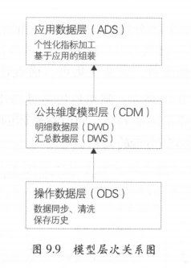
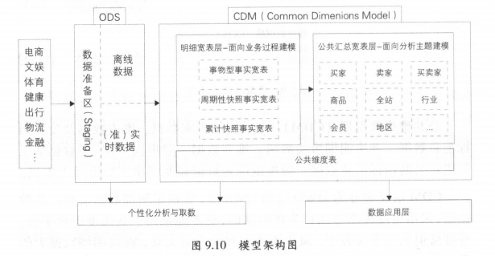
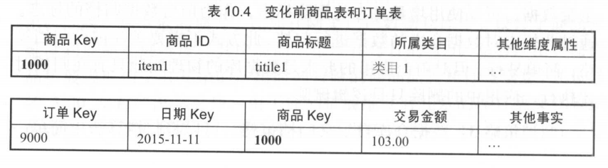
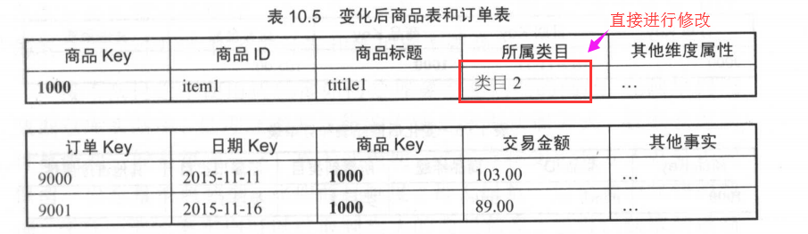
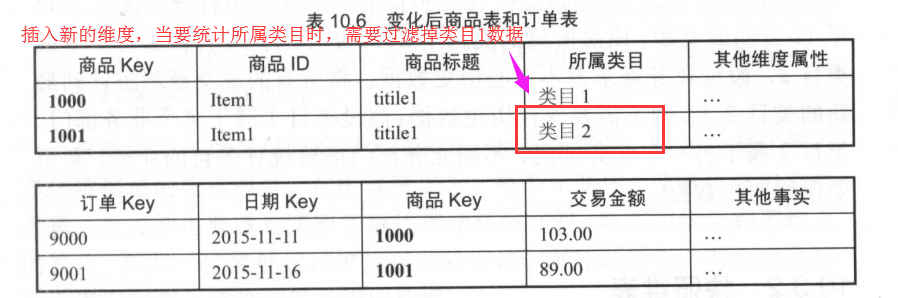
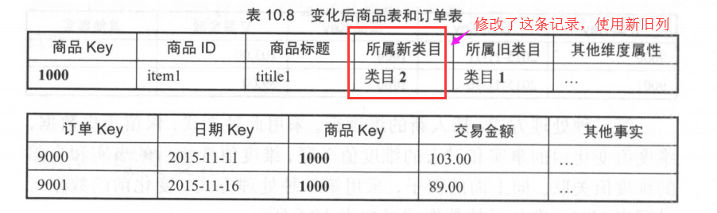
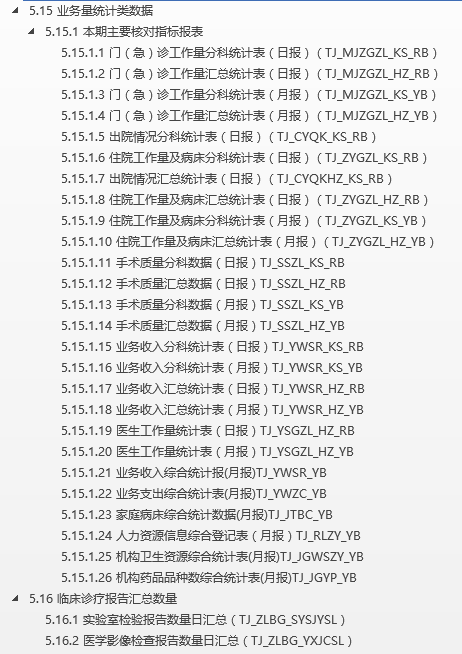

[TOC]
### 1建模综述
数据模型就是数组组织和存储方法，强调从业务、数据存取和使用角度合理存储数据。
> 性能、成本、效率、质量之间取得最佳平衡

1. 性能：快速查询所需数据，减少数据IO吞吐；
2. 成本：极大减少不必要的数据冗余，也能实现计算结果复用，极大降低存储和计算成本；
3. 效率：改善用户使用数据的体验，提高使用数据的效率；
4. 质量：改善数据统计口径的不一致性，减少数据计算错误的可能性；

#### 1.1 OLTP和OLAP 
OLTP系统通常面向的主要是数据操作是随机读写，主要采用满足3SN的实体关系模型存储数据，从而在失误处理中解决数据的冗余和一致性问题；  
而OLAP系统面向的主要数据操作是批量读写，事务处理的一致性不是OLAP所关注的，其主要关注数据的整合，以及在一次性的复杂大数据查询和处理中的性能。

#### 1.2 典型数据仓库建模方法论
##### 1.2.1 ER模型
Bill Inmon 提出，从全企业的高度设计一个3NF模型，用实体关系（Entity Relatonship，ER）模型描述企业业务，在范式理论上符合3NF。（和OLTP的3NF相比，它是站在企业角度面向主题的抽象，而不是针对某个具体的业务流程的实体对象关系的抽象）。
- 需要全面了解企业业务和数据
- 实施周期非常长
- 对建模人员的能力要求非常高   

其建模步骤分为三个阶段:  
- 高层模型：一个高度抽象的模型，描述主要的主题以及主题间的关系，用于描述企业的业务总体概况。
- 中层模型：在高层模型的基础上，细化主题的数据项。
- 物理模型（也叫底层模型）：在中层模型的基础上，考虑物理存储，同时基于性能和平台特点进行物理属性的设计，也可能做一些表的合并、分区的设计等。

##### 1.2.2 纬度模型
Ralph Kimball，从分析决策的需求出发构建模型，为分析需求服务。因此重点关注用户如何更快速地完成需求分析，同时具有较好的大规模复杂查询的响应性能。典型的星型模型，以及一些特殊场景下使用的需求模型。  
其设计分为以下几个步骤：  
- 选择需要进行分析决策的业务过程。业务过程可以是单个业务事件，比如交易的支付、退款等；也可以是某个事件的状态，比如当前的账户余额等；还可以是一系列相关业务事件组成的业务流程，具体需要看我们分析的是某些事件发生情况，还是当前状态，或是事件流转效率。
- 选择粒度。在事件分析中，我们要预判所有分析需要细分的程度，从而决定选择的粒度。粒度是维度的一个组合。
- 识别维表。选择好粒度之后，就需要基于此粒度设计维表，包括维度属性，用于分析时进行分组和筛选。
- 选择事实。确定分析需要衡量的指标。
### 2 模型设计
#### 2.1 模型层次
阿里巴巴的数据团队把表数据模型分为三层 ：
- 操作数据层（ODS，operatiional data store）、
- 公共维度模型层（CDM），其中公共维度模型层包括明细数据层（DWD，Data Warehouse Detail）和汇总数据层（DWS，Data Warehouse Summary）
- 应用数据层（ADS，Application Data Store）

**操作数据层（ ODS ）**：把操作系统数据几乎无处理地存放在数据仓库系统中。  

- 同步：结构化数据增量或全量同步 。
-  结构化：非结构化（日志）结构化处理并存储。
- 累积历史、清洗：根据数据业务需求及稽核和审计要求保存历史数据、清洗数据。 

**公共维度模型层（ CDM ）**：存放明细事实数据、维表数据及公共指标汇总数据 ， 其中明细事实数据、维表数据一般根据 ODS 层数据加工生成 ：公共指标汇总数据一般根据维表数据和明细事实数据加工生成。  

> CDM 层又细分为 DWD 层和 DWS 层，分别是明细数据层和汇总数据层，采用维度模型方法作为理论基础 ， 更多地采用 一些维度退化手法，将维度退化至事实表中，减少事实表和维表的关联 ，提高明细数据表 的易用性 ：同时在汇总数据层， 加强指标的维度退化， 采取更多的宽表化手段构建公共指标数据层，提升公共指标的复用性，减少重复加工。其主要功 能如下:  

- 组合相关和相似数据：采用明细宽表，复用关联计算，减少数据扫描。
- 公共指标统一加工：构建命名规范、口径一致和算法统一的统计指标，为上层数据产品、应用和服务提供公共指标 ; 建立逻辑汇总宽表。
-  建立 一致性维度：建立 一致的数据分析维表，降低数据计算口径、算法不统一的风险。  

**应用数据层（ ADS ）**：存放数据产品个性化的统计指标数据，根据CDM 层与 ODS 层加工生成 。 

- 个性化指标加工：不公用性、复杂性（指数型、比值型、排名型指标）。
- 基于应用的数据组装 ： 大宽表集市、横表转纵表、趋势指标串。 

数据调用服务优先使用公共维度模型层（ CDM ）数据，当公共层没有数据时，需评估是否需要创建公共层数据，当不需要建设公用的公共层时，方可直接使用操作数据层（ ODS ）数据。应用数据层（ ADS)作为产品特有的个性化数据一般不对外提供数据服务，但是 ADS 作为被服务方也需要遵守这个约定。  

#### 2.2 维度设计
确定纬度属性的几个提示：
1. 尽可能生成丰富的纬度属性  
2. 尽可能多给出包括一些富有意义的文字性描述
3. 区分数值型属性和事实
4. 尽量沉淀出通用的纬度属性

##### 2.2.1 一致性纬度和交叉探查
不同数据域的计算过程使用的纬度不一致，就会导致交叉探查存在问题。
> 举例：2个数据域使用不同的维度列统计出来的数据无法交叉探查；
> 2个数据域使用相同维度列，但是有各自的维度表，各自的维度表可能值个数不同、值个数相同导致最后结果无法交叉探查；值枚举个数相同，但是单位不同，导致交叉探查还得转换统一单位。

维度一致性办法：
1. 共享维表。
2. 一致性上卷，一个维度是另一个维度的子集。
3. 交叉属性，2个维度具有部分相同的属性。

##### 2.2.2 维度整合
1. 命名规范统一
2. 字段类型统一
3. 公共代码以及代码值统一
4. 业务含义相同表统一

##### 2.2.3 缓慢变化维
维度属性随着时间的流逝发生缓慢变化。
> 与事实表相同，维度变化相对较慢。

三种处理办法：
原始记录为：

1. 重写纬度值。该方法不保留历史数据，直接覆盖，会导致历史数据丢失。

   

2. 插入新的维度行。但是统计的时候会存在问题，就是需要过滤掉老的维度值，不好确认那个是老的值，那个是新的值，如使用更新时间字段，也会增加统计的麻烦性。

3. 添加维度列，一列为新值，一列为旧值 

   

#### 2.3 事实表设计

设计原则：

- 原则 1 ：尽可能包含所有与业务过程相关的事实
- 原则 2 ：只选择与业务过程相关的事实
- 原则 3 ： 分解不可加性事实为可加的组件
- 原则 4：在选择维度和事实之前必须先声明粒度
- 原则 5 ： 在同一个事实表中不能有多种不同粒度的事实
- 原则 6 ：事实的单位要保持一致
- 原则 7 ： 对事实的 null 值要处理
- 原则 8 ：使用退化维度提高事实表的易用性

### 3. 医疗信息化数据仓库案例
#### 3.1 层次结构划分以及职责
**Stage层->ODS层**：使用前置机手机医疗机构HIS、LIS、PECS等信息系统数据，使用kettle进行定时同步到分布式数据库中。  

**CMD层（包含DWD明细数据层、DWS 汇总数据层）：**
  ODS-> DWD层：对ODS层数据进行处理，NULL值处理，编码校验处理等   
  DWD-> DWS：对只有编码的列进行关联具体名称，如医疗机构代码、身份证类型编码、性别代码、保险类型编码等关联上具体的名称，如01，增加列：男

> 为什么不在ODS层就直接做？
> 1. 系统编码存在差异，后续我们依据最新的国家标准整理出了一份编码，但在处理HIS系统中关于ICD-10疾病编码时，还是根据实际情况对标准进行了一定的修改，使之能包含所有医疗机构中HIS的所有代码，同时尽量让ODS层工作简化。
> 2. 医疗领域中有国家规范数据元-数据字典，ODS层无需存储对应名称，数据字典可看成是维表，在DWS层统一操作，有利于数据一致性保障。

**ADS层：**
提供了业务量统计类数据：

#### 3.2 数据集类别
1. 基础数据类：大部分作为维表
> 如患者疾病信息表、医护人员信息表、仪器设备表、科室信息、疾病诊断目录、手术目录等
2. 诊疗病史信息
> 门诊诊疗病史信息（门诊就诊记录表、门诊处方（医嘱）明显表、门诊收费明显表），还提供门诊收费汇总表  
> 住院诊疗病史信息（住院就诊记录表、住院医嘱明显表等）
3. 诊疗业务运营数据
4. 诊断明细类数据
5. 实验室报告
6. 电子病历数据（核心集市）
> 门急诊病历、病历概要、住院病程记录、知情告知信息等等类别
7. 药房发药记录
8. 抢救类数据
9. 临床路径类数据
10. 体检类数据
12. 药品类数据
13. 家床类
14. 数据交换类数据（上报数据量记录汇总，批次表）
15. 业务量统计类数据
16. 临床诊疗报告汇总数据
17. 医保类

#### 3.3 **具体目录：**

1.2	基础数据类	
1.2.1	患者基本信息表(JC_HZJBXXB)	
1.2.2	医护人员信息表(JC_YHRYXXB)	
1.2.3	仪器设备表(JC_YQSBB)	
1.2.4	科室信息(JC_KSXXB)	
1.2.5	收费项目目录(JC_SFXMML)	
1.2.6	临床项目目录(JC_ZLXMML)	
1.2.7	材料目录(JC_CLML)	
1.2.8	医嘱项目与收费项目对应表(JC_ZLSFXMDYB)	
1.2.9	数据字典对应表（JC_SJZDDYB）	
1.2.10	疾病诊断目录（JC_JBZDML）	
1.2.11	手术目录（JC_SSML）	
1.3	诊疗病史信息	
1.3.1	门诊诊疗病史信息	
1.3.1.1	门诊就诊记录表(MZ_JZJLB)	
1.3.1.2	门诊处方（医嘱）明细表(MZ_CFMXB)	
1.3.1.3	门诊收费汇总表(MZ_SFHZB)（卫计委考核重点表）	
1.3.1.4	门诊收费明细表(MZ_SFMXB)	
1.3.2	住院诊疗病史信息	
1.3.2.1	住院就诊记录表(ZY_JZJLB)	
1.3.2.2	住院医嘱明细表(ZY_YZMXB)	
1.3.2.3	住院收费汇总表(已结算)(ZY_SFHZB)（卫计委重点考核表）	
1.3.2.4	住院收费明细表（已结算）(ZY_SFMXB)（卫计委重点考核表）	
1.3.2.5	住院出院小结报告(ZY_CYXJBG)（国家电子病历共享文档指标）	
1.3.2.6	住院病案首页主体表(ZYBL_BASYZTB)（国家电子病历共享文档指标）	
1.3.2.7	中医住院病案首页(zyzyba_zyzybasy)（国家电子病历共享文档指标）	
1.4	诊疗业务运营数据	
1.4.1	门诊诊疗业务运营信息	
1.4.1.1	门诊挂号表(MZ_GHB)	
1.4.2	住院诊疗业务运营信息	
1.4.2.1	入院登记信息(ZY_RYDJB)（国家电子病历共享文档指标）	
1.4.2.2	24h内入出院记录(ryjl_rcyjl)（国家电子病历共享文档指标）	
1.4.2.3	24h内入院死亡记录(ryjl_ryswjl)（国家电子病历共享文档指标）	
1.4.2.4	出院登记信息(ZY_CYDJB)	
1.4.2.5	转诊（院）记录(zzjl_zzjl)  （国家电子病历共享文档指标）	
1.4.2.6	住院费用发生明细表(ZY_FYFSMXB)	
1.5	诊断明细类数据	
1.5.1	诊断明细报告(BG_ZDMXBG)	
1.6	实验室报告	
1.6.1	检验记录表(SY_JYJLB)（检查检验互认指标）	
1.6.2	检验明细表（检验指标）(SY_JYJGZBB)（检查检验互认指标）	
1.6.3	细菌结果表(SY_XJJGB)（检查检验互认指标）	
1.6.4	药敏结果表(SY_YMJGB)（检查检验互认指标）	
1.6.5	检查记录表（SY_JCJLB）（检查检验互认指标）	
1.6.6	检查报告影像表(SY_JCBGYXB)（检查检验互认指标）	
1.7	电子病历数据	
1.7.1	门（急）诊病历	
1.7.1.1	急诊留观病历（mjzbl_jzlgbl）（国家电子病历共享文档指标）	
1.7.1.2	门（急）诊病历（mjzbl_mjzbl）（国家电子病历共享文档指标）	
1.7.2	病历概要	
1.7.2.1	卫生事件摘要(blgy_wssjzy)	
1.7.2.2	医疗费用记录(blgy_ylfyjl)	
1.7.2.3	基本健康信息(blgy_jbjkxx)	
1.7.3	住院病程记录	
1.7.3.1	首次病程记录(zybcjl_scbcjl) （国家电子病历共享文档指标）	
1.7.3.2	日常病程记录(zybcjl_rcbcjl) （国家电子病历共享文档指标）	
1.7.3.3	上级医师查房记录(zybcjl_sjyscfjl) （国家电子病历共享文档指标）	
1.7.3.4	疑难病例讨论(zybcjl_ynbltl) （国家电子病历共享文档指标）	
1.7.3.5	交接班记录(zybcjl_jjbjl)	
1.7.3.6	转科记录(zybcjl_zkjl)（国家电子病历共享文档指标）	
1.7.3.7	阶段小结(zybcjl_jdxj)（国家电子病历共享文档指标）	
1.7.3.8	会诊记录(zybcjl_hzjl)（国家电子病历共享文档指标）	
1.7.3.9	术前小结(zybcjl_sqxj)（国家电子病历共享文档指标）	
1.7.3.10	术前讨论(zybcjl_sqtl)（国家电子病历共享文档指标）	
1.7.3.11	术后首次病程记录(zybcjl_shscbcjl) （国家电子病历共享文档指标）	
1.7.3.12	出院记录(zybcjl_cyjl)（国家电子病历共享文档指标）	
1.7.3.13	死亡记录(zybcjl_swjl)（国家电子病历共享文档指标）	
1.7.3.14	死亡病例讨论记录(zybcjl_swbltljl)（国家电子病历共享文档指标）	
1.7.4	知情告知信息	
1.7.4.1	手术同意(zqgzxx_ssty)	
1.7.4.2	麻醉知情通知(zqgzxx_mzzqtz)	
1.7.4.3	输血治疗同意书(zqgzxx_sxzltys)	
1.7.4.4	特殊检查及特殊治疗同意书(zqgzxx_tszltys)	
1.7.4.5	病危（重通知书）(zqgzxx_bwtzs)（国家电子病历共享文档指标）	
1.7.4.6	其他知情同意书(zqgzxx_qtzqtys)	
1.7.5	护理操作记录	
1.7.5.1	一般护理记录(hljl_ybhljl)（国家电子病历共享文档指标）	
1.7.5.2	手术护理功能(hljl_sshlgn)（国家电子病历共享文档指标）	
1.7.5.3	生命体征测量记录(hljl_smtzcljl)（国家电子病历共享文档指标）	
1.7.5.4	出入量记录(hljl_crljl)	
1.7.5.5	高值耗材使用记录(GZHC_SYJLB)	
1.7.5.6	危（重）护理记录(hljl_bwhljl)（国家电子病历共享文档指标）	
1.7.5.7	特级护理记录(hljl_tjhljl)（国家电子病历共享文档指标）	
1.7.6	护理评估与计划	
1.7.6.1	入院评估记录(hlpgyjh_rypgjl)（国家电子病历共享文档指标）	
1.7.6.2	护理计划记录(hlpgyjl_hljhjl)	
1.7.6.3	出院评估与指导记录(hlpgyjl_cypgyzdjl)	
1.7.7	助产记录	
1.7.7.1	待产记录 (zcjl_dcjl)（国家电子病历共享文档指标）	
1.7.7.2	阴道分娩记录 (zcjl_ydfmjl)（国家电子病历共享文档指标）	
1.7.7.3	剖宫产手术记录 (zcjl_pgcssjl)（国家电子病历共享文档指标）	
1.7.8	治疗处置类数据	
1.7.8.1	治疗处置记录表(ZL_CZJLB)（国家电子病历共享文档指标）	
1.7.8.2	麻醉术前访视记录(ybzlczjl_mzsqfsjl)	
1.7.8.3	麻醉记录 (ybzlczjl_mzjl)	
1.7.8.4	麻醉术后访视记录 (ybzlczjl_mzshfsjl)	
1.7.9	手术报告类数据	
1.7.9.1	手术记录(BG_SSJLBG)	
1.7.9.2	手术申请单(ZY_SSSQD）	
1.7.9.3	手术安排（ZY_SSAP）	
1.7.9.4	麻醉安排(ZY_MZAP)	
1.7.10	输血记录类数据	
1.7.10.1	输血申请(ZY_SXSQ）	
1.7.10.2	输血记录表(SX_JLB)	
1.8	药房发药记录	
1.8.1	门诊、住院发药记录（mzzy_fyjl）	
1.9	抢救类数据	
1.9.1	抢救记录表(QJ_JLB)	
1.10	临床路径类数据	
1.10.1	临床路径执行状况(LCLJ_ZXZKB)	
1.11	体检类数据	
1.11.1	就诊记录表（体检）(TJ_TJJLB)	
1.11.2	体检总检表(TJ_TJZJB)（国家电子病历重点表）	
1.11.3	体格及功能检查报告表(TJ_BGB)	
1.11.4	体格及功能检查明细表(TJ_MXB)	
1.12	药品类数据	
1.12.1	药品基本信息YP_JBXX	
1.12.2	药品出入库明细(YP_CRKMXB)	
1.12.3	药品库存信息(YP_KCXXB)	
1.12.4	药品厂家信息(YP_CJXXB)	
1.12.5	药品调价历史(YP_TJLSB)	
1.13	家床类	
1.13.1	家庭病床登记表(JTBC_DJB)	
1.14	数据交换类数据	
1.14.1	数据量记录汇总(TJ_SJL_JLHZ)	
1.14.2	批次表(TJ_SJL_PCB)	
1.15	业务量统计类数据	
1.15.1	本期主要核对指标报表	
1.15.1.1	门（急）诊工作量分科统计表（日报）（TJ_MJZGZL_KS_RB）	
1.15.1.2	门（急）诊工作量汇总统计表（日报）（TJ_MJZGZL_HZ_RB）	
1.15.1.3	门（急）诊工作量分科统计表（月报）（TJ_MJZGZL_KS_YB）	
1.15.1.4	门（急）诊工作量汇总统计表（月报）（TJ_MJZGZL_HZ_YB）	
1.15.1.5	出院情况分科统计表（日报）（TJ_CYQK_KS_RB）	
1.15.1.6	住院工作量及病床分科统计表（日报）（TJ_ZYGZL_KS_RB）	
1.15.1.7	出院情况汇总统计表（日报）（TJ_CYQKHZ_KS_RB）	
1.15.1.8	住院工作量及病床汇总统计表（日报）（TJ_ZYGZL_HZ_RB）	
1.15.1.9	住院工作量及病床分科统计表（月报）（TJ_ZYGZL_KS_YB）	
1.15.1.10	住院工作量及病床汇总统计表（月报）（TJ_ZYGZL_HZ_YB）	
1.15.1.11	手术质量分科数据（日报）TJ_SSZL_KS_RB	
1.15.1.12	手术质量汇总数据（日报）TJ_SSZL_HZ_RB	
1.15.1.13	手术质量分科数据（月报）TJ_SSZL_KS_YB	
1.15.1.14	手术质量汇总数据（月报）TJ_SSZL_HZ_YB	
1.15.1.15	业务收入分科统计表（日报）TJ_YWSR_KS_RB	
1.15.1.16	业务收入分科统计表（月报）TJ_YWSR_KS_YB	
1.15.1.17	业务收入汇总统计表（日报）TJ_YWSR_HZ_RB	
1.15.1.18	业务收入汇总统计表（月报）TJ_YWSR_HZ_YB	
1.15.1.19	医生工作量统计表（日报）TJ_YSGZL_HZ_RB	
1.15.1.20	医生工作量统计表（月报）TJ_YSGZL_HZ_YB	
1.15.1.21	业务收入综合统计报(月报)TJ_YWSR_YB	
1.15.1.22	业务支出综合统计表(月报)TJ_YWZC_YB	
1.15.1.23	家庭病床综合统计数据(月报)TJ_JTBC_YB	
1.15.1.24	人力资源信息综合登记表（月报）TJ_RLZY_YB	
1.15.1.25	机构卫生资源综合统计表(月报)TJ_JGWSZY_YB	
1.15.1.26	机构药品品种数综合统计表(月报)TJ_JGYP_YB	
1.16	临床诊疗报告汇总数量	
1.16.1	实验室检验报告数量日汇总（TJ_ZLBG_SYSJYSL）	
1.16.2	医学影像检查报告数量日汇总（TJ_ZLBG_YXJCSL）	
1.17	医保类	
1.17.1	医保住院结算表（日报）（YB_ZYJSB_RB）	
1.17.2	医保门急诊结算表（日报）（YB_MZJJSB_RB）	
1.17.3	医保住院结算表（月报）（YB_ZYJSB_YB）	
1.17.4	医保门急诊结算表（月报）YB_MZJJSB_YB	